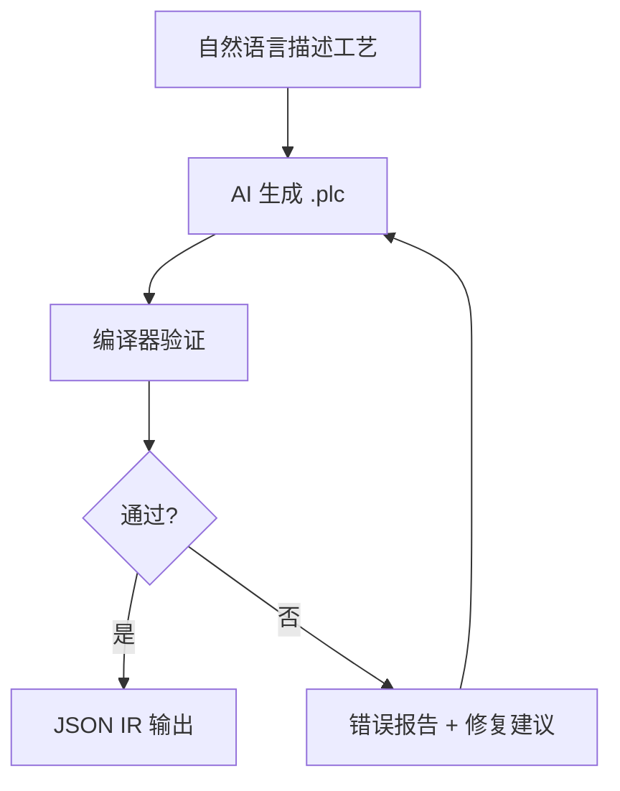

<p align="center">
  <h1 align="center">RustPLC</h1>
  <p align="center">
    <strong>形式化验证的工业控制编译器</strong><br>
    声明物理拓扑与安全约束，编译器数学证明其正确性。
  </p>
  <p align="center">
    <a href="README_EN.md">English</a> | <strong>中文</strong>
  </p>
</p>

---

## 30 秒了解 RustPLC



**传统方式**：工程师手写梯形图 → 人工审查安全性 → 现场调试发现碰撞/死锁/超时

**RustPLC 方式**：工程师描述工艺 → AI 生成声明式 DSL → 编译器数学证明安全性 → 问题在编译期全部暴露

---

## 快速开始

```bash
git clone https://github.com/xxrust/RustPLC.git
cd RustPLC
cargo build --release
cargo run --release -- examples/two_cylinder.plc --no-print-ir
```

```
验证通过：
  - Safety: 完备证明（深度 4）— conflicts_with 全部满足
  - Liveness: 通过 — 无死锁风险
  - Timing: 通过
  - Causality: 通过 — 所有信号链路连通
```

---

## 系统架构

```
┌─────────────────────────────────────────────────────────────────────────────────────┐
│                                  📝 输入层                                           │
├─────────────────────────────────────────────────────────────────────────────────────┤
│  .plc DSL 文件                    场景 YAML (scenario.yaml)                         │
│  - topology (拓扑)                - digital_inputs / analog_inputs                   │
│  - constraints (约束)             - tick_ms / duration_ticks                         │
│  - tasks (控制逻辑)               - fault injection (故障注入)                       │
└────────────────┬────────────────────────────────────────────────────────────────────┘
                 │
                 ▼
┌─────────────────────────────────────────────────────────────────────────────────────┐
│                              ⚙️ 编译器核心 (src/)                                   │
├─────────────────────────────────────────────────────────────────────────────────────┤
│  Parser (pest PEG) ──▶ AST ──▶ 语义分析 + 预处理 ──▶ IR                            │
│                                (repeat/delay 展开)   (TopologyGraph + StateMachine) │
│                                                                                      │
│  关键模块：                                                                          │
│  • parser/plc.pest    - PEG 语法定义                                                │
│  • ast/mod.rs         - AST 类型 (PlcProgram, DeviceDeclaration, StepStatement)    │
│  • semantic/mod.rs    - 语义分析 + IR 降级                                          │
│  • ir/mod.rs          - IR 类型 (petgraph DiGraph)                                  │
└────────────────┬────────────────────────────────────────────────────────────────────┘
                 │
                 ▼
┌─────────────────────────────────────────────────────────────────────────────────────┐
│                        🔬 验证引擎（并行执行）(src/verification/)                    │
├─────────────────────────────────────────────────────────────────────────────────────┤
│  ┌─────────────────┐  ┌─────────────────┐  ┌─────────────────┐  ┌─────────────────┐│
│  │  Safety 引擎    │  │ Liveness 引擎   │  │  Timing 引擎    │  │ Causality 引擎  ││
│  │  BMC + k-归纳   │  │ SCC + 可达性    │  │  关键路径分析   │  │   拓扑 BFS      ││
│  │  conflicts_with │  │  死锁检测       │  │  response_time  │  │  connected_to   ││
│  │  requires       │  │  活锁检测       │  │  budget 上界    │  │  detects 链路   ││
│  └─────────────────┘  └─────────────────┘  └─────────────────┘  └─────────────────┘│
│                                      ▼                                               │
│                          verification_report.json                                    │
│                          (结构化验证报告 + warnings 分级)                            │
└────────────────┬────────────────────────────────────────────────────────────────────┘
                 │
                 ▼
┌─────────────────────────────────────────────────────────────────────────────────────┐
│                          🏃 运行时层 (crates/)                                       │
├─────────────────────────────────────────────────────────────────────────────────────┤
│                        ┌─────────────────────────────┐                              │
│                        │   runtime-core (no_std)     │                              │
│                        │   确定性状态机执行器         │                              │
│                        │   - Program / Task / Step   │                              │
│                        │   - Instr / Action          │                              │
│                        └──────────┬──────────────────┘                              │
│                                   │                                                  │
│              ┌────────────────────┼────────────────────┐                            │
│              ▼                    ▼                    ▼                            │
│  ┌──────────────────┐  ┌──────────────────┐  ┌──────────────────┐                 │
│  │   SimIO (sim)    │  │  Virtual Board   │  │  RP2040 HAL      │                 │
│  │   SIL 仿真 I/O   │  │  虚拟板级 Runner │  │  硬件抽象层      │                 │
│  │   - Plant 模型   │  │  - tick_timing   │  │  - GPIO/ADC/PWM  │                 │
│  │   - 故障注入     │  │  - 模拟真实板    │  │  - PIO (运动)    │                 │
│  │   - 波形导出     │  │  - overrun 标记  │  │  - RTT 日志      │                 │
│  └──────────────────┘  └──────────────────┘  └──────────────────┘                 │
│          │                      │                      │                            │
│          ▼                      ▼                      ▼                            │
│   sil_trace.jsonl      board_trace.jsonl      RP2040 固件 (UF2)                    │
│   sim_report.json      tick_timing.jsonl      + board.log (RTT)                    │
└────────────────┬────────────────────────────────────────────────────────────────────┘
                 │
                 ▼
┌─────────────────────────────────────────────────────────────────────────────────────┐
│                          📊 分析与门禁 (src/)                                        │
├─────────────────────────────────────────────────────────────────────────────────────┤
│  trace-diff              timing-report           no-board-gate                      │
│  SIL vs Board 对比       p50/p95/p99 统计       实时阈值门禁                        │
│  - 逐 tick 差异检测      - exec_us / slack_us   - --max-p99-exec-us                │
│  - context 上下文        - overrun_count        - --max-overrun-count               │
│  - fail-on-mismatch      - timing_report.json   - 轨迹一致性 + 实时性               │
│                                                                                      │
│  release-bundle                                                                      │
│  可审计交付包                                                                        │
│  - manifest.json (SHA256 清单)                                                      │
│  - build_meta.json (git commit / dirty / tool_version)                             │
│  - 所有验证报告 + trace + timing 证据                                               │
└────────────────┬────────────────────────────────────────────────────────────────────┘
                 │
                 ▼
┌─────────────────────────────────────────────────────────────────────────────────────┐
│                                📦 输出层                                             │
├─────────────────────────────────────────────────────────────────────────────────────┤
│  ✅ 编译期：verification_report.json (四引擎证明结果)                               │
│  🧪 仿真期：trace.jsonl + wave.vcd + sim_report.json                               │
│  📦 部署期：firmware.uf2 + io_map.toml + analog_contract.toml                      │
│  🚫 门禁期：diff_report.json + timing_report.json + gate_summary.json              │
│  📋 交付期：release-bundle/ (manifest + 所有工件 + SHA 清单)                        │
└─────────────────────────────────────────────────────────────────────────────────────┘
```

---

## 核心能力

| 能力 | 说明 |
|------|------|
| **🔬 形式化验证** | 四大引擎（Safety / Liveness / Timing / Causality）编译期数学证明 |
| **🤖 AI 辅助生成** | 自然语言描述工艺 → AI 多轮对话生成 `.plc` → 自动验证 |
| **🧪 SIL 仿真** | 场景驱动的确定性仿真，故障注入、波形导出、批量回归 |
| **📋 场景工程** | 场景初始化、验证、展开、批量生成、失败最小化 |
| **🎛️ PID 控制** | DSL 声明 PID 回路，运行时确定性执行，KPI 回归分析 |
| **🔄 运动控制** | 步进电机 + AB 编码器，PIO 高速脉冲，碰撞防护，虚拟通道 |
| **📦 RP2040 部署** | 交叉编译到 Raspberry Pi Pico，I/O 映射，trace 对比门禁 |
| **⏱️ 实时门禁** | tick 时序采样，p50/p95/p99 统计，实时阈值门禁 |
| **🚫 无板交付** | 虚拟板级 Runner，SIL vs virtual-board 对比，release-bundle |
| **🛡️ 恢复模板** | 急停/掉电/传感器卡死恢复模板，关键 wait 可恢复性 lint |

---

## 典型工作流

### 1. 编写 / 生成 .plc

**方式一：AI 对话生成（推荐）**

```
> 帮我写个 PLC 程序。我有两个气缸，不能同时伸出，先伸 A 再伸 B...
```

AI 会通过多轮对话生成完整的 `.plc` 文件并自动验证。

**方式二：手写 DSL**

```plc
[topology]
device Y0: digital_output
device valve_A: solenoid_valve { driven_by: Y0, response_time: 20ms }
device cyl_A: cylinder { driven_by: valve_A, stroke_time: 300ms }
device sensor_A_ext: sensor { driven_by: X0, detects: cyl_A.extended }

[constraints]
safety:
    cyl_A.extended conflicts_with cyl_B.extended

[tasks]
task cycle:
    step extend_A:
        action: extend cyl_A
        wait: sensor_A_ext == true
        timeout: 500ms -> goto fault_handler
```

### 2. 编译验证

```bash
cargo run --release -- your_file.plc --no-print-ir
```

### 3. 场景仿真

```bash
# 初始化场景骨架
cargo run --release -- scenario-init examples/assembly_station.plc \
  --out scenarios/normal.yaml --preset normal

# SIL 仿真
cargo run --release -- sim-plc examples/assembly_station.plc \
  --scenario scenarios/normal.yaml --out trace.jsonl

# 批量回归
cargo run --release -- sim-regress --plc-dir examples --scenario-dir scenarios
```

### 4. 无板门禁

```bash
# SIL vs virtual-board 对比 + 实时阈值检查
cargo run --release -- no-board-gate examples/assembly_station.plc \
  --scenario scenarios/normal.yaml \
  --out-dir out/gate \
  --max-p99-exec-us 500 \
  --max-overrun-count 0
```

### 5. RP2040 部署

```bash
# 生成固件构建输入
cargo run --release -- build-rp2040 examples/assembly_station.plc --out out/rp2040

# 填写 I/O 映射
cp out/rp2040/io_map.template.toml out/rp2040/io_map.toml
# 编辑 io_map.toml 填写 GPIO 引脚

# 一步构建 UF2 固件
cargo run --release -- build-rp2040 examples/assembly_station.plc \
  --out out/rp2040 \
  --io-map out/rp2040/io_map.toml \
  --emit-uf2 out/firmware.uf2

# 烧录到 Pico
cargo run --release -- flash-rp2040 --uf2 out/firmware.uf2 --mount /media/RPI-RP2
```

### 6. 发布交付

```bash
# 打包可审计的发布工件（含 SHA 清单、git 元数据、实时证据）
cargo run --release -- release-bundle examples/assembly_station.plc \
  --scenario scenarios/normal.yaml \
  --out-dir out/release \
  --max-p99-exec-us 500 \
  --max-overrun-count 0
```

---

## 📚 详细文档

完整文档请查阅 **[GitHub Wiki](https://github.com/xxrust/RustPLC/wiki)**：

| 页面 | 内容 |
|------|------|
| [Quick Start](https://github.com/xxrust/RustPLC/wiki/Quick-Start) | 5 分钟上手指南 |
| [DSL Language Reference](https://github.com/xxrust/RustPLC/wiki/DSL-Language-Reference) | 完整语法参考 |
| [Architecture](https://github.com/xxrust/RustPLC/wiki/Architecture) | 编译流水线与模块结构 |
| [Verification Engines](https://github.com/xxrust/RustPLC/wiki/Verification-Engines) | 四大引擎原理 |
| [SIL Simulation](https://github.com/xxrust/RustPLC/wiki/SIL-Simulation) | 仿真闭环 |
| [Scenario System](https://github.com/xxrust/RustPLC/wiki/Scenario-System) | 场景工程化 |
| [PID Control](https://github.com/xxrust/RustPLC/wiki/PID-Control) | PID 回路 |
| [Motion Control](https://github.com/xxrust/RustPLC/wiki/Motion-Control) | 步进 + AB 编码器 |
| [No-Board Gate](https://github.com/xxrust/RustPLC/wiki/No-Board-Gate) | 无板交付门禁 |
| [Recovery Templates](https://github.com/xxrust/RustPLC/wiki/Recovery-Templates) | 异常恢复模板 |
| [RP2040 Deployment](https://github.com/xxrust/RustPLC/wiki/RP2040-Deployment) | 板级部署 |
| [Examples Gallery](https://github.com/xxrust/RustPLC/wiki/Examples-Gallery) | 示例详解 |
| [AI Assisted Generation](https://github.com/xxrust/RustPLC/wiki/AI-Assisted-Generation) | AI 生成流程 |
| [Contributing](https://github.com/xxrust/RustPLC/wiki/Contributing) | 开发指南 |

**本地文档（仓库内）：**
- 场景系统：[`docs/scenario_playbook.md`](docs/scenario_playbook.md)、[`docs/scenario_minimization.md`](docs/scenario_minimization.md)
- 无板交付：[`docs/no_board_playbook.md`](docs/no_board_playbook.md)
- 运动控制：[`docs/stepper_ab_encoder.md`](docs/stepper_ab_encoder.md)
- 恢复模板：[`docs/recovery_templates_sequence_lint.md`](docs/recovery_templates_sequence_lint.md)

---

## 路线图

### 已完成

**核心编译器：**
- ✅ DSL 设计与解析器
- ✅ 四大形式化验证引擎（Safety / Liveness / Timing / Causality）
- ✅ 结构化错误报告（行号 + 修复建议）
- ✅ DSL v2（delay / repeat / wait AND|OR / if-else / goto task.step / 自定义状态）
- ✅ AI 辅助生成（plc-gen skill）

**I/O 与控制：**
- ✅ 模拟量 I/O（analog_input / analog_output / set_analog / 阈值比较）
- ✅ PID 最小可用子集（DSL/IR/runtime 打通 + KPI 回归）
- ✅ 运动控制（步进 + AB 编码器 + PIO + 碰撞防护 + 虚拟通道）

**仿真与测试：**
- ✅ SIL 仿真闭环（SimIO / Plant / 故障注入 / 波形导出）
- ✅ 场景系统（init / validate / expand / gen / 批量回归 / 失败最小化）
- ✅ 仿真对象模型与 KPI 回归（超调/稳定时间/稳态误差）

**部署与门禁：**
- ✅ 代码生成 + RP2040 构建/烧录（build-rp2040 / flash-rp2040）
- ✅ 板级可观测与 SIL 对比（board-parse / trace-diff）
- ✅ 虚拟板级 Runner + 无板对比门禁（no-board-gate）
- ✅ 发布包与追溯（release-bundle + SHA 清单 + git 元数据）

**质量与实时性：**
- ✅ 统一验证报告契约（verification_report.json + warnings 分级）
- ✅ CLI 门禁（--deny-warnings）
- ✅ Runtime 上界分析（tick 转移/动作/并行展开预算）
- ✅ 结构上界到时间预算映射（budget_time_estimate）
- ✅ Tick 时序观测契约（tick_timing.jsonl + 每 tick 执行时长/slack/overrun）
- ✅ 时序统计报告（timing-report：p50/p95/p99/max + overrun 计数）
- ✅ 无板门禁实时阈值（--max-p99-exec-us / --max-overrun-count）
- ✅ 最坏负载场景注入与可复现回放
- ✅ 异常恢复模板与顺控 lint（关键 wait 必须可恢复）

**文档与工程化：**
- ✅ 模拟量安全覆盖透明化（规则绑定率与抽象粒度报告）
- ✅ 阈值语义强化（类型/range/unit 一致性校验）
- ✅ No-RTOS Real-Time Playbook 文档

### 计划中

- ⏳ 硬件抽象层扩展（EtherCAT / Modbus / 更多 GPIO 板卡）
- ⏳ 多控制器协同
- ⏳ 图形化 DSL 编辑器

---

## License

MIT

---

<p align="center">
  <sub>Written in Rust, so it won't panic. Well, at least not on the production line.</sub>
</p>
