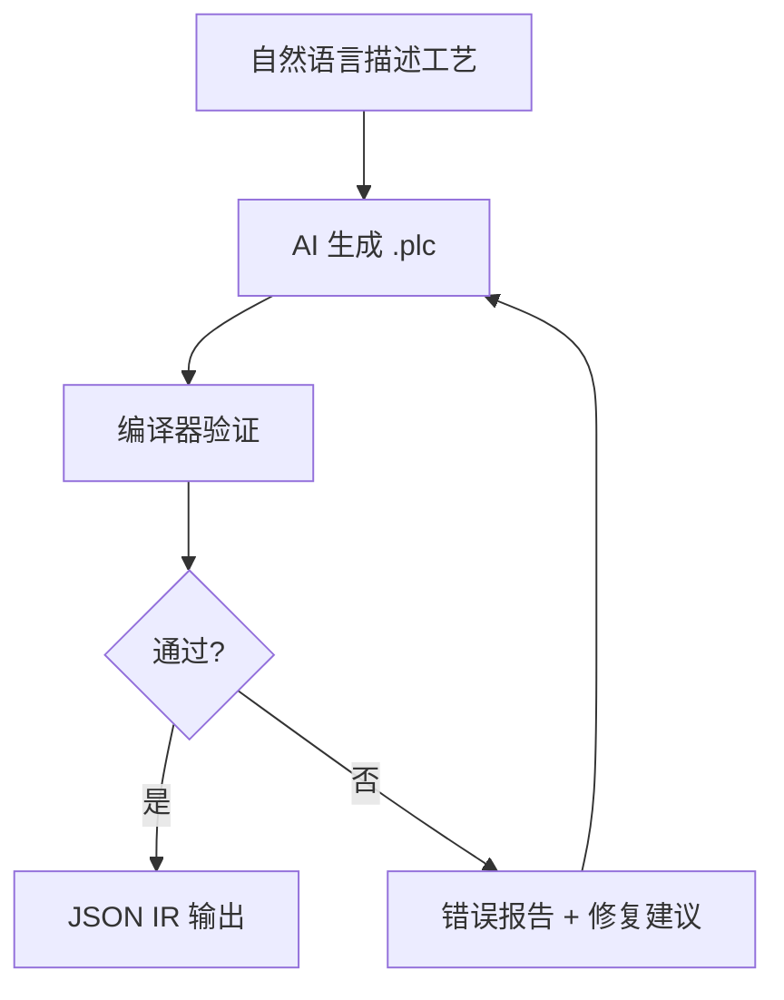
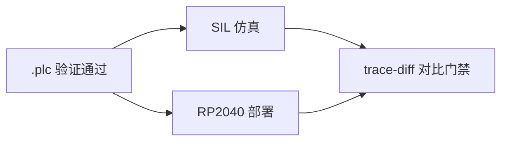

<p align="center">
  <h1 align="center">RustPLC</h1>
  <p align="center">
    <strong>形式化验证的工业控制编译器</strong><br>
    不写程序控制设备 —— 声明物理事实与意图，让编译器证明它是安全的。
  </p>
  <p align="center">
    <a href="README_EN.md">English</a> | <strong>中文</strong>
  </p>
</p>

---

## 30 秒了解 RustPLC



**传统方式**：工程师手写梯形图 → 人工审查安全性 → 现场调试发现碰撞/死锁/超时

**RustPLC 方式**：工程师描述工艺 → AI 生成声明式 DSL → 编译器数学证明安全性 → 问题在编译期全部暴露

## 快速开始

```bash
git clone https://github.com/xxrust/RustPLC.git
cd RustPLC
cargo build --release
cargo run --release -- examples/two_cylinder.plc
# 仅看验证摘要（不打印大块 IR JSON）
cargo run --release -- examples/two_cylinder.plc --no-print-ir
```

```
验证通过：
  - Safety: 完备证明（深度 4）— conflicts_with 全部满足
  - Liveness: 通过 — 无死锁风险
  - Timing: 通过
  - Causality: 通过 — 所有信号链路连通
```

## AI 对话生成示例

在 Claude Code 中用自然语言描述工艺，AI 多轮对话生成经过验证的 `.plc` 文件：

**你**：

> 帮我写个plc程序。我有一个装配工位：左右两条传送带各送一个工件到位，到位后停传送带。然后左右各有一个推料缸把工件推到中间装配位，两个都推到位后，压装缸下压完成装配，压完缩回。然后两个推料缸缩回，最后出料缸把成品推出去再缩回。压装的时候两个推料缸必须保持伸出，出料的时候压装缸必须已经缩回。

**AI 自动推理拓扑与安全约束**：

```
左传送带链路:  Y0 → motor_left → sensor_left_arrive → X0
左推料缸链路:  Y2 → valve_push_L → cyl_push_L → sensor_push_L_ext → X2
压装缸链路:    Y4 → valve_press → cyl_press → sensor_press_ext → X6
...

安全约束：
  cyl_press.extended requires cyl_push_L.extended   — 压装时左推缸必须保持
  cyl_press.extended requires cyl_push_R.extended   — 压装时右推缸必须保持
  cyl_eject.extended conflicts_with cyl_press.extended — 出料和压装互斥
```

**AI 生成 `.plc` 并自动验证**：

```
验证通过：
  - Safety: 完备证明（深度 14）— requires/conflicts_with 全部满足
  - Liveness: 通过 — 无死锁风险
  - Timing: 通过
  - Causality: 通过 — 所有信号链路连通
```

完整文件见 [`examples/assembly_station.plc`](examples/assembly_station.plc)。

## 四大验证引擎

| 引擎 | 检查内容 | 方法 |
|------|---------|------|
| **Safety** | 状态互斥（`conflicts_with`）、前置依赖（`requires`） | 有界模型检查 + k-归纳 |
| **Liveness** | 死锁 / 活锁（无超时的 wait、零出度状态） | SCC 分析 + 可达性检查 |
| **Timing** | 时序包络（`must_complete_within` / `worst_case`） | 最坏关键路径计算 |
| **Causality** | 因果链完整性（信号能否沿拓扑链路传播） | 拓扑图 BFS |

四个引擎并行运行，一次编译暴露所有问题。验证失败时给出精确诊断：

```
ERROR [safety] 安全约束违反
  位置: task cycle.step together
  原因: cyl_A.extended 与 cyl_B.extended 在并行分支中同时成立
  建议: 将冲突动作改为顺序执行

ERROR [liveness] 潜在死锁
  位置: task main.step_wait
  原因: wait 条件缺少 timeout 分支
  建议: 请添加 timeout: <时长> -> goto <恢复 task>
```

## 从验证到部署

`.plc` 验证通过后，可以进入仿真和板级部署：



```bash
# 从 .plc 初始化一个可运行的场景骨架（用于后续仿真/门禁/交付）
cargo run --release -- scenario-init examples/assembly_station.plc \
  --out out/assembly_station.scenario.yaml --preset normal

# 也可使用内置模板（更适合快速构造特定类型用例）：
#   --preset timeout        # 触发超时路径（通常不脚本传感器到位）
#   --preset sensor_stuck   # 注入传感器卡死 fault 示例
#   --preset bounce         # 按键抖动示例

# SIL 仿真
cargo run --release -- sim-plc examples/assembly_station.plc \
  --scenario scenarios/normal.yaml --out trace.jsonl

# 场景文件支持“设备名写法”（来自 .plc 的 topology），例如 scenarios/normal.yaml 中的：
#   digital_inputs: { start_button: true }
# 以及高层语法糖（pulse/hold），可通过 scenario-expand 导出展开后的 inputs：
#   cargo run --release -- scenario-expand examples/assembly_station.plc \
#     --scenario examples/scenarios/pulse_hold.yaml --out out/pulse_hold.expanded.yaml

# 批量生成场景（参数化配置 -> 多组 YAML，用于回归/门禁）
cargo run --release -- scenario-gen --plc examples/assembly_station.plc \
  --config examples/scenario_gen/basic.yaml --out-dir out/scenario_gen

# 无开发板对比门禁（SIL vs virtual-board，一条命令跑完 sim + virtual-board + trace-diff）
cargo run --release -- no-board-gate examples/assembly_station.plc \
  --scenario scenarios/normal.yaml --out-dir out/no_board_gate

# RP2040 固件构建
cargo run --release -- build-rp2040 examples/assembly_station.plc \
  --out out/rp2040
```

> 提示：`build-rp2040` 首次运行会生成 `out/rp2040/io_map.template.toml`。复制并按你的引脚修改后再执行 `--emit-uf2`。

顺控恢复模板与关键 wait lint 见：[`docs/recovery_templates_sequence_lint.md`](docs/recovery_templates_sequence_lint.md)。
无开发板完整交付流程见：[`docs/no_board_playbook.md`](docs/no_board_playbook.md)。
场景编写与回归流程见：[`docs/scenario_playbook.md`](docs/scenario_playbook.md) 与 [`docs/scenario_minimization.md`](docs/scenario_minimization.md)。
步进轴/AB 编码器专题 Wiki 草稿（仓库内）：
- [`docs/wiki/Stepper-AB-Encoder-Safety-Modeling.md`](docs/wiki/Stepper-AB-Encoder-Safety-Modeling.md)
- [`docs/wiki/Topology-Abstraction-PLS-Angle-Distance.md`](docs/wiki/Topology-Abstraction-PLS-Angle-Distance.md)
- [`docs/wiki/Fail-Safe-Safe-State.md`](docs/wiki/Fail-Safe-Safe-State.md)

## 📚 详细文档

深度内容请查阅 **[Wiki](https://github.com/xxrust/RustPLC/wiki)**：

| 页面 | 内容 |
|------|------|
| [Quick Start](https://github.com/xxrust/RustPLC/wiki/Quick-Start) | 5 分钟上手：安装、编译、运行 |
| [DSL Language Reference](https://github.com/xxrust/RustPLC/wiki/DSL-Language-Reference) | 完整语法参考：拓扑、约束、控制逻辑、PID |
| [Architecture](https://github.com/xxrust/RustPLC/wiki/Architecture) | 编译流水线、模块结构、IR 设计 |
| [Verification Engines](https://github.com/xxrust/RustPLC/wiki/Verification-Engines) | 四大引擎原理与数学基础 |
| [SIL Simulation](https://github.com/xxrust/RustPLC/wiki/SIL-Simulation) | 仿真闭环：场景定义、故障注入、批量回归 |
| [PID Control](https://github.com/xxrust/RustPLC/wiki/PID-Control) | PID 回路声明、运行时语义、KPI 回归 |
| [No-Board Gate](https://github.com/xxrust/RustPLC/wiki/No-Board-Gate) | 无板交付门禁：虚拟板级 + trace 对比 + release-bundle |
| [Recovery Templates](https://github.com/xxrust/RustPLC/wiki/Recovery-Templates) | 异常恢复模板与顺控 lint |
| [RP2040 Deployment](https://github.com/xxrust/RustPLC/wiki/RP2040-Deployment) | 交叉编译、I/O 映射、烧录、trace 对比 |
| [Examples Gallery](https://github.com/xxrust/RustPLC/wiki/Examples-Gallery) | 示例文件详解与工业场景对照 |
| [AI Assisted Generation](https://github.com/xxrust/RustPLC/wiki/AI-Assisted-Generation) | AI 对话生成 `.plc` 的完整流程 |
| [Contributing](https://github.com/xxrust/RustPLC/wiki/Contributing) | 开发指南、测试、代码结构 |

## 路线图

- [x] DSL 设计与解析器
- [x] 四大形式化验证引擎（Safety / Liveness / Timing / Causality）
- [x] 结构化错误报告（行号 + 修复建议）
- [x] DSL v2：delay / repeat / wait AND|OR / if-else / goto task.step / 自定义状态
- [x] AI 辅助生成（plc-gen skill）
- [x] 模拟量 I/O（analog_input / analog_output / set_analog / 阈值比较）
- [x] SIL 仿真闭环（SimIO / Plant / 故障注入 / 波形导出 / 批量回归）
- [x] 代码生成 + RP2040 构建/烧录（build-rp2040 / flash-rp2040）
- [x] 板级可观测与 SIL 对比（trace-parse / trace-diff）
- [x] 统一验证报告契约（verification_report.json + warnings 分级）
- [x] CLI 门禁（--deny-warnings）
- [x] Runtime 上界分析（tick 转移/动作/并行展开预算）
- [x] 虚拟板级 Runner + 无板对比门禁（no-board-gate）
- [x] 发布包与追溯（release-bundle + sha 清单 + git 元数据）
- [x] 模拟量安全覆盖透明化（规则绑定率与抽象粒度报告）
- [x] 阈值语义强化（类型/range/unit 一致性校验）
- [x] PID 最小可用子集（DSL/IR/runtime 打通 + KPI 回归）
- [x] 仿真对象模型与 KPI 回归（超调/稳定时间/稳态误差）
- [x] 异常恢复模板与顺控 lint（关键 wait 必须可恢复）
- [x] Tick 时序观测契约（tick_timing.jsonl + 每 tick 执行时长/slack/overrun）
- [x] 时序统计报告（timing-report：p50/p95/p99/max + overrun 计数）
- [x] 无板门禁实时阈值（--max-p99-exec-us / --max-overrun-count）
- [x] 结构上界到时间预算映射（budget_time_estimate）
- [x] release-bundle 纳入实时证据工件（tick_timing.jsonl / timing_report.json）
- [x] 最坏负载场景注入与可复现回放
- [x] No-RTOS Real-Time Playbook 文档
- [ ] 硬件抽象层扩展（EtherCAT / Modbus / 更多 GPIO 板卡）
- [ ] 多控制器协同
- [ ] 图形化 DSL 编辑器

## License

MIT

---

<p align="center">
  <sub>用 Rust 写的，所以它不会 panic。好吧，至少不会在生产线上。</sub>
</p>
