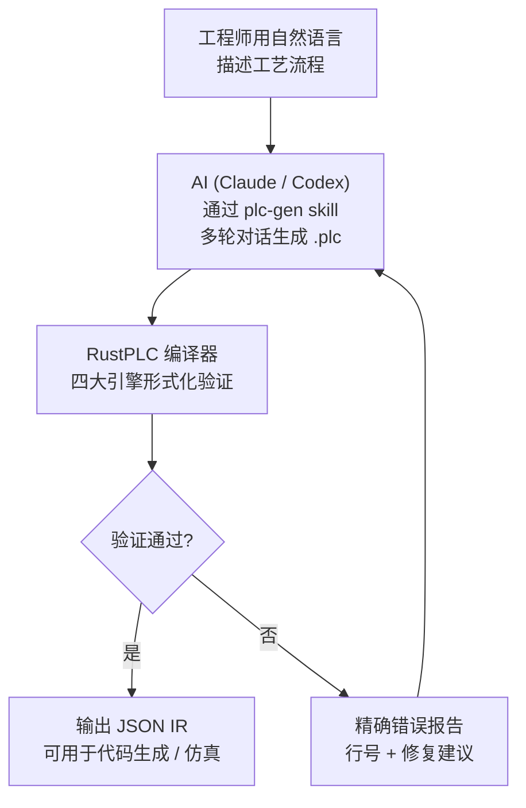
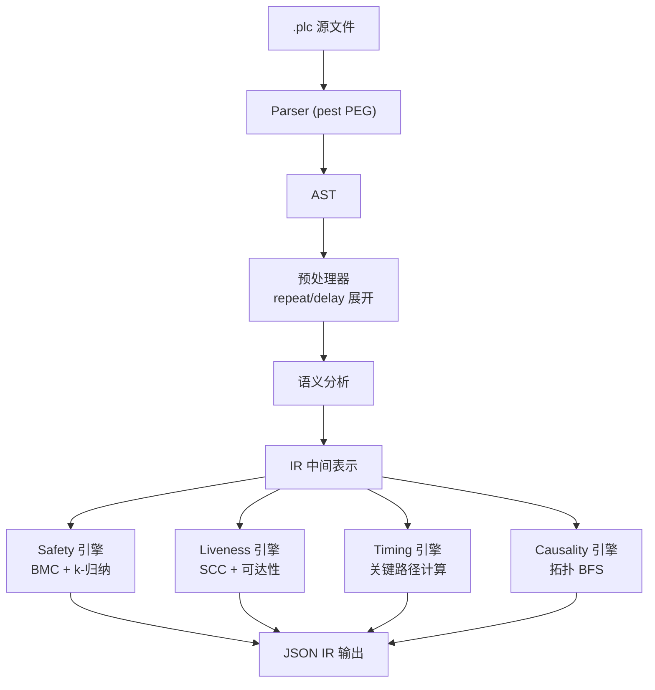
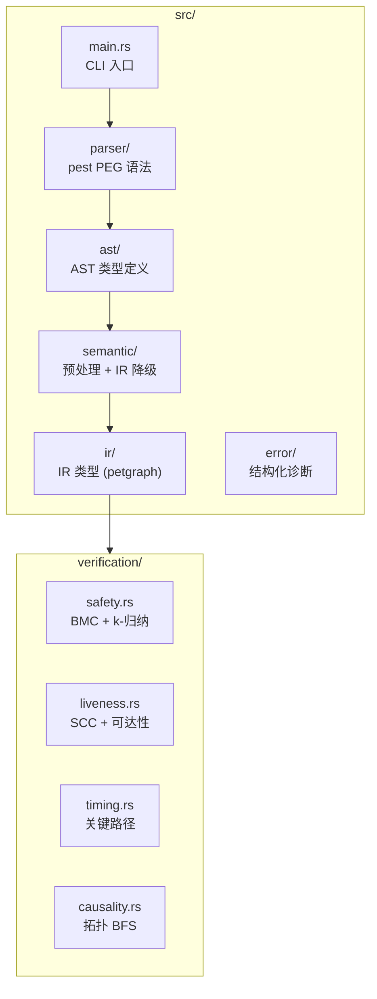

<p align="center">
  <h1 align="center">RustPLC</h1>
  <p align="center">
    <strong>形式化验证的工业控制编译器</strong><br>
    不写程序控制设备 —— 声明物理事实与意图，让编译器证明它是安全的。
  </p>
  <p align="center">
    <a href="README_EN.md">English</a> | <strong>中文</strong>
  </p>
</p>

---

## 30 秒了解 RustPLC



**传统方式**：工程师手写梯形图 → 人工审查安全性 → 现场调试发现碰撞/死锁/超时

**RustPLC 方式**：工程师描述工艺 → AI 生成声明式 DSL → 编译器数学证明安全性 → 问题在编译期全部暴露

## 快速开始

```bash
git clone https://github.com/xxrust/RustPLC.git
cd RustPLC
cargo build --release
```

### 方式一：AI 对话生成（推荐）

在 Claude Code 或 Codex 中，项目内置了 `plc-gen` skill。你只需用自然语言描述工艺流程，AI 会通过四个阶段的多轮对话，帮你生成经过验证的 `.plc` 文件。

下面是一个真实的对话示例 —— 自动装配工位：

---

**你**：

> 帮我写个plc程序。我有一个装配工位：左右两条传送带各送一个工件到位，到位后停传送带。然后左右各有一个推料缸把工件推到中间装配位，两个都推到位后，压装缸下压完成装配，压完缩回。然后两个推料缸缩回，最后出料缸把成品推出去再缩回。压装的时候两个推料缸必须保持伸出，出料的时候压装缸必须已经缩回。

**AI（阶段一 · 理解工艺）**：

> 我整理一下动作序列：
> 1. 左右传送带同时启动，分别等待到位传感器
> 2. 停传送带 → 左推料缸伸出 → 右推料缸伸出
> 3. 压装缸下压（此时左右推缸必须保持伸出）→ 压装缸缩回
> 4. 左右推料缸缩回 → 出料缸伸出（压装缸必须已缩回）→ 出料缸缩回
>
> 确认几个问题：启动方式是按钮吗？循环模式是单次还是自动？

**你**：按钮启动，单次循环，完成后等待再次启动。

**AI（阶段二 · 推理设备拓扑与连接链路）**：

> 根据工艺流程，我推理出完整的设备拓扑。工业控制中信号沿固定链路流动：**PLC 输出口 → 电磁阀 → 执行器（气缸/电机）→ 传感器 → PLC 输入口**。每个执行器都需要声明这条完整链路，编译器据此验证因果可达性和时序。
>
> ```
> 左传送带链路:  Y0 → motor_left → sensor_left_arrive → X0
> 右传送带链路:  Y1 → motor_right → sensor_right_arrive → X1
> 左推料缸链路:  Y2 → valve_push_L → cyl_push_L → sensor_push_L_ext → X2
>                                                  → sensor_push_L_ret → X3
> 右推料缸链路:  Y3 → valve_push_R → cyl_push_R → sensor_push_R_ext → X4
>                                                  → sensor_push_R_ret → X5
> 压装缸链路:    Y4 → valve_press → cyl_press → sensor_press_ext → X6
>                                               → sensor_press_ret → X7
> 出料缸链路:    Y5 → valve_eject → cyl_eject → sensor_eject_ext → X8
>                                               → sensor_eject_ret → X9
> 启动按钮:      start_button → X10
> ```
>
> 安全约束：
> - `cyl_press.extended requires cyl_push_L.extended` — 压装时左推缸必须保持
> - `cyl_press.extended requires cyl_push_R.extended` — 压装时右推缸必须保持
> - `cyl_eject.extended conflicts_with cyl_press.extended` — 出料和压装互斥

**AI（阶段四 · 生成并验证）**：

AI 将拓扑、约束、控制逻辑组装成 `.plc` 文件后自动运行编译器：

```bash
$ cargo run --release -- examples/assembly_station.plc
```

```
验证通过：
  - Safety: 完备证明（深度 14）— requires/conflicts_with 全部满足
  - Liveness: 通过 — 无死锁风险
  - Timing: 通过
  - Causality: 通过 — 所有信号链路连通
```

生成的 `.plc` 文件（节选关键部分）：

```plc
[topology]

# PLC I/O 端口
device Y0: digital_output
device Y1: digital_output
device Y2: digital_output
device Y3: digital_output
device Y4: digital_output
device Y5: digital_output
device X0: digital_input
...
device X10: digital_input

# 左传送带链路: Y0 → motor_left → sensor_left_arrive → X0
device motor_left: motor { connected_to: Y0, rated_speed: 30rpm, ramp_time: 50ms }
device sensor_left_arrive: sensor { connected_to: X0, detects: motor_left.position_A }

# 左推料缸链路: Y2 → valve_push_L → cyl_push_L → sensor_push_L_ext/ret
device valve_push_L: solenoid_valve { connected_to: Y2, response_time: 20ms }
device cyl_push_L: cylinder { connected_to: valve_push_L, stroke_time: 500ms, retract_time: 500ms }
device sensor_push_L_ext: sensor { connected_to: X2, detects: cyl_push_L.extended }
device sensor_push_L_ret: sensor { connected_to: X3, detects: cyl_push_L.retracted }

# ... 其余链路类推

[constraints]

safety: cyl_press.extended requires cyl_push_L.extended
    reason: "压装时左推缸必须保持伸出"
safety: cyl_press.extended requires cyl_push_R.extended
    reason: "压装时右推缸必须保持伸出"
safety: cyl_eject.extended conflicts_with cyl_press.extended
    reason: "出料缸伸出时压装缸必须缩回"

causality: Y2 -> valve_push_L -> cyl_push_L -> sensor_push_L_ext
causality: Y4 -> valve_press -> cyl_press -> sensor_press_ext
# ... 其余因果链类推

[tasks]

task cycle:
    step start_left:
        action: set motor_left on
    step start_right:
        action: set motor_right on
    step wait_left_arrive:
        wait: sensor_left_arrive == true
        timeout: 5000ms -> goto fault_handler
    step wait_right_arrive:
        wait: sensor_right_arrive == true
        timeout: 5000ms -> goto fault_handler
    step stop_left:
        action: set motor_left off
    step stop_right:
        action: set motor_right off
    step push_left:
        action: extend cyl_push_L
        wait: sensor_push_L_ext == true
        timeout: 800ms -> goto fault_handler
    step push_right:
        action: extend cyl_push_R
        wait: sensor_push_R_ext == true
        timeout: 800ms -> goto fault_handler
    step press_down:
        action: extend cyl_press
        wait: sensor_press_ext == true
        timeout: 500ms -> goto fault_handler
    step press_up:
        action: retract cyl_press
        wait: sensor_press_ret == true
        timeout: 500ms -> goto fault_handler
    step retract_left:
        action: retract cyl_push_L
        wait: sensor_push_L_ret == true
        timeout: 800ms -> goto fault_handler
    step retract_right:
        action: retract cyl_push_R
        wait: sensor_push_R_ret == true
        timeout: 800ms -> goto fault_handler
    step eject_out:
        action: extend cyl_eject
        wait: sensor_eject_ext == true
        timeout: 500ms -> goto fault_handler
    step eject_back:
        action: retract cyl_eject
        wait: sensor_eject_ret == true
        timeout: 500ms -> goto fault_handler
    on_complete: goto ready

task fault_handler:
    step safe_retract:
        action: retract cyl_press
        action: retract cyl_push_L
        action: retract cyl_push_R
        action: retract cyl_eject
    step safe_stop:
        action: set motor_left off
        action: set motor_right off
    step alarm:
        action: log "装配工位故障：动作超时，请人工确认设备状态"
    on_complete: goto ready

task ready:
    step wait_start:
        wait: start_button == true
        allow_indefinite_wait: true
    on_complete: goto cycle
```

完整文件见 [`examples/assembly_station.plc`](examples/assembly_station.plc)。

---

### 方式二：手写 DSL

如果你熟悉 DSL 语法，也可以直接编写 `.plc` 文件：

```bash
cargo run --release -- your_file.plc
```

验证通过后，编译器输出完整的 IR（JSON 格式到 stdout），包含拓扑图、状态机、约束集、时序模型和验证摘要。

## 为什么需要 RustPLC

传统 PLC 编程（梯形图 / ST / FBD）依赖工程师的经验来保证安全性。当系统复杂度上升，人工审查的可靠性急剧下降——气缸碰撞、死锁、超时这些问题往往在现场调试时才暴露。

RustPLC 换了一种思路：

- 用声明式 DSL 描述物理拓扑、控制逻辑和安全约束
- 编译期自动执行形式化验证，在代码运行之前证明安全性
- 错误信息精确到行号，附带修复建议

**安全不靠测试覆盖率，靠数学证明。**

## DSL 语言参考

一个 `.plc` 文件由三个段组成，对应工业控制的三个层面：

### [topology] — 声明物理世界

拓扑段描述设备及其连接关系。工业控制中信号沿固定链路流动：

```
PLC 输出口 (digital_output)
    ↓ connected_to
电磁阀 (solenoid_valve)        ← response_time: 阀芯响应时间
    ↓ connected_to
执行器 (cylinder / motor)       ← stroke_time / ramp_time: 动作时间
    ↓ detects
传感器 (sensor)                 ← detects: 检测哪个设备的哪个状态
    ↓ connected_to
PLC 输入口 (digital_input)
```

编译器沿这条链路做三件事：
1. **因果验证** — BFS 检查 `action: extend cyl_A` 的信号能否传播到 `wait: sensor_A_ext == true`
2. **时序计算** — 累加 `response_time` + `stroke_time` 得到动作最小执行时间
3. **安全检查** — `cyl_A.extended` 等状态的语义由设备类型决定

支持的设备类型：

| 类型 | 用途 | 关键属性 | 默认状态 |
|------|------|----------|----------|
| `digital_output` | PLC 输出口 Y0, Y1... | — | on / off |
| `digital_input` | PLC 输入口 X0, X1... | `debounce` | on / off |
| `solenoid_valve` | 电磁阀 | `connected_to`, `response_time` | on / off |
| `cylinder` | 气缸 | `connected_to`, `stroke_time`, `retract_time` | extended / retracted |
| `motor` | 电机 | `connected_to`, `rated_speed`, `ramp_time` | on / off |
| `sensor` | 传感器 | `connected_to`, `detects` | on / off |
| `analog_input` | 模拟量输入 AI0, AI1... | `range`, `unit` | —（连续值域） |
| `analog_output` | 模拟量输出 AO0, AO1... | `range`, `ramp_time`, `unit` | —（连续值域） |

任何设备都可通过 `states: [...]` 自定义状态集（如三位阀 `states: [extend, neutral, retract]`）。

### [constraints] — 声明安全红线

```plc
# 互斥：两个状态不能同时为真
safety: cyl_A.extended conflicts_with cyl_B.extended

# 依赖：状态 A 为真时，状态 B 必须也为真
safety: cyl_press.extended requires cyl_clamp.extended

# 模拟量阈值约束：支持 >, <, >=, <= 比较
safety: pressure_sensor > 80 conflicts_with heater.on
    reason: "超压时禁止加热"

# 时序
timing: task.cycle must_complete_within 8000ms
timing: task.cycle must_complete_within_worst_case 12000ms
timing: task.cycle must_start_after 100ms

# 因果链（显式声明，编译器也会从拓扑自动推断）
causality: Y0 -> valve_A -> cyl_A -> sensor_A_ext
```

### [tasks] — 声明控制逻辑

控制逻辑以状态机表达，每个 `step` 内可用的语句：

| 语句 | 作用 |
|------|------|
| `action: extend / retract / set / set_analog / log` | 驱动执行器或记录日志 |
| `wait: ... == / > / < / >= / <= true` | 等待条件满足（支持 AND / OR，不可混用） |
| `delay: Nms` | 固定延时，纳入时序验证 |
| `timeout: Nms -> goto ...` | 超时保护跳转 |
| `if: ... goto ... else: goto ...` | 条件分支 |
| `goto task` / `goto task.step` | 跳转到指定 task 或 step |
| `repeat N: ...` | 编译期展开为 N 份顺序步骤（2~100） |
| `parallel: branch_A: ... branch_B: ...` | 并行分支，全部完成后继续 |
| `race: branch_A: ... then: goto ...` | 竞争分支，先完成者决定跳转 |
| `allow_indefinite_wait: true` | 人工操作等待豁免（跳过 liveness 检查） |

语句用法速查：

```plc
# 基本动作
action: extend cyl_A              # 气缸伸出
action: retract cyl_A             # 气缸缩回
action: set motor on              # 电机启动
action: set_analog AO0 7.5        # 模拟量输出（如比例阀开度）
action: log "message"             # 日志

# 等待
wait: sensor_A == true                                  # 单条件
wait: sensor_A == true AND sensor_B == true             # AND（不可与 OR 混用）
wait: sensor_A == true OR sensor_B == true              # OR

# 延时与超时
delay: 2000ms                                           # 固定延时
timeout: 500ms -> goto fault_handler                    # 超时保护

# 分支
if: mode == true goto task_A else: goto task_B          # 条件分支
goto fault_handler.alarm                                # 跳转到 task.step

# 循环
repeat 3:                                               # 编译期展开为 3 份
    action: extend cyl_glue
    wait: sensor_glue_ext == true
    timeout: 400ms -> goto fault_handler

# 并行（全部完成后继续）
parallel:
    branch_A:
        action: extend cyl_A
    branch_B:
        action: extend cyl_B

# 竞争（先完成的分支决定跳转）
race:
    sensor_path:
        wait: sensor_pos == true
        then: goto normal_stop
    timeout_path:
        delay: 5000ms
        then: goto emergency_stop

# 人工等待豁免
allow_indefinite_wait: true
```

## 编译流水线



## 四大验证引擎

| 引擎 | 检查内容 | 方法 |
|------|---------|------|
| **Safety** | 状态互斥（`conflicts_with`）、前置依赖（`requires`） | 有界模型检查 + k-归纳 |
| **Liveness** | 死锁 / 活锁（无超时的 wait、零出度状态） | SCC 分析 + 可达性检查 |
| **Timing** | 时序包络（`must_complete_within` / `worst_case` / `must_start_after`） | 最坏关键路径计算 |
| **Causality** | 因果链完整性（信号能否沿 connected_to + detects 链路传播） | 拓扑图 BFS |

四个引擎并行运行，一次编译暴露所有问题。验证失败时，错误信息精确定位问题并给出建议：

```
ERROR [safety] 安全约束违反
  位置: task cycle.step together
  原因: cyl_A.extended 与 cyl_B.extended 在并行分支中同时成立
  建议: 将冲突动作改为顺序执行

ERROR [liveness] 潜在死锁
  位置: task main.step_wait
  原因: wait 条件缺少 timeout 分支
  建议: 请添加 timeout: <时长> -> goto <恢复 task>

ERROR [timing] 时序超限
  位置: task main
  约束: must_complete_within 50ms
  实际最坏路径: 220ms（response_time 20ms + stroke_time 200ms = 220ms）
  建议: 请增大约束值或优化动作时序

ERROR [causality] 因果链断裂
  声明链路: Y0 -> valve_A -> cyl_B -> sensor_B_ext
  断裂位置: valve_A -> cyl_B（cyl_B 未声明 connected_to: valve_A）
  建议: 请检查 cyl_B 的 connected_to 配置
```

### 数学基础

RustPLC 的验证不是"跑测试碰运气"，而是基于成熟的形式化方法，在有限状态空间上给出数学证明。

**Safety — 有界模型检查（BMC）+ k-归纳**

将控制逻辑建模为有限状态转换系统 `M = (S, S₀, T, L)`，其中 S 是状态集合（控制位置 × 设备状态向量），T 是转换关系。对于安全性质 P（如 `¬(cyl_A.extended ∧ cyl_B.extended)`），BMC 从初始状态 S₀ 出发做 BFS，在深度 k 内穷举所有可达状态，检查是否存在反例。搜索深度 k 由 Kosaraju SCC 分析自动确定：`k = max(|SCC|) + 1`，确保每个强连通分量内的循环至少被完整遍历一次。若深度 k 内穷尽所有可达状态且无反例，则获得完备证明（等价于 k-归纳的归纳步成立）。

**Liveness — Tarjan SCC + 可达性分析**

死锁检测基于图论：在状态机转换图上运行 Tarjan 强连通分量算法，识别所有 SCC。若某个 SCC 内的所有 wait 边都缺少 timeout 且未标记 `allow_indefinite_wait`，则该 SCC 构成潜在活锁。零出度状态（无后继转换且无 `on_complete`）构成死锁。这是对 CTL 性质 `AG(EF done)` 的保守近似检查。

**Timing — 最坏关键路径**

将每个 step 的执行时间建模为加权 DAG，权重来自拓扑链路上的设备物理参数（沿 `connected_to` 累加 `response_time` + `stroke_time`）和显式 `delay`。通过 DAG 最长路径算法计算最坏执行时间，与 `must_complete_within` 约束比较。`must_complete_within_worst_case` 变体将 timeout 上界也纳入路径权重。parallel 分支取各分支最大值。

**Causality — 拓扑图 BFS 可达性**

设备连接关系构成有向图 G = (V, E)，其中 `connected_to` 和 `detects` 定义边。对于声明的因果链 `Y0 → valve → cyl → sensor`，编译器在 G 上做 BFS 验证每一跳的可达性。这保证了物理信号能从 PLC 输出口沿实际接线传播到传感器，任何链路断裂都会在编译期被捕获。

## 示例文件

`examples/` 目录包含多个已验证的示例：

| 文件 | 场景 | 涉及特性 |
|------|------|----------|
| `two_cylinder.plc` | 双缸顺序动作 | conflicts_with、基础顺序 |
| `half_rotation.plc` | 电机半圈旋转 | race、多 task 跳转 |
| `assembly_station.plc` | 双传送带装配工位 | requires vs conflicts_with、motor + cylinder |
| `stamp_bend_line.plc` | 冲压折弯产线 | 多工位 task 链、大量约束 |
| `glue_station.plc` | 涂胶站 | repeat 循环展开 |
| `drill_station.plc` | 钻孔站 | motor + cylinder 混合 |
| `grind_station.plc` | 打磨站 | race 模式选择、delay |
| `delay_demo.plc` | delay 演示 | 固定延时 |
| `repeat_demo.plc` | repeat 演示 | 循环展开 |
| `and_or_wait_demo.plc` | AND/OR 演示 | 组合等待条件 |
| `if_else_demo.plc` | if/else 演示 | 条件分支 |
| `custom_states_demo.plc` | 自定义状态演示 | 三位阀 |
| `analog_pressure_demo.plc` | 液压站比例阀压力控制 | analog_input/output、set_analog、阈值比较 |

## 项目结构



## 测试

```bash
cargo test    # 131 个测试（69 单元 + 14 集成 + 31 压力/覆盖 + 1 fixture + 6 端到端 + 10 验证能力）
```

### 可选：启用 Z3 求解器

```bash
cargo build --release --features z3-solver
```

启用后 Safety 引擎将使用 Z3 SMT 求解器进行更强的互斥性证明。

## 技术栈

- **Rust 2024 Edition** — 内存安全，零成本抽象
- **pest** — PEG 解析器生成器
- **petgraph** — 图数据结构（拓扑图 + 状态机）
- **Z3**（可选）— SMT 求解器

## 路线图

- [x] DSL 设计与解析器
- [x] 四大形式化验证引擎（Safety / Liveness / Timing / Causality）
- [x] 结构化错误报告（行号 + 修复建议）
- [x] DSL v2：delay / repeat / wait AND|OR / if-else / goto task.step / 自定义状态
- [x] AI 辅助生成（plc-gen skill）
- [x] 模拟量 I/O（analog_input / analog_output / set_analog / 阈值比较）
- [ ] 代码生成 → 确定性 Rust 执行内核
- [ ] 硬件抽象层（EtherCAT / Modbus / GPIO）
- [ ] PID 控制
- [ ] 多控制器协同
- [ ] 图形化 DSL 编辑器

## License

MIT

---

<p align="center">
  <sub>用 Rust 写的，所以它不会 panic。好吧，至少不会在生产线上。</sub>
</p>
