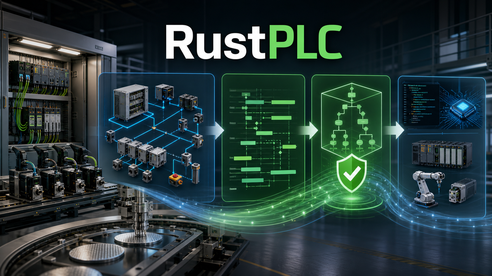
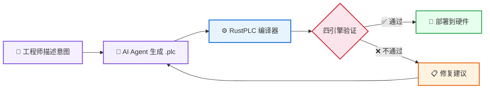
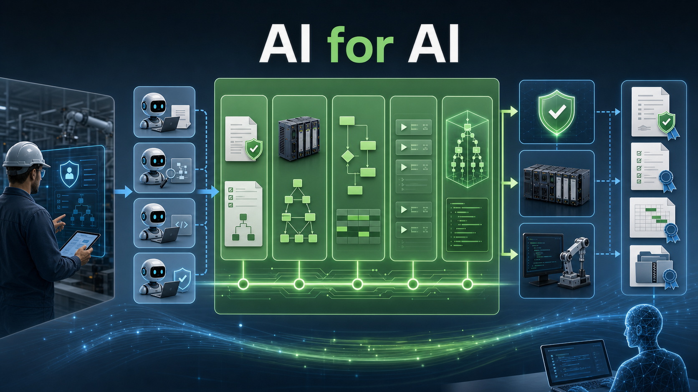
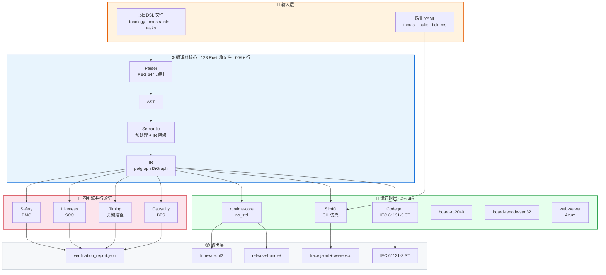

<p align="center">
  
</p>

<p align="center">
  <strong>让 AI Agent 设计工控程序，编译器数学证明正确性</strong>
</p>

<p align="center">
  
  
  
  
  
</p>

<p align="center">
  <a href="README_EN.md">English</a> | <strong>中文</strong>
</p>

<p align="center">
  <a href="#30-秒理解-rustplc">30 秒理解</a> •
  <a href="#为什么需要-rustplc">为什么需要</a> •
  <a href="#标准项目分层">项目分层</a> •
  <a href="#快速开始">快速开始</a> •
  <a href="#核心能力">核心能力</a> •
  <a href="#ai-for-ai-方向">AI for AI</a> •
  <a href="#文档">文档</a>
</p>

---

## 30 秒理解 RustPLC



传统方式：工程师手写梯形图 → 人工安全审查 → 碰撞/死锁/超时在调试现场才发现

RustPLC：工程师描述工艺 → AI 生成声明式 DSL → 编译器数学证明安全性 → 所有问题在编译期捕获

**一句话：RustPLC 是工控领域的 "Rust 编译器" — 如果它编译通过，它就是安全的。**

---

## 为什么需要 RustPLC

工业控制软件有一个根本矛盾：

> 控制逻辑越复杂，人工审查越不可靠；但越是复杂系统，安全性要求越高。

现有工具链（梯形图、ST、FBD）本质上是 **"写完再查"** — 先实现逻辑，再靠人工 review 和现场调试发现问题。这在简单场景够用，但面对并发控制、多轴联动、安全联锁时，人脑已经跟不上状态空间的爆炸。

RustPLC 的回答是 **"写时即证"**：

<p align="center">
  
</p>

最后一行是关键：当 AI Agent 能生成工控程序时，**谁来保证 AI 生成的代码是安全的？** RustPLC 就是这个保证。

---

## 标准项目分层

RustPLC 的标准项目不是把所有控制逻辑塞进一个 `main.plc`。复杂设备必须按语义层组织，让拓扑、工艺调度、PLC 程序流、故障、人机入口各自有明确边界：

```text
plc/main.system.md
    |
    v
00_topology/
    设备、连接、工件位置、容量、资源边界
    |
    v
process_model/process_operation_model.toml
    可调度工艺操作：source available / destination capacity / shared resource / predecessor
    |
    v
01_init/
    初始化基线、默认值、安全初态
    |
    v
02_process/
    自动生产任务：PLC 怎样执行 process_model 中允许的候选操作
    |
    v
03_constraints/
    安全、互斥、节拍、因果约束
    |
    v
04_faults/
    故障路径、报警映射、恢复与收敛
    |
    v
05_supervision/  06_manual/  07_hmi/
    运行入口层：supervisor / 手动维护 / HMI 展示与交互
    |
    v
rustplc.bundle.toml -> IR -> verification / runtime bridge / codegen
```

`supervisor` 不是生产工艺设备，也不是 `02_process/` 里的普通生产步骤。它负责 operator front-door、自动循环锁存、启动/停止、模式仲裁和安全回退。`05_supervision/`、`06_manual/`、`07_hmi/` 默认禁用时，不表示主流程没写完，而是表示这些运行入口层在当前交付中暂未启用。

这层设计的核心原因是：拓扑只能证明物理连接和资源边界，不能直接推出最合适的程序流。`process_model` 是拓扑和 task/step 之间缺失的调度意图层，`process-model-check` 再验证 task/step 是否 refine 这份源侧模型。

---

## 快速开始

```bash
git clone https://github.com/xxrust/RustPLC.git
cd RustPLC
cargo build --release
```

### 编译并验证

```bash
cargo run --release -- examples/dual_axis_platform.plc --no-print-ir
```

```
Verification passed:
  - Safety: Complete proof (depth 4) — conflicts_with satisfied
  - Liveness: Passed — no deadlock risk
  - Timing: Passed — task.cycle within 8000ms budget
  - Causality: Passed — all signal chains connected
```

四个验证引擎并行运行，数学证明你的程序没有碰撞、死锁、超时和断链。

### 生成 IEC 61131-3 ST 代码

```bash
cargo run --release -- gen-st examples/dual_axis_platform.plc --out out/dual_axis.st
```

验证通过的 IR 直接生成标准 ST 代码，可导入 OpenPLC / CODESYS。

### 场景仿真

```bash
# 生成场景骨架
cargo run --release -- scenario-init examples/project_scaffold_demo/plc/main.plc \
  --out scenarios/normal.yaml --preset normal

# SIL 仿真
cargo run --release -- sim-plc examples/project_scaffold_demo/plc/main.plc \
  --scenario scenarios/normal.yaml --out trace.jsonl
```

### 部署到 RP2040

```bash
cargo run --release -- build-rp2040 examples/rp2040_motion_minimal.plc \
  --out out/rp2040 --io-map examples/rp2040_motion_minimal.io_map.toml --emit-uf2 out/firmware.uf2
```

### 创建新项目

```bash
cargo run --release -- new my_plc_project --layout structured-fragments
```

```
my_plc_project/
├── rustplc.project.toml
├── plc/main.system.md
├── 00_topology/
├── process_model/
│   └── process_operation_model.toml
├── 01_init/
├── 02_process/
├── 03_constraints/
├── 04_faults/
├── 05_supervision/
├── 06_manual/
├── 07_hmi/
├── rustplc.bundle.toml
├── scenarios/
│   ├── nominal/
│   └── faults/
└── out/
```

---

## DSL 一览

RustPLC 的 DSL 不是另一种编程语言 — 它是工控意图的声明式描述。工程师（或 AI）声明 **"有什么设备、什么约束、要做什么"**，编译器负责证明这些声明是否自洽。

```plc
[topology]
device plc_main: plc {
    purpose: "控制器本体",
    model_ref: openplc_softplc
}
device valve_A: solenoid_valve {
    purpose: "气缸 A 驱动电磁阀",
    response_time: 20ms
}
device cyl_A: cylinder {
    purpose: "工位 A 气缸",
    stroke_time: 300ms
}
device sensor_A_ext: sensor { purpose: "气缸 A 伸出到位反馈" }
device sensor_A_ret: sensor { purpose: "气缸 A 缩回到位反馈" }

relation { from: plc_main.Y0, to: valve_A.coil, via: driven_by }
relation { from: valve_A.out, to: cyl_A.cmd, via: driven_by }
relation { from: cyl_A.extended, to: sensor_A_ext.sense, via: detects }
relation { from: sensor_A_ext.out, to: plc_main.X0, via: reports_to }
relation { from: cyl_A.retracted, to: sensor_A_ret.sense, via: detects }
relation { from: sensor_A_ret.out, to: plc_main.X1, via: reports_to }

[constraints]
timing: task.cycle must_complete_within 2000ms
causality: Y0 -> valve_A -> cyl_A -> sensor_A_ext
causality: Y0 -> valve_A -> cyl_A -> sensor_A_ret

[tasks]
task cycle:
    step extend:
        action: extend cyl_A
            timeout: 500ms -> goto fault.timeout
            on_motion_fault -> fault.motion_fault
            on_safety_fault -> fault.safety_fault
    on_complete: goto ready

task fault:
    step timeout:
        action: log "气缸动作超时"
    step motion_fault:
        action: log "气缸反馈与目标动作不一致"
    step safety_fault:
        action: log "气缸反馈出现矛盾状态"
```

三个段落，三件事：

- **topology** — 有什么设备，怎么连接
- **constraints** — 什么不能发生，什么必须满足
- **tasks** — 按什么顺序做什么

编译器读取这三段，构建统一 IR，然后用四个引擎证明约束在所有可能的执行路径上都成立。

---

## 核心能力

### 四引擎形式化验证

编译器内置四个并行验证引擎，不是测试，是数学证明：

| 引擎 | 方法 | 证明什么 |
|------|------|---------|
| Safety | BMC + k-归纳 | `conflicts_with` / `requires` 在所有状态下成立 |
| Liveness | SCC + 可达性分析 | 无死锁、无活锁、所有路径可终止 |
| Timing | 关键路径分析 | `must_complete_within` 时间预算满足 |
| Causality | 拓扑 BFS | 信号链完整，无断链、无孤立设备 |

### 编译流水线

<p align="center">
  
</p>

### 多目标部署

| 目标 | 命令 | 输出 |
|------|------|------|
| 形式化验证 | `compile` | verification_report.json |
| ST 代码生成 | `gen-st` | IEC 61131-3 ST (OpenPLC/CODESYS) |
| RP2040 固件 | `build-rp2040` | UF2 固件 + io_map |
| STM32 仿真 | `build-renode-stm32` | ELF + Renode trace |
| SIL 仿真 | `sim-plc` | trace.jsonl + sim_report |
| 无板交付 | `no-board-gate` | diff_report + timing_report |
| 发布包 | `release-bundle` | SHA256 manifest + 全部证据 |

### 场景工程

```bash
scenario-init     # 生成场景骨架
scenario-validate # 校验场景合法性
scenario-expand   # 展开 pulse/hold 语法糖
scenario-gen      # 批量生成场景
sim-regress       # 批量回归仿真
```

故障注入、波形导出、KPI 回归（超调量 / 稳态误差 / 调节时间）、失败最小化 — 完整的仿真工程链。

### 实时门禁

```bash
# SIL vs 虚拟板对比 + 实时阈值检查
cargo run --release -- no-board-gate examples/project_scaffold_demo/plc/main.plc \
  --scenario scenarios/normal.yaml \
  --max-p99-exec-us 500 --max-overrun-count 0
```

tick 级时序采样，p50/p95/p99 统计，超限自动拦截。发布包包含 SHA256 manifest + git 元数据，可审计可追溯。

---

## AI for AI 方向

RustPLC 不只是 "AI 帮人写 PLC 程序"。更强的方向是成为 **AI for AI 工程平台**：一个 AI 生成控制语义，另一个 AI 能基于同一份结构化证据进行验证、批评、修复、优化或交付。

<p align="center">
  
</p>

这个方向成立的前提不是“循环修 bug”，而是五个工程契约：

1. 人类先定义设备边界、工艺边界、安全边界和交付边界
2. AI 生成的产物必须落到 `system contract -> topology -> process_model -> task/step`
3. `process_model` 先表达可调度工艺操作，task/step 只是它的可执行投影
4. verification、runtime bridge、codegen 必须同源消费 IR
5. verification report、trace、timing report、release bundle 必须可被另一个 AI 或工程师复现

差异化不是 "又一个生成器"，而是把 AI 输出收敛成 **可验证、可执行、可审计、可复现** 的工程证据链。

### MCP 集成

RustPLC 提供 MCP Server，AI Agent 可以直接调用编译器：

```json
{
  "mcpServers": {
    "rustplc": {
      "command": "python",
      "args": ["-m", "server"],
      "cwd": "rustplc-mcp"
    }
  }
}
```

Agent 可用的工具：
- `validate_plc` — 验证 .plc 文件
- `compile_plc` — 编译并获取 IR
- `get_rustplc_skill_guide` — 获取 DSL 编写指南

---

## 示例库

| 示例 | 特性 | 复杂度 |
|------|------|--------|
| `project_scaffold_demo/` | 最小项目结构、脚手架 | ★ |
| `rp2040_motion_minimal.plc` | 运动控制、板级 I/O 映射 | ★★ |
| `dual_axis_platform.plc` | 双轴联动、parallel、race、conflicts_with | ★★★ |
| `load_unload_concurrent_tasks.plc` | 多设备协调、parallel、requires | ★★★ |
| `nuclear_coolant_isolation.plc` | SIL3 核安全、冗余传感器、OR 容错 | ★★★★ |
| `three_station_assembly.plc` | 大规模拓扑、装配流程 | ★★★★ |
| `process_device_demo.plc` | 过程设备语义动作、runtime handler 边界 | ★★ |
| `recovery_templates/` | 急停恢复、故障分流 | ★★★ |
| `force_override_demo.plc` | 在线强制、调试语义 | ★★ |

---

## 系统架构

> 完整的编译流水线图见上方 [编译流水线](#编译流水线) 章节。下图是分层总览：



---

## 项目规模

| 指标 | 数值 |
|------|------|
| Rust 源文件 | 123 个 |
| 编译器代码 | 60,000+ 行 |
| PEG 语法规则 | 544 行 |
| 测试用例 | 868 个 |
| 示例 .plc 文件 | 32 个 |
| Workspace crate | 7 个 |
| 验证引擎 | 4 个 |
| CLI 子命令 | 20+ 个 |
| Wiki 文档 | 19 篇 |
| 架构文档 | 8 篇 |

---

## 文档

### 仓库内文档

| 文档 | 内容 |
|------|------|
| [`AGENTS.md`](AGENTS.md) | 项目总纲、分层原则、源码导航 |
| [`docs/architecture/signal-direction.md`](docs/architecture/signal-direction.md) | 并发 task / blocking step 语义（冻结） |
| [`docs/architecture/process-operation-layer.md`](docs/architecture/process-operation-layer.md) | 拓扑与 task/step 之间的工艺操作调度层 |
| [`docs/architecture/device-semantics-library.md`](docs/architecture/device-semantics-library.md) | 设备族语义抽象 |
| [`docs/architecture/intent_alignment_verification.md`](docs/architecture/intent_alignment_verification.md) | 意图合约验证 |

### 标准项目组织

标准项目分层是 README 的主模型，详见上文 [标准项目分层](#标准项目分层)。更完整的组织思想见 [`docs/wiki/Structured-Fragment-Project-Layout.md`](docs/wiki/Structured-Fragment-Project-Layout.md)。

### Wiki

| 页面 | 内容 |
|------|------|
| [AI for AI 平台愿景](docs/wiki/AI-for-AI-Platform-Vision.md) | AI Agent 工程平台方向 |
| [结构化项目布局](docs/wiki/Structured-Fragment-Project-Layout.md) | `00_topology` 到 `07_hmi` 的组织思想 |
| [PLC 优化管线](docs/wiki/PLC-Optimization-Pipeline.md) | 优化候选生成与排序 |
| [设备库](docs/wiki/Device-Library.md) | TOML 设备定义与约束 |
| [场景资产化](docs/wiki/Scenario-Assetization-Coverage-Feedback.md) | 场景工程与覆盖反馈 |
| [RP2040 运动控制](docs/wiki/RP2040-Motion-Minimal-Example.md) | 嵌入式部署示例 |
| [拓扑信号方向](docs/wiki/Topology-Signal-Direction-Refactor.md) | 端口级拓扑语义 |
| [步进电机安全建模](docs/wiki/Stepper-AB-Encoder-Safety-Modeling.md) | 运动控制安全 |
| [CI Runbook](docs/wiki/CI-Runbook.md) | CI/CD 流程 |
| [故障安全状态](docs/wiki/Fail-Safe-Safe-State.md) | 安全状态建模 |
| [开发者引导包](docs/wiki/Developer-Bootstrap-Pack.md) | 新人上手指南 |

### CLI 帮助

```bash
cargo run --release -- --help              # 命令索引
cargo run --release -- help <command>      # 单个命令详情
cargo run --release -- help compile        # 编译命令帮助
cargo run --release -- help sim-plc        # 仿真命令帮助
```

---

## 工程原则

- 语义必须先于实现
- IR 是唯一语义汇合点
- Verification 是主路径，不是插件
- Runtime 和 Codegen 只消费已闭合的 IR 语义
- 文档、示例、测试、skills 必须与编译器契约同步

---

## Roadmap

### 已完成

**编译器核心** — DSL 设计、四引擎验证、结构化错误报告、DSL v2 语法扩展、优化管线

**设备语义** — 气缸与轴动作语义、过程设备动作、station 协议契约

**仿真与测试** — SIL 仿真、场景工程（init/validate/expand/gen/regress）、KPI 回归

**部署与门禁** — ST 代码生成、RP2040 固件、Renode STM32 仿真、无板交付门禁、发布包

**拓扑与语义** — 端口级拓扑、多维标签、语义 diff、性能门禁、意图合约验证

### 进行中

- ⏳ 硬件抽象层（EtherCAT / Modbus / 更多 GPIO 板卡）
- ⏳ 多控制器协调
- ⏳ LSP 编辑器集成（语法高亮、补全、跳转定义）
- ⏳ Web IDE（在线编辑、验证、仿真）

---

## 许可

[MIT License](LICENSE)

---

<p align="center">
  <sub>用 Rust 写的，所以它不会 panic。至少不会在产线上。</sub>
</p>
