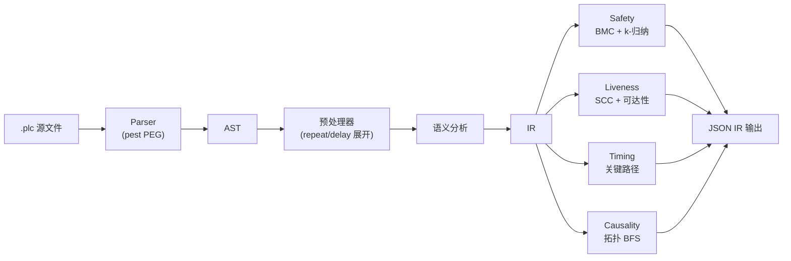
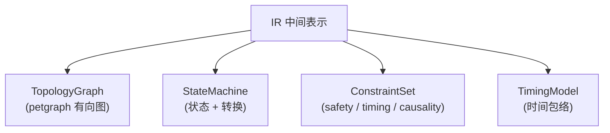
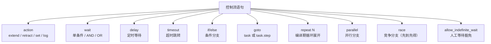
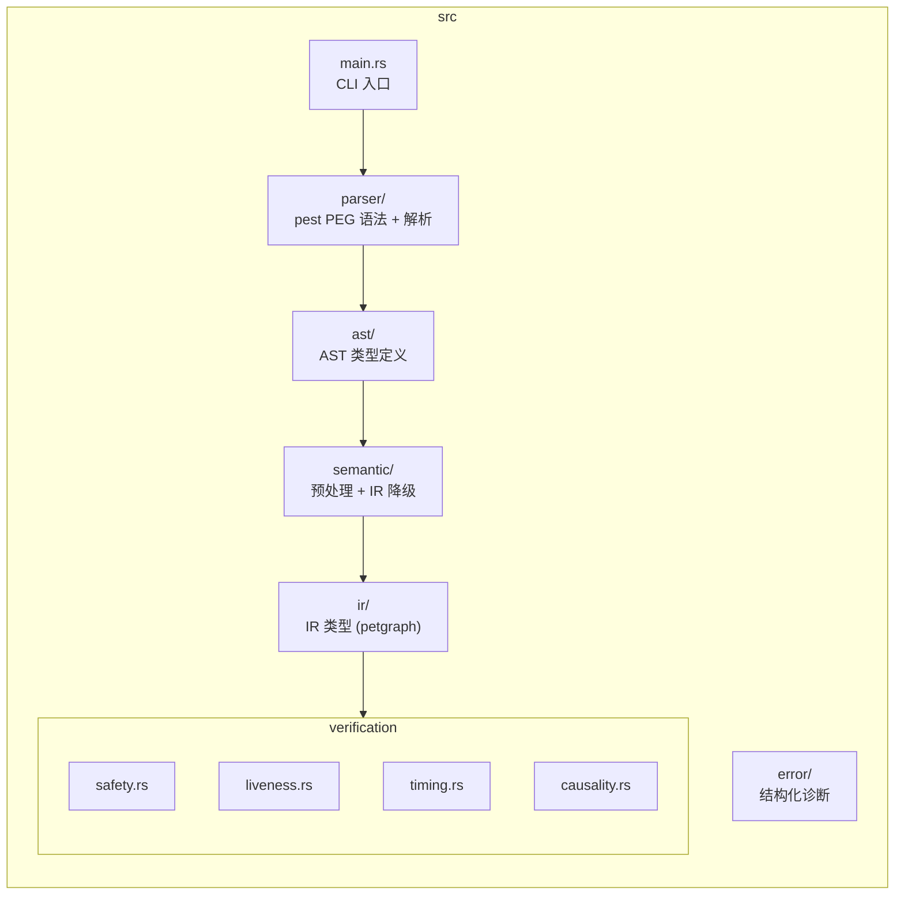

<p align="center">
  <h1 align="center">RustPLC</h1>
  <p align="center">
    <strong>形式化验证的工业控制编译器</strong><br>
    不写程序控制设备 —— 声明物理事实与意图，让编译器证明它是安全的。
  </p>
</p>

<p align="center">
  <a href="#快速开始">快速开始</a> ·
  <a href="#为什么需要-rustplc">为什么</a> ·
  <a href="#dsl-语言一览">DSL 语言</a> ·
  <a href="#四大验证引擎">验证引擎</a> ·
  <a href="#示例">示例</a> ·
  <a href="#编译流水线">架构</a>
</p>

---

## 为什么需要 RustPLC

传统 PLC 编程（梯形图 / ST / FBD）依赖工程师的经验来保证安全性。当系统复杂度上升，人工审查的可靠性急剧下降——气缸碰撞、死锁、超时这些问题往往在现场调试时才暴露。

RustPLC 换了一种思路：

- 用声明式 DSL 描述物理拓扑、控制逻辑和安全约束
- 编译期自动执行形式化验证，在代码运行之前证明安全性
- 错误信息精确到行号，附带修复建议

**安全不靠测试覆盖率，靠数学证明。**

## 编译流水线



IR 包含四个核心数据结构：



## 四大验证引擎

| 引擎 | 检查内容 | 方法 |
|------|---------|------|
| **Safety** | 状态互斥冲突（`conflicts_with`）、前置依赖（`requires`） | 有界模型检查 + k-归纳 |
| **Liveness** | 死锁 / 活锁（无超时的 wait、零出度状态） | SCC 分析 + 可达性检查 |
| **Timing** | 时序包络（`must_complete_within` / `must_complete_within_worst_case` / `must_start_after`） | 最坏关键路径计算 |
| **Causality** | 因果链完整性（信号能否从输出传递到传感器） | 拓扑图 BFS 最短路径 |

四个引擎并行运行，一次编译暴露所有问题。

```mermaid
flowchart TD
    subgraph Safety["Safety 引擎"]
        S1["枚举所有可达状态组合"] --> S2["检查 conflicts_with 互斥"]
        S1 --> S3["检查 requires 前置依赖"]
        S2 --> S4["BMC 深度 = SCC size + 1"]
        S3 --> S4
    end

    subgraph Liveness["Liveness 引擎"]
        L1["构建状态机转换图"] --> L2["Tarjan SCC 检测"]
        L2 --> L3["检查 SCC 内是否有\ntimeout / allow_indefinite_wait"]
        L1 --> L4["检查零出度状态\n(需 on_complete)"]
    end

    subgraph Timing["Timing 引擎"]
        T1["沿 connected_to 链\n累加 response_time"] --> T2["计算 action + delay 路径"]
        T2 --> T3["must_complete_within:\n仅 action/delay 时间"]
        T2 --> T4["must_complete_within_worst_case:\n含 timeout 上界"]
    end

    subgraph Causality["Causality 引擎"]
        C1["构建拓扑有向图"] --> C2["补充 detects 逻辑边"]
        C2 --> C3["BFS 验证声明链路\n每一跳可达"]
    end
```



## DSL 语言一览

一个 `.plc` 文件由三个段组成：

```plc
[topology]          # 声明物理设备与连接关系
[constraints]       # 声明安全、时序、因果约束
[tasks]             # 声明控制逻辑（状态机）
```

### 拓扑 —— 描述你的物理世界

```plc
[topology]

device Y0: digital_output
device valve_A: solenoid_valve {
    connected_to: Y0
    response_time: 20ms
}
device cyl_A: cylinder {
    connected_to: valve_A
    stroke_time: 300ms
    retract_time: 300ms
}
device sensor_A_ext: sensor {
    connected_to: X0
    detects: cyl_A.extended
}
```

支持的设备类型：`digital_output` / `digital_input` / `solenoid_valve` / `cylinder` / `motor` / `sensor`

设备可通过 `states` 属性自定义状态（如三位阀）：

```plc
device valve_3pos: solenoid_valve {
    states: [extend, neutral, retract]
}
```

### 约束 —— 声明安全红线

```plc
[constraints]

# 互斥约束：两个状态不能同时为真
safety: cyl_A.extended conflicts_with cyl_B.extended
    reason: "A缸和B缸不能同时伸出"

# 前置依赖：press 伸出前 clamp 必须已伸出
safety: cyl_press.extended requires cyl_clamp.extended
    reason: "压合前必须先夹紧"

# 时序约束
timing: task.init must_complete_within 5000ms
timing: task.init must_complete_within_worst_case 8000ms
timing: task.init must_start_after 100ms

# 因果链
causality: Y0 -> valve_A -> cyl_A -> sensor_A_ext
```

### 任务 —— 控制逻辑即状态机

```plc
[tasks]

task init:
    step extend_A:
        action: extend cyl_A
        wait: sensor_A_ext == true
        timeout: 500ms -> goto fault_handler
    step retract_A:
        action: retract cyl_A
        wait: sensor_A_ret == true
        timeout: 500ms -> goto fault_handler
    on_complete: goto ready
```

### 控制流语句

DSL 支持丰富的控制流原语：



#### delay —— 定时等待

在步骤间插入固定延时，编译器将其纳入时序验证：

```plc
step stabilize:
    delay: 2000ms
```

#### wait AND / OR —— 组合等待条件

等待多个传感器同时满足（AND）或任一满足（OR）：

```plc
# 两个传感器都到位才继续
wait: sensor_A_ext == true AND sensor_A_ext2 == true

# 任一传感器到位即继续
wait: sensor_A_ret == true OR sensor_A_ret2 == true
```

> AND/OR 不能混用，编译器会拒绝混合逻辑表达式。

#### if/else —— 条件分支

根据设备状态跳转到不同 task：

```plc
step decide:
    if: mode_switch == true goto process_A else: goto process_B
```

#### repeat N —— 编译期循环展开

重复执行一组动作 N 次，编译器在预处理阶段展开为 N 份顺序步骤：

```plc
step glue_cycle:
    repeat 3:
        action: extend cyl_glue
        wait: sensor_glue_ext == true
        timeout: 400ms -> goto fault_handler
        action: retract cyl_glue
        wait: sensor_glue_ret == true
        timeout: 400ms -> goto fault_handler
```

#### goto task.step —— 精确跳转

`goto` 支持跳转到指定 task 的指定 step：

```plc
goto fault_handler.alarm
```

#### parallel —— 并行分支

多个分支同时执行，全部完成后继续：

```plc
step concurrent:
    parallel:
        branch_A:
            action: extend cyl_A
            wait: sensor_A_ext == true
            timeout: 500ms -> goto fault
        branch_B:
            action: extend cyl_B
            wait: sensor_B_ext == true
            timeout: 500ms -> goto fault
```

#### race —— 竞争分支

多个分支同时执行，先完成的分支决定跳转目标：

```plc
step compete:
    race:
        sensor_path:
            wait: sensor_pos == true
            then: goto normal_stop
        timeout_path:
            delay: 5000ms
            then: goto emergency_stop
```

## 快速开始

```bash
# 克隆
git clone https://github.com/xxrust/RustPLC.git
cd RustPLC

# 编译
cargo build --release

# 验证一个 .plc 文件
cargo run --release -- examples/two_cylinder.plc
```

输出：

```
验证通过：
  - Safety: 完备证明（深度 8）
  - Liveness: 通过
  - Timing: 通过
  - Causality: 通过
```

验证通过后，编译器输出完整的 IR（JSON 格式），包含拓扑图、状态机、约束集、时序模型和验证摘要。

### 可选：启用 Z3 求解器

```bash
cargo build --release --features z3-solver
```

启用后 Safety 引擎将使用 Z3 SMT 求解器进行更强的互斥性证明。

## 示例

`examples/` 目录包含多个示例文件：

| 文件 | 场景 | 验证结果 |
|------|------|---------|
| `two_cylinder.plc` | 双缸顺序动作 + 安全互斥 | 全部通过 |
| `half_rotation.plc` | 电机半圈旋转 + race 竞争分支 | 全部通过 |
| `delay_demo.plc` | 输送带送料 + delay 定时等待 | 全部通过 |
| `repeat_demo.plc` | 涂胶站 + repeat 3 次循环展开 | 全部通过 |
| `and_or_wait_demo.plc` | 气缸动作 + wait AND/OR 组合条件 | 全部通过 |
| `if_else_demo.plc` | 模式选择 + if/else 条件分支 | 全部通过 |
| `custom_states_demo.plc` | 三位阀 + 自定义设备状态 | 全部通过 |
| `error_all_verifiers.plc` | 故意触发四个引擎全部报错 | 四项失败 |
| `error_missing_device.plc` | 引用未定义设备 | 语义错误 |

### 错误报告示例

当验证失败时，错误信息精确定位问题并给出建议：

```
ERROR [liveness] 潜在死锁
  位置: task main.step_wait
  原因: wait 条件缺少 timeout 分支
  建议: 请添加 timeout: <时长> -> goto <恢复 task>

ERROR [timing] 时序超限
  位置: task main
  约束: must_complete_within 50ms
  实际最坏路径: 220ms
  建议: 请增大约束值或优化动作时序

ERROR [causality] 因果链断裂
  声明链路: Y0 -> valve_A -> cyl_B -> sensor_B_ext
  断裂位置: valve_A -> cyl_B
  建议: 请检查 cyl_B 的 connected_to 配置
```

## 项目结构



## 测试

```bash
# 运行全部 89 个测试（69 单元 + 13 集成 + 1 fixture + 6 端到端验证）
cargo test
```

测试覆盖：解析器、语义分析（含 repeat/delay 展开、AND/OR wait、if/else、自定义状态）、四个验证引擎的正向/反向用例，以及从单缸到双工位工业场景的端到端验证。

## 技术栈

- **Rust 2024 Edition** —— 内存安全，零成本抽象
- **pest** —— PEG 解析器生成器
- **petgraph** —— 图数据结构（拓扑图 + 状态机）
- **Z3**（可选）—— SMT 求解器，增强安全性证明

## 路线图

- [x] DSL 设计与解析器
- [x] AST → IR 语义分析
- [x] 四大形式化验证引擎
- [x] 结构化错误报告（行号 + 修复建议）
- [x] DSL v2：delay / repeat / wait AND|OR / if-else / goto task.step / 自定义设备状态
- [x] Safety `requires` 前置依赖检查
- [ ] 代码生成 → 确定性 Rust 执行内核
- [ ] 硬件抽象层（EtherCAT / Modbus / GPIO）
- [ ] 模拟量 I/O 与 PID 控制
- [ ] 多控制器协同
- [ ] 图形化 DSL 编辑器

## License

MIT

---

<p align="center">
  <sub>用 Rust 写的，所以它不会 panic。好吧，至少不会在生产线上。</sub>
</p>
