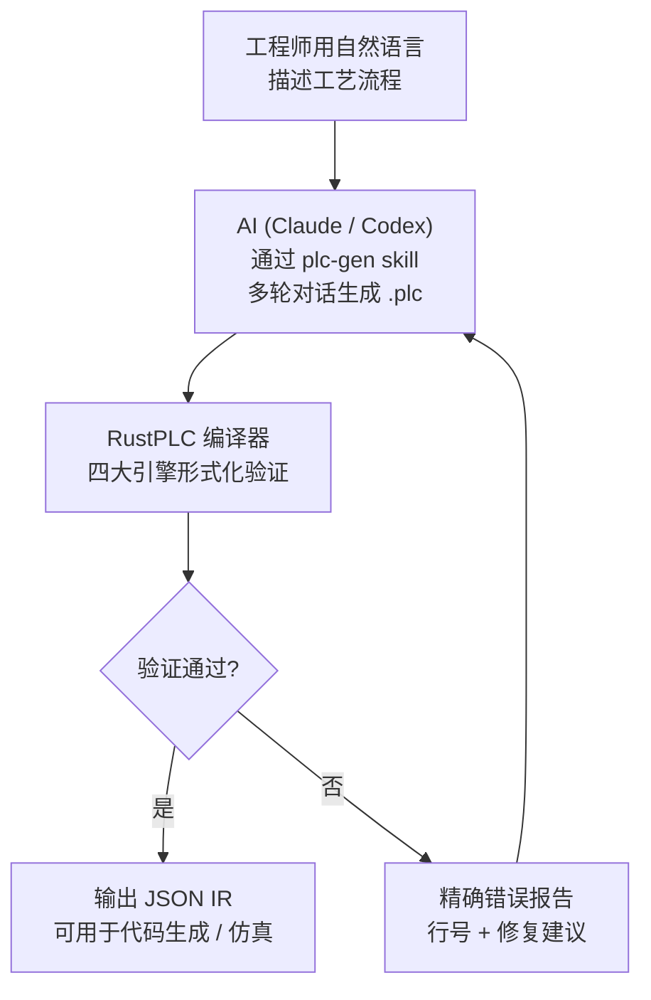
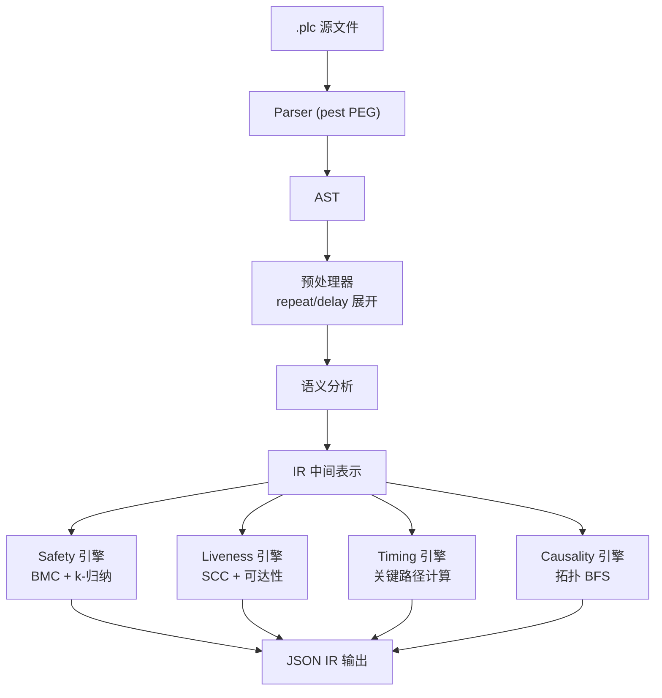
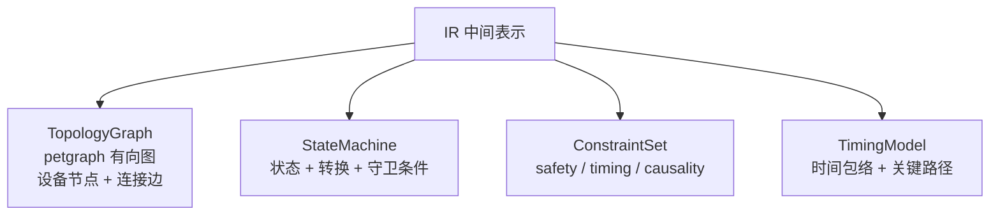
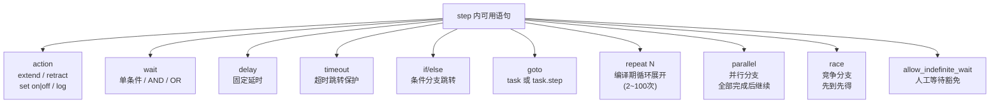
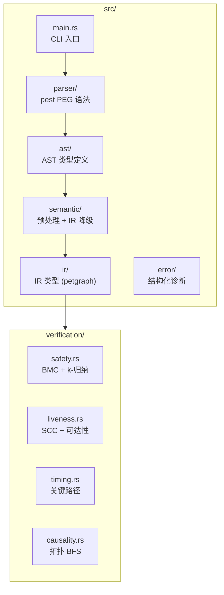
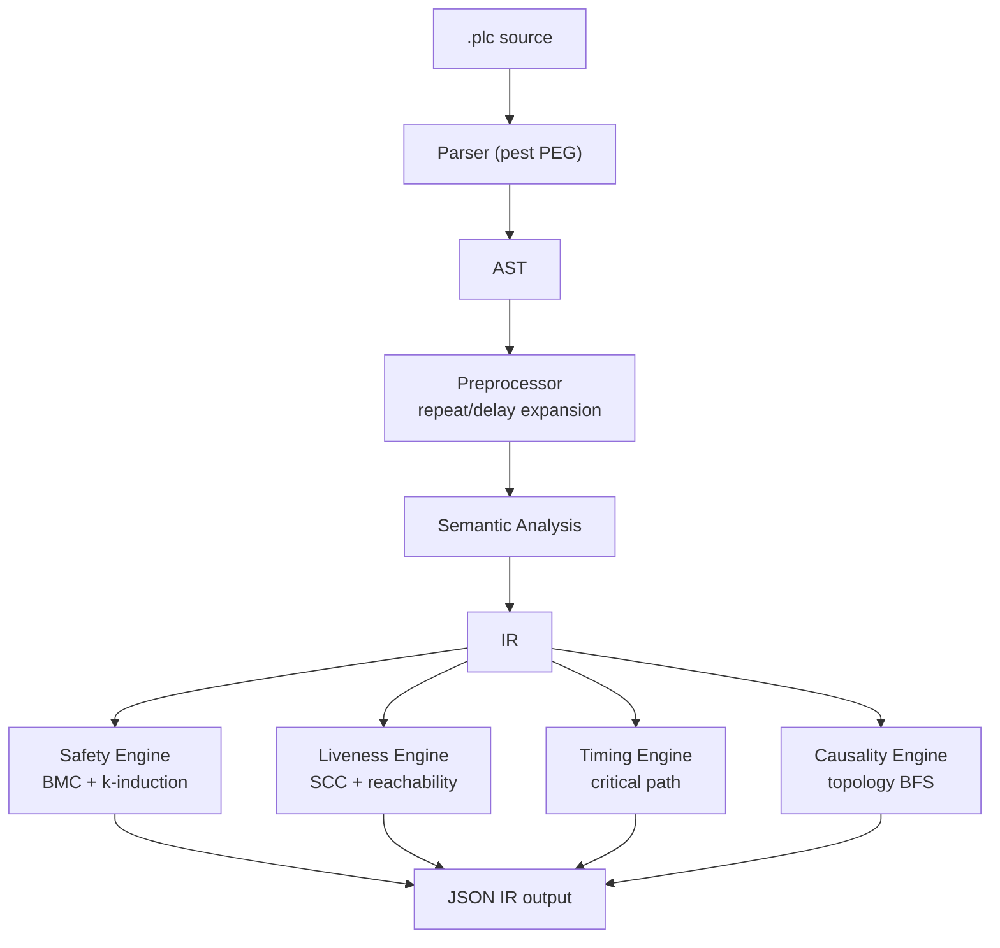

<p align="center">
  <h1 align="center">RustPLC</h1>
  <p align="center">
    <strong>形式化验证的工业控制编译器</strong><br>
    不写程序控制设备 —— 声明物理事实与意图，让编译器证明它是安全的。
  </p>
  <p align="center">
    <a href="#中文文档">中文</a> | <a href="#english-documentation">English</a>
  </p>
</p>

---

# 中文文档

## 30 秒了解 RustPLC



**传统方式**：工程师手写梯形图 → 人工审查安全性 → 现场调试发现碰撞/死锁/超时

**RustPLC 方式**：工程师描述工艺 → AI 生成声明式 DSL → 编译器数学证明安全性 → 问题在编译期全部暴露

## 快速开始

```bash
git clone https://github.com/xxrust/RustPLC.git
cd RustPLC
cargo build --release
```

### 方式一：AI 对话生成（推荐）

在 Claude Code 或 Codex 中，项目内置了 `plc-gen` skill。你只需用自然语言描述工艺流程，AI 会通过多轮对话帮你生成经过验证的 `.plc` 文件。

下面是一个真实的对话示例 —— 自动装配工位：

**你**：

> 帮我写个plc程序。我有一个装配工位：左右两条传送带各送一个工件到位，到位后停传送带。然后左右各有一个推料缸把工件推到中间装配位，两个都推到位后，压装缸下压完成装配，压完缩回。然后两个推料缸缩回，最后出料缸把成品推出去再缩回。压装的时候两个推料缸必须保持伸出，出料的时候压装缸必须已经缩回。

**AI（阶段一 · 理解工艺）**：

> 我整理一下动作序列：
> 1. 左右传送带同时启动，分别等待到位传感器
> 2. 停传送带 → 左推料缸伸出 → 右推料缸伸出
> 3. 压装缸下压（此时左右推缸必须保持伸出）→ 压装缸缩回
> 4. 左右推料缸缩回 → 出料缸伸出（压装缸必须已缩回）→ 出料缸缩回
>
> 确认几个问题：启动方式是按钮吗？循环模式是单次还是自动？

**你**：按钮启动，单次循环，完成后等待再次启动。

**AI（阶段二 · 推理拓扑）**：

> 推理出的设备：
> - 2 个电机（左右传送带）+ 2 个到位传感器
> - 4 个气缸（左推、右推、压装、出料）各配伸出/缩回传感器
> - 1 个启动按钮
>
> 安全约束：
> - `cyl_press.extended requires cyl_push_L.extended` — 压装时左推缸必须保持
> - `cyl_press.extended requires cyl_push_R.extended` — 压装时右推缸必须保持
> - `cyl_eject.extended conflicts_with cyl_press.extended` — 出料和压装互斥

**AI（阶段四 · 生成并验证）**：

AI 生成 `.plc` 文件后自动运行编译器：

```bash
$ cargo run --release -- examples/assembly_station.plc
```

```
验证通过：
  - Safety: 完备证明（深度 14）— requires/conflicts_with 全部满足
  - Liveness: 通过 — 无死锁风险
  - Timing: 通过
  - Causality: 通过 — 所有信号链路连通
```

生成的核心控制逻辑（节选）：

```plc
[constraints]
safety: cyl_press.extended requires cyl_push_L.extended
    reason: "压装时左推缸必须保持伸出"
safety: cyl_press.extended requires cyl_push_R.extended
    reason: "压装时右推缸必须保持伸出"
safety: cyl_eject.extended conflicts_with cyl_press.extended
    reason: "出料缸伸出时压装缸必须缩回"

[tasks]
task cycle:
    step start_left:
        action: set motor_left on
    step start_right:
        action: set motor_right on
    step wait_left_arrive:
        wait: sensor_left_arrive == true
        timeout: 5000ms -> goto fault_handler
    step wait_right_arrive:
        wait: sensor_right_arrive == true
        timeout: 5000ms -> goto fault_handler
    step stop_left:
        action: set motor_left off
    step stop_right:
        action: set motor_right off
    step push_left:
        action: extend cyl_push_L
        wait: sensor_push_L_ext == true
        timeout: 800ms -> goto fault_handler
    step push_right:
        action: extend cyl_push_R
        wait: sensor_push_R_ext == true
        timeout: 800ms -> goto fault_handler
    step press_down:
        action: extend cyl_press
        wait: sensor_press_ext == true
        timeout: 500ms -> goto fault_handler
    step press_up:
        action: retract cyl_press
        wait: sensor_press_ret == true
        timeout: 500ms -> goto fault_handler
    step retract_left:
        action: retract cyl_push_L
        ...
    step eject_out:
        action: extend cyl_eject
        ...
    on_complete: goto ready

task fault_handler:
    step safe_retract:
        action: retract cyl_press
        action: retract cyl_push_L
        action: retract cyl_push_R
        action: retract cyl_eject
    step alarm:
        action: log "装配工位故障：动作超时"
    on_complete: goto ready

task ready:
    step wait_start:
        wait: start_button == true
        allow_indefinite_wait: true
    on_complete: goto cycle
```

完整文件见 [`examples/assembly_station.plc`](examples/assembly_station.plc)。

### 方式二：手写 DSL

如果你熟悉 DSL 语法，也可以直接编写 `.plc` 文件：

```bash
cargo run --release -- your_file.plc
```

验证通过后，编译器输出完整的 IR（JSON 格式到 stdout），包含拓扑图、状态机、约束集、时序模型和验证摘要。

## 为什么需要 RustPLC

传统 PLC 编程（梯形图 / ST / FBD）依赖工程师的经验来保证安全性。当系统复杂度上升，人工审查的可靠性急剧下降——气缸碰撞、死锁、超时这些问题往往在现场调试时才暴露。

RustPLC 换了一种思路：

- 用声明式 DSL 描述物理拓扑、控制逻辑和安全约束
- 编译期自动执行形式化验证，在代码运行之前证明安全性
- 错误信息精确到行号，附带修复建议

**安全不靠测试覆盖率，靠数学证明。**

## 编译流水线



IR 包含四个核心数据结构：



## 四大验证引擎

| 引擎 | 检查内容 | 方法 |
|------|---------|------|
| **Safety** | 状态互斥（`conflicts_with`）、前置依赖（`requires`） | 有界模型检查 + k-归纳 |
| **Liveness** | 死锁 / 活锁（无超时的 wait、零出度状态） | SCC 分析 + 可达性检查 |
| **Timing** | 时序包络（`must_complete_within` / `worst_case` / `must_start_after`） | 最坏关键路径计算 |
| **Causality** | 因果链完整性（信号能否从输出传递到传感器） | 拓扑图 BFS |

四个引擎并行运行，一次编译暴露所有问题。

验证失败时，错误信息精确定位问题并给出建议：

```
ERROR [safety] 验证失败
  位置: task cycle.step together
  原因: cyl_A.extended conflicts_with cyl_B.extended 在并行分支中同时触发
  建议: 将冲突动作改为顺序执行

ERROR [liveness] 潜在死锁
  位置: task main.step_wait
  原因: wait 条件缺少 timeout 分支
  建议: 请添加 timeout: <时长> -> goto <恢复 task>

ERROR [timing] 时序超限
  位置: task main
  约束: must_complete_within 50ms
  实际最坏路径: 220ms
  建议: 请增大约束值或优化动作时序

ERROR [causality] 因果链断裂
  声明链路: Y0 -> valve_A -> cyl_B -> sensor_B_ext
  断裂位置: valve_A -> cyl_B
  建议: 请检查 cyl_B 的 connected_to 配置
```

## DSL 语言参考

一个 `.plc` 文件由三个段组成：

```plc
[topology]          # 声明物理设备与连接关系
[constraints]       # 声明安全、时序、因果约束
[tasks]             # 声明控制逻辑（状态机）
```

### 设备类型

| 类型 | 用途 | 关键属性 | 默认状态 |
|------|------|----------|----------|
| `digital_output` | 输出端口 Y0, Y1... | — | on / off |
| `digital_input` | 输入端口 X0, X1... | `debounce` | on / off |
| `solenoid_valve` | 电磁阀 | `connected_to`, `response_time` | on / off |
| `cylinder` | 气缸 | `connected_to`, `stroke_time`, `retract_time` | extended / retracted |
| `motor` | 电机 | `connected_to`, `rated_speed`, `ramp_time` | on / off |
| `sensor` | 传感器 | `connected_to`, `detects` | on / off |

任何设备都可通过 `states: [...]` 自定义状态集（如三位阀 `states: [extend, neutral, retract]`）。

### 约束类型

```plc
# 互斥：两个状态不能同时为真
safety: cyl_A.extended conflicts_with cyl_B.extended

# 依赖：状态 A 为真时，状态 B 必须也为真
safety: cyl_press.extended requires cyl_clamp.extended

# 时序
timing: task.cycle must_complete_within 8000ms
timing: task.cycle must_complete_within_worst_case 12000ms
timing: task.cycle must_start_after 100ms

# 因果链
causality: Y0 -> valve_A -> cyl_A -> sensor_A_ext
```

### 控制流语句



语句用法速查：

```plc
# 基本动作
action: extend cyl_A              # 气缸伸出
action: retract cyl_A             # 气缸缩回
action: set motor on              # 电机启动
action: log "message"             # 日志

# 等待
wait: sensor_A == true                                  # 单条件
wait: sensor_A == true AND sensor_B == true             # AND（不可与 OR 混用）
wait: sensor_A == true OR sensor_B == true              # OR

# 延时与超时
delay: 2000ms                                           # 固定延时
timeout: 500ms -> goto fault_handler                    # 超时保护

# 分支
if: mode == true goto task_A else: goto task_B          # 条件分支
goto fault_handler.alarm                                # 跳转到 task.step

# 循环
repeat 3:                                               # 编译期展开为 3 份
    action: extend cyl_glue
    wait: sensor_glue_ext == true
    timeout: 400ms -> goto fault_handler

# 并行（全部完成后继续）
parallel:
    branch_A:
        action: extend cyl_A
    branch_B:
        action: extend cyl_B

# 竞争（先完成的分支决定跳转）
race:
    sensor_path:
        wait: sensor_pos == true
        then: goto normal_stop
    timeout_path:
        delay: 5000ms
        then: goto emergency_stop

# 人工等待豁免
allow_indefinite_wait: true
```

## 示例文件

`examples/` 目录包含多个已验证的示例：

| 文件 | 场景 | 涉及特性 |
|------|------|----------|
| `two_cylinder.plc` | 双缸顺序动作 | conflicts_with、基础顺序 |
| `half_rotation.plc` | 电机半圈旋转 | race、多 task 跳转 |
| `assembly_station.plc` | 双传送带装配工位 | requires vs conflicts_with、motor + cylinder |
| `stamp_bend_line.plc` | 冲压折弯产线 | 多工位 task 链、大量约束 |
| `glue_station.plc` | 涂胶站 | repeat 循环展开 |
| `drill_station.plc` | 钻孔站 | motor + cylinder 混合 |
| `grind_station.plc` | 打磨站 | race 模式选择、delay |
| `delay_demo.plc` | delay 演示 | 固定延时 |
| `repeat_demo.plc` | repeat 演示 | 循环展开 |
| `and_or_wait_demo.plc` | AND/OR 演示 | 组合等待条件 |
| `if_else_demo.plc` | if/else 演示 | 条件分支 |
| `custom_states_demo.plc` | 自定义状态演示 | 三位阀 |

## 项目结构



## 测试

```bash
cargo test    # 120 个测试（69 单元 + 13 集成 + 31 压力/覆盖 + 1 fixture + 6 端到端）
```

### 可选：启用 Z3 求解器

```bash
cargo build --release --features z3-solver
```

启用后 Safety 引擎将使用 Z3 SMT 求解器进行更强的互斥性证明。

## 技术栈

- **Rust 2024 Edition** — 内存安全，零成本抽象
- **pest** — PEG 解析器生成器
- **petgraph** — 图数据结构（拓扑图 + 状态机）
- **Z3**（可选）— SMT 求解器

## 路线图

- [x] DSL 设计与解析器
- [x] 四大形式化验证引擎（Safety / Liveness / Timing / Causality）
- [x] 结构化错误报告（行号 + 修复建议）
- [x] DSL v2：delay / repeat / wait AND|OR / if-else / goto task.step / 自定义状态
- [x] AI 辅助生成（plc-gen skill）
- [ ] 代码生成 → 确定性 Rust 执行内核
- [ ] 硬件抽象层（EtherCAT / Modbus / GPIO）
- [ ] 模拟量 I/O 与 PID 控制
- [ ] 多控制器协同
- [ ] 图形化 DSL 编辑器

---

# English Documentation

## What is RustPLC

RustPLC is a formally verified compiler for industrial control systems. Instead of writing ladder logic or structured text, you declare physical topology, safety constraints, and control logic in a `.plc` DSL file. The compiler mathematically proves safety, liveness, timing, and causality properties at compile time — before any code runs on real hardware.

## Quick Start

```bash
git clone https://github.com/xxrust/RustPLC.git
cd RustPLC
cargo build --release
```

### Option 1: AI-Assisted Generation (Recommended)

RustPLC ships with a built-in `plc-gen` skill for Claude Code / Codex. Describe your process in plain language, and the AI generates a verified `.plc` file through multi-turn dialogue.

Example conversation — an assembly station:

**You**:

> I have an assembly station: two conveyors (left and right) each deliver a workpiece. After both arrive, stop the conveyors. Then left and right push cylinders push the workpieces to the center. Once both are in position, a press cylinder presses down to assemble, then retracts. Both push cylinders retract, then an eject cylinder pushes the finished product out. The press must not act unless both push cylinders are extended. The eject must not act while the press is extended.

**AI (Phase 1 · Understand)**:

> Let me confirm the sequence:
> 1. Start both conveyors → wait for arrival sensors
> 2. Stop conveyors → extend left push → extend right push
> 3. Press down (requires both pushers extended) → press up
> 4. Retract both pushers → eject out (conflicts with press) → eject back
>
> Is this a button-triggered single cycle?

**You**: Yes, button start, single cycle, wait for restart after completion.

**AI (Phase 4 · Generate & Verify)**:

```bash
$ cargo run --release -- examples/assembly_station.plc
```

```
Verification passed:
  - Safety: Complete proof (depth 14) — requires/conflicts_with satisfied
  - Liveness: Passed — no deadlock risk
  - Timing: Passed
  - Causality: Passed — all signal chains connected
```

Generated core logic (excerpt):

```plc
[constraints]
safety: cyl_press.extended requires cyl_push_L.extended
    reason: "press requires left pusher extended"
safety: cyl_press.extended requires cyl_push_R.extended
    reason: "press requires right pusher extended"
safety: cyl_eject.extended conflicts_with cyl_press.extended
    reason: "eject conflicts with press"

[tasks]
task cycle:
    step push_left:
        action: extend cyl_push_L
        wait: sensor_push_L_ext == true
        timeout: 800ms -> goto fault_handler
    step push_right:
        action: extend cyl_push_R
        wait: sensor_push_R_ext == true
        timeout: 800ms -> goto fault_handler
    step press_down:
        action: extend cyl_press
        wait: sensor_press_ext == true
        timeout: 500ms -> goto fault_handler
    step press_up:
        action: retract cyl_press
        ...
    on_complete: goto ready

task fault_handler:
    step safe_retract:
        action: retract cyl_press
        action: retract cyl_push_L
        action: retract cyl_push_R
        action: retract cyl_eject
    step alarm:
        action: log "Assembly station fault: action timeout"
    on_complete: goto ready

task ready:
    step wait_start:
        wait: start_button == true
        allow_indefinite_wait: true
    on_complete: goto cycle
```

Full file: [`examples/assembly_station.plc`](examples/assembly_station.plc)

### Option 2: Write DSL Directly

```bash
cargo run --release -- your_file.plc
```

On success, the compiler outputs full IR (JSON to stdout) with topology graph, state machine, constraint set, timing model, and verification summary.

## Compilation Pipeline



## Four Verification Engines

| Engine | Checks | Method |
|--------|--------|--------|
| **Safety** | Mutual exclusion (`conflicts_with`), dependencies (`requires`) | Bounded model checking + k-induction |
| **Liveness** | Deadlock / livelock (wait without timeout, zero-outdegree states) | SCC analysis + reachability |
| **Timing** | Timing envelope (`must_complete_within` / `worst_case` / `must_start_after`) | Worst-case critical path |
| **Causality** | Signal chain integrity (output → actuator → sensor) | Topology BFS |

All four engines run in parallel. One compilation exposes all issues.

## DSL Reference

A `.plc` file has three sections:

```plc
[topology]          # Physical devices and connections
[constraints]       # Safety, timing, causality constraints
[tasks]             # Control logic (state machine)
```

### Device Types

| Type | Purpose | Key Attributes | Default States |
|------|---------|----------------|----------------|
| `digital_output` | Output port Y0, Y1... | — | on / off |
| `digital_input` | Input port X0, X1... | `debounce` | on / off |
| `solenoid_valve` | Solenoid valve | `connected_to`, `response_time` | on / off |
| `cylinder` | Cylinder | `connected_to`, `stroke_time`, `retract_time` | extended / retracted |
| `motor` | Motor | `connected_to`, `rated_speed`, `ramp_time` | on / off |
| `sensor` | Sensor | `connected_to`, `detects` | on / off |

Any device supports custom states via `states: [...]` (e.g., 3-position valve: `states: [extend, neutral, retract]`).

### Control Flow Statements

```plc
action: extend cyl_A                                    # Extend cylinder
action: retract cyl_A                                   # Retract cylinder
action: set motor on                                    # Start motor
action: log "message"                                   # Log message
delay: 2000ms                                           # Fixed delay
wait: sensor == true                                    # Single condition
wait: A == true AND B == true                           # AND (cannot mix with OR)
wait: A == true OR B == true                            # OR
timeout: 500ms -> goto fault_handler                    # Timeout protection
if: mode == true goto task_A else: goto task_B          # Conditional branch
goto task.step                                          # Jump to specific step
repeat N: ...                                           # Compile-time unroll (2~100)
parallel: branch_A: ... branch_B: ...                   # All branches, join after
race: branch_A: ... then: goto X  branch_B: ...        # First branch wins
allow_indefinite_wait: true                             # Manual operation exemption
```

## Examples

See the [`examples/`](examples/) directory for 15+ verified `.plc` files covering single cylinders, multi-station production lines, motor control, race detection, repeat cycles, and more.

## Tests

```bash
cargo test    # 120 tests (69 unit + 13 integration + 31 stress/coverage + 1 fixture + 6 e2e)
```

### Optional: Enable Z3 Solver

```bash
cargo build --release --features z3-solver
```

## Tech Stack

- **Rust 2024 Edition** — memory safety, zero-cost abstractions
- **pest** — PEG parser generator
- **petgraph** — graph data structures (topology + state machine)
- **Z3** (optional) — SMT solver for stronger safety proofs

## License

MIT

---

<p align="center">
  <sub>Written in Rust, so it won't panic. Well, at least not on the production line.</sub>
</p>
