<p align="center">
  <h1 align="center">RustPLC</h1>
  <p align="center">
    <strong>形式化验证的工业控制编译器</strong><br>
    声明物理拓扑与安全约束，编译器数学证明其正确性。
  </p>
  <p align="center">
    <a href="README_EN.md">English</a> | <strong>中文</strong>
  </p>
</p>

---

**传统方式**：工程师手写梯形图 → 人工审查安全性 → 现场调试发现碰撞/死锁/超时

**RustPLC 方式**：工程师描述工艺 → AI 生成声明式 DSL → 编译器数学证明安全性 → 问题在编译期全部暴露

| 维度 | 传统 PLC | RustPLC |
|------|----------|---------|
| 安全校验 | 规则校验 + 人工审查 | 编译期四引擎形式化验证 |
| 问题暴露 | 现场联调期 | 编译/仿真阶段前置 |
| 变更审计 | 图形 diff，成本高 | DSL 文本 diff + release bundle |
| 仿真回归 | 依赖厂商工具链 | SIL/virtual-board 可脚本化批量回归 |
| 硬件绑定 | 与厂商生态耦合 | 拓扑与 I/O 映射解耦，支持 RP2040 |

---

## 快速开始

```bash
git clone https://github.com/xxrust/RustPLC.git
cd RustPLC
cargo build --release
cargo run --release -- examples/two_cylinder.plc --no-print-ir
```

```
验证通过：
  - Safety:    完备证明（深度 4）— conflicts_with 全部满足
  - Liveness:  通过 — 无死锁风险
  - Timing:    通过
  - Causality: 通过 — 所有信号链路连通
```

推荐示例入口：
- `examples/two_cylinder.plc` — 最小可运行
- `examples/assembly_station.plc` — 大型拓扑
- `examples/recovery_templates/estop_recovery.plc` — 急停恢复
- `examples/force_override_demo.plc` — 在线强制与调试

> **强制审核规则（自 2026-02-24 起）**：每个 `device` 必须声明 `purpose`，缺失直接 semantic gate 失败。
>
> **兼容说明（~ 2026-06-30）**：旧版 `connected_to` / 端口当设备写法仍可运行，但会给出 WARN 级迁移提示。

---

## 系统架构

```mermaid
flowchart TD
    subgraph INPUT["📝 输入层"]
        A1[".plc DSL 文件\ntopology / constraints / tasks\nextern fn 声明 + 调用"]
        A2["场景 YAML\ndigital_inputs / analog_inputs\ntick_ms / fault injection"]
    end

    subgraph COMPILER["⚙️ 编译器核心 (src/)"]
        B1["Parser (pest PEG) → AST → 语义分析 + 预处理 → IR\n(TopologyGraph + StateMachine)"]
        B2["设备模型：device_library.rs · device_subtype.rs\n语义门禁：topology_semantic_gate.rs (SEM-101~107) · sequence_lint.rs\nExtern 解析：extern_functions.rs — 签名校验 / 合约注入 / tick 预算检查\n运行时支撑：diagnostics.rs · alarm_runtime.rs · iec_address.rs"]
    end

    subgraph VERIFY["🔬 验证引擎（并行执行）src/verification/"]
        C1["Safety    (BMC + k-归纳)   conflicts_with / requires"]
        C2["Liveness  (SCC + 可达性)   死锁 / 活锁检测"]
        C3["Timing    (关键路径)        response_time 上界"]
        C4["Causality (BFS)             connected_to 链路"]
        C5["Extern    non-pure 冲突 / tick 预算超限检查"]
        C6["→ verification_report.json（结构化报告 + warnings 分级）"]
    end

    subgraph RUST["🦀 Rust 计算平面 (extern functions)"]
        R1["数值算法\n拟合 / 统计 / quadratic_fit"]
        R2["线性代数\n矩阵运算 / 向量变换"]
        R3["优化求解\nPID / MPC / 控制器"]
        R4["注册：ExternFunctionRegistry\n合约：deterministic · pure · range · timeout\n验证：单元测试 + perf bench + 数值稳定性分析"]
    end

    subgraph RUNTIME["🏃 运行时层 (crates/)"]
        D0["runtime-core（no_std 确定性状态机执行器）"]
        D1["SimIO (sim)\nSIL 仿真 I/O · Plant / 故障注入\nsil_trace.jsonl · alarm_events.ndjson"]
        D2["Virtual Board\n虚拟板级 Runner · tick_timing 采样\nboard_trace.jsonl · tick_timing.jsonl"]
        D3["RP2040 HAL\nGPIO/ADC/PWM · PIO / RTT 日志\nfirmware.uf2 · board.log"]
    end

    subgraph GATE["📊 分析与门禁 (src/)"]
        E1["trace-diff · timing-report · no-board-gate · release-bundle · trace-doctor"]
        E2["sequence-lint · commissioning-run · pil-run · extern-perf-gate"]
        E3["component-topology-validate/diff · component-scenario-validate · component-sim · io-map-normalize"]
    end

    subgraph OUTPUT["📦 输出层"]
        F1["编译期：verification_report.json + SEM-10x 语义门禁报告"]
        F2["仿真期：trace.jsonl + wave.vcd + sim_report.json + alarm_events.ndjson"]
        F3["诊断期：diagnosis_report.json + component_diagnosis.json + io_snapshot.json"]
        F4["部署期：firmware.uf2 + io_map.toml"]
        F5["门禁期：diff_report.json + timing_report.json + gate_summary.json"]
        F6["交付期：release-bundle/ (manifest.json + SHA256 清单 + git 元数据 + 所有工件)"]
    end

    INPUT --> COMPILER
    COMPILER --> VERIFY
    VERIFY --> RUNTIME
    RUNTIME --> GATE
    GATE --> OUTPUT

    RUST <-->|"extern 调用 / 合约校验"| VERIFY
    RUST <-->|"每 tick 执行"| RUNTIME
```



---

## 核心能力

| 能力 | 说明 |
|------|------|
| **📝 ST 代码生成** | `gen-st` 将验证后的 IR 编译为 IEC 61131-3 ST 代码；vendored `iec2c` 在 CI 中验证语法 |
| **🔬 形式化验证** | Safety / Liveness / Timing / Causality 四引擎，编译期数学证明 |
| **🔐 语义门禁** | SEM-101~107 端口/类型/角色/subtype 校验，`purpose` 强制审核 |
| **🤖 AI 辅助生成** | 自然语言 → AI 多轮对话生成 `.plc` → 自动验证 |
| **🧪 SIL 仿真** | 场景驱动确定性仿真，故障注入、波形导出、批量回归 |
| **🧩 元件库仿真** | ComponentLibrary + 元件拓扑/场景/仿真/诊断完整链路 |
| **🩺 诊断与告警** | 五类诊断引擎，证据锚点排序，AlarmDispatcher WebSocket 推送 |
| **🔧 调试运行** | `commissioning-run` nominal+fault 双场景，`pil-run` PIL 仿真 |
| **🌐 在线控制** | 在线强制通道、在线变量注入、保持变量，全程审计输出 |
| **🎛️ PID / 运动** | PID 回路 KPI 回归，步进 + AB 编码器，PIO 高速脉冲，碰撞防护 |
| **📦 RP2040 部署** | 交叉编译到 Pico，I/O 映射，trace 对比门禁 |
| **🚫 无板交付** | virtual-board Runner，SIL vs board 对比，release-bundle |
| **⏱️ 实时门禁** | p50/p95/p99 统计，`--max-p99-exec-us` / `--max-overrun-count` |
| **🏷️ 标签拓扑** | 多维标签，规则引擎，语义 Diff，性能门禁（500 节点/2000 边） |
| **📦 设备库** | `devices/*.toml` 声明端口状态与安全约束，编译期自动注入 |

---

## 典型工作流

### 1. 编写 / 生成 .plc

**AI 对话生成（推荐）**

```
> 帮我写个 PLC 程序。我有两个气缸，不能同时伸出，先伸 A 再伸 B...
```

**手写 DSL**

```plc
[topology]
device plc_main: plc {
    purpose: "控制器本体与工艺 I/O 端口映射",
    ports: [Y0:digital:producer, X0:digital:consumer]
}
device valve_A: solenoid_valve {
    purpose: "控制A缸主气路通断",
    response_time: 20ms,
    ports: [coil:digital:consumer, out:pneumatic:producer]
}
device cyl_A: cylinder {
    purpose: "A工位执行缸，负责伸缩动作",
    stroke_time: 300ms,
    ports: [cmd:pneumatic:consumer, extended:logical:producer]
}
device sensor_A_ext: sensor { purpose: "采集A缸伸出到位信号" }

relation { from: plc_main.Y0, to: valve_A.coil, via: driven_by }
relation { from: valve_A.out, to: cyl_A.cmd, via: driven_by }
relation { from: cyl_A.extended, to: sensor_A_ext.sense, via: detects }
relation { from: sensor_A_ext.out, to: plc_main.X0, via: reports_to }

[constraints]
safety: cyl_A.extended requires sensor_A_ext.on

[tasks]
task cycle:
    step extend_A:
        action: extend cyl_A
        wait: sensor_A_ext == true
        timeout: 500ms -> goto fault_handler
```

### 2. 编译验证

```bash
cargo run --release -- your_file.plc --no-print-ir
```

### 3. 场景仿真

```bash
cargo run --release -- scenario-init examples/assembly_station.plc \
  --out scenarios/normal.yaml --preset normal

cargo run --release -- sim-plc examples/assembly_station.plc \
  --scenario scenarios/normal.yaml --out trace.jsonl

cargo run --release -- sim-regress --plc-dir examples --scenario-dir scenarios
```

### 4. 无板门禁

```bash
cargo run --release -- no-board-gate examples/assembly_station.plc \
  --scenario scenarios/normal.yaml \
  --out-dir out/gate \
  --max-p99-exec-us 500 \
  --max-overrun-count 0
```

### 5. RP2040 部署

```bash
cargo run --release -- build-rp2040 examples/assembly_station.plc \
  --out out/rp2040 --io-map io_map.toml --emit-uf2 out/firmware.uf2

cargo run --release -- flash-rp2040 --uf2 out/firmware.uf2 --mount /media/RPI-RP2
```

### 6. 发布交付

```bash
cargo run --release -- release-bundle examples/assembly_station.plc \
  --scenario scenarios/normal.yaml \
  --out-dir out/release \
  --max-p99-exec-us 500 \
  --max-overrun-count 0
```

---

## 📚 文档

**GitHub Wiki：**

| 页面 | 内容 |
|------|------|
| [Quick Start](https://github.com/xxrust/RustPLC/wiki/Quick-Start) | 5 分钟上手 |
| [DSL Language Reference](https://github.com/xxrust/RustPLC/wiki/DSL-Language-Reference) | 完整语法参考 |
| [Architecture](https://github.com/xxrust/RustPLC/wiki/Architecture) | 编译流水线与模块结构 |
| [Verification Engines](https://github.com/xxrust/RustPLC/wiki/Verification-Engines) | 四大引擎原理 |
| [SIL Simulation](https://github.com/xxrust/RustPLC/wiki/SIL-Simulation) | 仿真闭环 |
| [Scenario System](https://github.com/xxrust/RustPLC/wiki/Scenario-System) | 场景工程化 |
| [Device Library](https://github.com/xxrust/RustPLC/wiki/Device-Library) | 设备库与端口模型 |
| [No-Board Gate](https://github.com/xxrust/RustPLC/wiki/No-Board-Gate) | 无板交付门禁 |
| [RP2040 Deployment](https://github.com/xxrust/RustPLC/wiki/RP2040-Deployment) | 板级部署 |
| [Recovery Templates](https://github.com/xxrust/RustPLC/wiki/Recovery-Templates) | 异常恢复模板 |
| [PID Control](https://github.com/xxrust/RustPLC/wiki/PID-Control) | PID 回路 |
| [Motion Control](https://github.com/xxrust/RustPLC/wiki/Motion-Control) | 步进 + AB 编码器 |
| [AI Assisted Generation](https://github.com/xxrust/RustPLC/wiki/AI-Assisted-Generation) | AI 生成流程 |
| [Examples Gallery](https://github.com/xxrust/RustPLC/wiki/Examples-Gallery) | 示例详解 |
| [Contributing](https://github.com/xxrust/RustPLC/wiki/Contributing) | 开发指南 |

**本地文档（`docs/已实现/`）：** 场景系统、无板交付、运动控制、恢复模板、拓扑语义门禁、诊断引擎、调试运行、保持变量、在线变量控制、元件库、Subtype 规范等详细设计文档均在此目录。

---

## 路线图

**已完成：** DSL 编译器 + 四引擎验证 · SIL/virtual-board/RP2040 运行时 · 场景工程 · PID/运动控制 · 无板门禁 + release-bundle · 拓扑语义门禁（SEM-101~107）· 设备库 + 端口模型 · 元件库仿真链路 · 诊断引擎 + 告警运行时 · commissioning-run / pil-run · 在线强制/变量/保持变量 · 标签驱动拓扑 + 语义 Diff + 性能门禁 · **ST 代码生成 + matiec 闭环验证**（`gen-st` 命令生成 IEC 61131-3 ST 代码，vendored `iec2c` 编译验证，跨平台测试闭环）

**计划中：**
- ⏳ 硬件抽象层扩展（EtherCAT / Modbus / 更多 GPIO 板卡）
- ⏳ 多控制器协同
- ⏳ LSP 编辑器集成（语法高亮、补全、跳转定义）

---

## License

MIT

---

<p align="center">
  <sub>Written in Rust, so it won't panic. Well, at least not on the production line.</sub>
</p>
