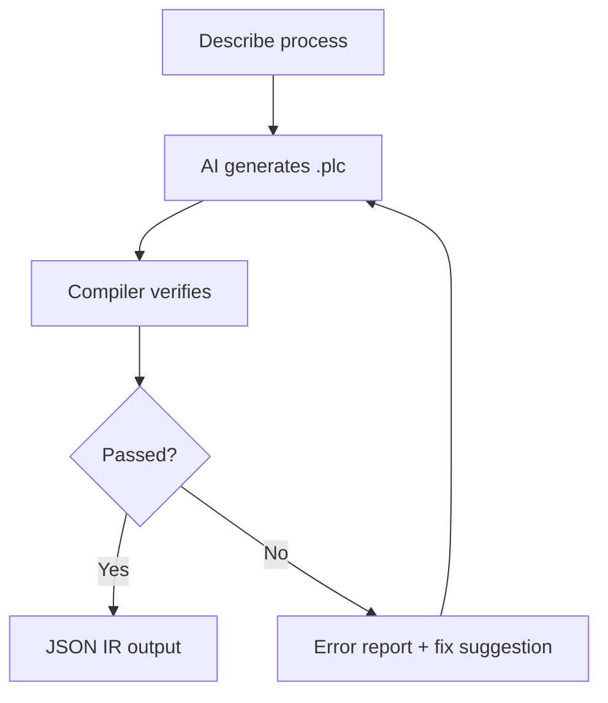
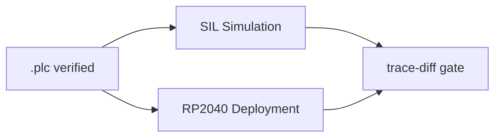

<p align="center">
  <h1 align="center">RustPLC</h1>
  <p align="center">
    <strong>Formally Verified Compiler for Industrial Control Systems</strong><br>
    Don't program devices — declare physical facts and intent, let the compiler prove it's safe.
  </p>
  <p align="center">
    <a href="README.md">中文</a> | <strong>English</strong>
  </p>
</p>

---

## Understand RustPLC in 30 Seconds



**Traditional**: Engineer writes ladder logic → manual safety review → collisions/deadlocks/timeouts found during commissioning

**RustPLC**: Engineer describes process → AI generates declarative DSL → compiler mathematically proves safety → all issues caught at compile time

## Quick Start

```bash
git clone https://github.com/xxrust/RustPLC.git
cd RustPLC
cargo build --release
cargo run --release -- examples/two_cylinder.plc
```

```
Verification passed:
  - Safety: Complete proof (depth 4) — conflicts_with satisfied
  - Liveness: Passed — no deadlock risk
  - Timing: Passed
  - Causality: Passed — all signal chains connected
```

## AI-Assisted Generation Example

Describe your process in plain language in Claude Code, and the AI generates a verified `.plc` file:

**You**:

> I have an assembly station: two conveyors deliver workpieces, then push cylinders push them to center, a press cylinder assembles, then an eject cylinder pushes the product out. The press must not act unless both pushers are extended. Eject must not act while press is extended.

**AI infers topology & safety constraints**:

```
Left conveyor:   Y0 → motor_left → sensor_left_arrive → X0
Left push cyl:   Y2 → valve_push_L → cyl_push_L → sensor_push_L_ext → X2
Press cylinder:  Y4 → valve_press → cyl_press → sensor_press_ext → X6
...

Safety constraints:
  cyl_press.extended requires cyl_push_L.extended
  cyl_press.extended requires cyl_push_R.extended
  cyl_eject.extended conflicts_with cyl_press.extended
```

**AI generates `.plc` and auto-verifies**:

```
Verification passed:
  - Safety: Complete proof (depth 14) — requires/conflicts_with satisfied
  - Liveness: Passed — no deadlock risk
  - Timing: Passed
  - Causality: Passed — all signal chains connected
```

Full file: [`examples/assembly_station.plc`](examples/assembly_station.plc)

## Four Verification Engines

| Engine | Checks | Method |
|--------|--------|--------|
| **Safety** | Mutual exclusion (`conflicts_with`), dependencies (`requires`) | Bounded Model Checking + k-induction |
| **Liveness** | Deadlock / livelock (unguarded waits, zero-outdegree states) | Tarjan SCC + reachability |
| **Timing** | Timing envelope (`must_complete_within` / `worst_case`) | Worst-case critical path |
| **Causality** | Signal chain integrity (can signals propagate along topology?) | Topology BFS |

All four engines run in parallel — one compilation exposes all issues. On failure, precise diagnostics:

```
ERROR [safety] Safety constraint violated
  Location: task cycle.step together
  Cause: cyl_A.extended and cyl_B.extended both true in parallel branches
  Suggestion: Make conflicting actions sequential

ERROR [liveness] Potential deadlock
  Location: task main.step_wait
  Cause: wait condition has no timeout branch
  Suggestion: Add timeout: <duration> -> goto <recovery task>
```

## From Verification to Deployment

After `.plc` verification passes, proceed to simulation and board-level deployment:



```bash
# SIL simulation
cargo run --release -- sim-plc examples/assembly_station.plc \
  --scenario scenarios/normal.yaml --out trace.jsonl

# No-board comparison gate (SIL vs virtual-board; runs sim + virtual-board + trace-diff)
cargo run --release -- no-board-gate examples/assembly_station.plc \
  --scenario scenarios/normal.yaml --out-dir out/no_board_gate

# RP2040 firmware build
cargo run --release -- build-rp2040 examples/assembly_station.plc \
  --out out/rp2040 --io-map out/rp2040/io_map.toml --emit-uf2 out/firmware.uf2
```

## 📚 Documentation

For in-depth content, see the **[Wiki](https://github.com/xxrust/RustPLC/wiki)**:

| Page | Content |
|------|---------|
| [Quick Start](https://github.com/xxrust/RustPLC/wiki/Quick-Start) | 5-minute setup: install, build, run |
| [DSL Language Reference](https://github.com/xxrust/RustPLC/wiki/DSL-Language-Reference) | Full syntax reference: topology, constraints, control logic, PID |
| [Architecture](https://github.com/xxrust/RustPLC/wiki/Architecture) | Compilation pipeline, module structure, IR design |
| [Verification Engines](https://github.com/xxrust/RustPLC/wiki/Verification-Engines) | Engine internals and mathematical foundations |
| [SIL Simulation](https://github.com/xxrust/RustPLC/wiki/SIL-Simulation) | Simulation loop: scenarios, fault injection, batch regression |
| [PID Control](https://github.com/xxrust/RustPLC/wiki/PID-Control) | PID loop declaration, runtime semantics, KPI regression |
| [No-Board Gate](https://github.com/xxrust/RustPLC/wiki/No-Board-Gate) | No-board delivery gate: virtual board + trace diff + release-bundle |
| [Recovery Templates](https://github.com/xxrust/RustPLC/wiki/Recovery-Templates) | Fault recovery templates and sequence lint |
| [RP2040 Deployment](https://github.com/xxrust/RustPLC/wiki/RP2040-Deployment) | Cross-compilation, I/O mapping, flashing, trace comparison |
| [Examples Gallery](https://github.com/xxrust/RustPLC/wiki/Examples-Gallery) | Example files with industrial scenario walkthroughs |
| [AI Assisted Generation](https://github.com/xxrust/RustPLC/wiki/AI-Assisted-Generation) | Full AI dialogue workflow for generating `.plc` files |
| [Contributing](https://github.com/xxrust/RustPLC/wiki/Contributing) | Development guide, testing, code structure |

## Roadmap

- [x] DSL design and parser
- [x] Four formal verification engines (Safety / Liveness / Timing / Causality)
- [x] Structured error reporting (line numbers + fix suggestions)
- [x] DSL v2: delay / repeat / wait AND|OR / if-else / goto task.step / custom states
- [x] AI-assisted generation (plc-gen skill)
- [x] Analog I/O (analog_input / analog_output / set_analog / threshold comparison)
- [x] SIL simulation loop (SimIO / Plant / fault injection / waveform export / batch regression)
- [x] Code generation + RP2040 build/flash (build-rp2040 / flash-rp2040)
- [x] Board-level observability & SIL comparison (trace-parse / trace-diff)
- [x] Unified verification report contract (verification_report.json + warning levels)
- [x] CLI gate (--deny-warnings)
- [x] Runtime upper-bound analysis (tick transfer / action / parallel expansion budgets)
- [x] Virtual board runner + no-board comparison gate (no-board-gate)
- [x] Release bundle & traceability (release-bundle + sha manifest + git metadata)
- [x] Analog safety coverage transparency (rule binding rate & abstraction granularity report)
- [x] Threshold semantic hardening (type / range / unit consistency checks)
- [x] PID minimal subset (DSL / IR / runtime integration + KPI regression)
- [x] Simulation object model & KPI regression (overshoot / settling time / steady-state error)
- [x] Recovery templates & sequence lint (critical waits must be recoverable)
- [x] Tick timing observability contract (tick_timing.jsonl + per-tick exec/slack/overrun)
- [x] Timing statistics report (timing-report: p50/p95/p99/max + overrun count)
- [x] No-board gate real-time thresholds (--max-p99-exec-us / --max-overrun-count)
- [x] Structural upper-bound to time budget mapping (budget_time_estimate)
- [x] Release bundle includes real-time evidence artifacts (tick_timing.jsonl / timing_report.json)
- [x] Worst-case load scenario injection & reproducible replay
- [x] No-RTOS Real-Time Playbook documentation
- [ ] Hardware abstraction layer (EtherCAT / Modbus / more GPIO boards)
- [ ] Multi-controller coordination
- [ ] Graphical DSL editor

## License

MIT

---

<p align="center">
  <sub>Written in Rust, so it won't panic. Well, at least not on the production line.</sub>
</p>
