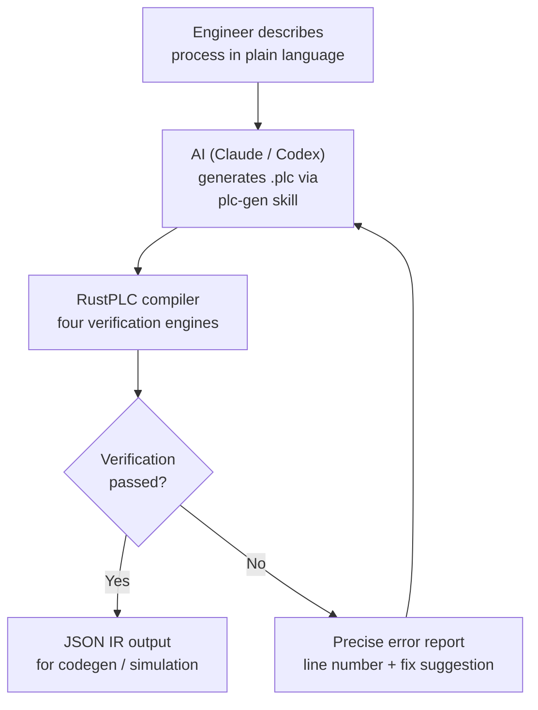
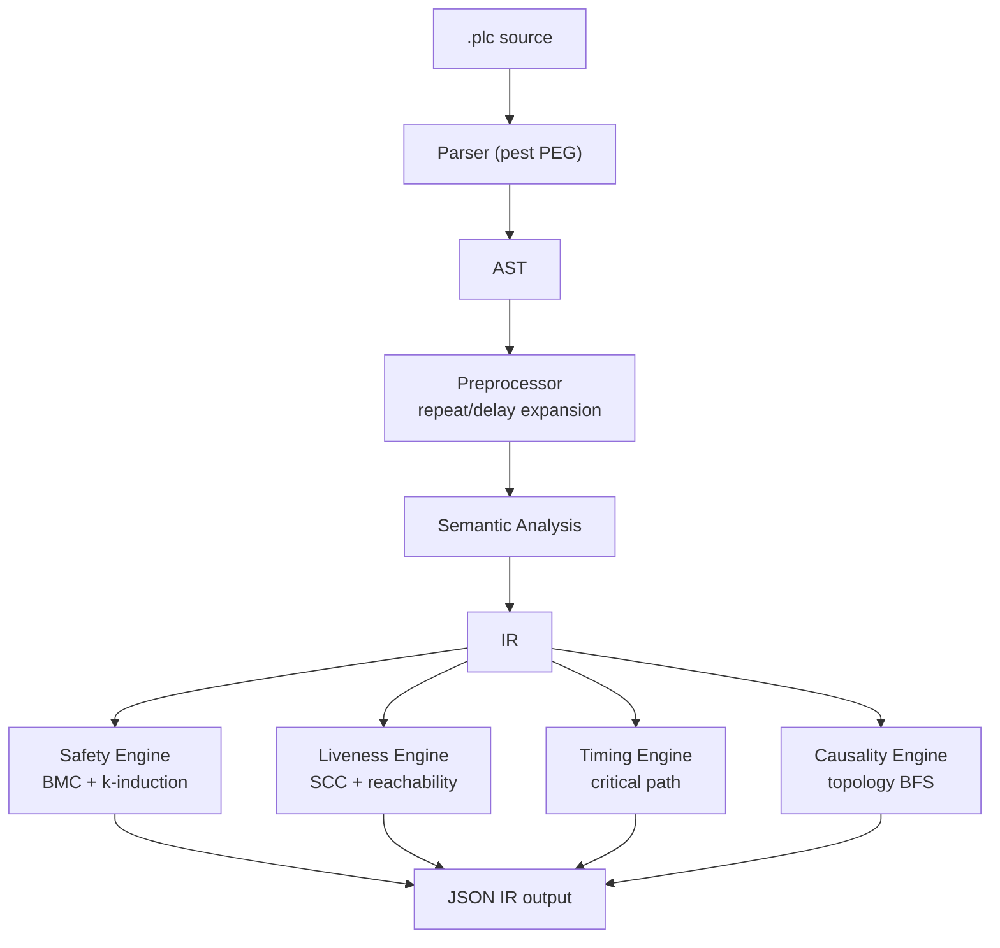
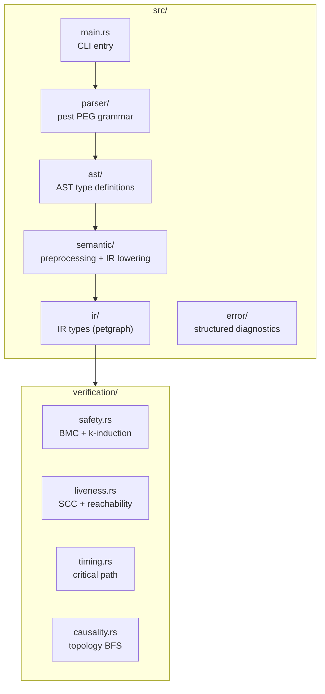

<p align="center">
  <h1 align="center">RustPLC</h1>
  <p align="center">
    <strong>Formally Verified Compiler for Industrial Control Systems</strong><br>
    Don't program devices — declare physical facts and intent, let the compiler prove it's safe.
  </p>
  <p align="center">
    <a href="README.md">中文</a> | <strong>English</strong>
  </p>
</p>

---

## Understand RustPLC in 30 Seconds



**Traditional**: Engineer writes ladder logic → manual safety review → collisions/deadlocks/timeouts found during commissioning

**RustPLC**: Engineer describes process → AI generates declarative DSL → compiler mathematically proves safety → all issues caught at compile time

## Quick Start

```bash
git clone https://github.com/xxrust/RustPLC.git
cd RustPLC
cargo build --release
```

### Option 1: AI-Assisted Generation (Recommended)

RustPLC ships with a built-in `plc-gen` skill for Claude Code / Codex. Describe your process in plain language, and the AI generates a verified `.plc` file through a four-phase multi-turn dialogue.

Here's a real conversation example — an assembly station:

---

**You**:

> I have an assembly station: two conveyors (left and right) each deliver a workpiece. After both arrive, stop the conveyors. Then left and right push cylinders push the workpieces to the center. Once both are in position, a press cylinder presses down to assemble, then retracts. Both push cylinders retract, then an eject cylinder pushes the finished product out. The press must not act unless both push cylinders are extended. The eject must not act while the press is extended.

**AI (Phase 1 · Understand Process)**:

> Let me confirm the sequence:
> 1. Start both conveyors → wait for arrival sensors
> 2. Stop conveyors → extend left push → extend right push
> 3. Press down (requires both pushers extended) → press up
> 4. Retract both pushers → eject out (conflicts with press) → eject back
>
> Is this a button-triggered single cycle?

**You**: Yes, button start, single cycle, wait for restart after completion.

**AI (Phase 2 · Infer Device Topology & Connection Chains)**:

> Based on the process, I've inferred the complete device topology. In industrial control, signals flow along a fixed chain: **PLC output → solenoid valve → actuator (cylinder/motor) → sensor → PLC input**. Each actuator needs this complete chain declared so the compiler can verify causal reachability and timing.
>
> ```
> Left conveyor:    Y0 → motor_left → sensor_left_arrive → X0
> Right conveyor:   Y1 → motor_right → sensor_right_arrive → X1
> Left push cyl:    Y2 → valve_push_L → cyl_push_L → sensor_push_L_ext → X2
>                                                    → sensor_push_L_ret → X3
> Right push cyl:   Y3 → valve_push_R → cyl_push_R → sensor_push_R_ext → X4
>                                                    → sensor_push_R_ret → X5
> Press cylinder:   Y4 → valve_press → cyl_press → sensor_press_ext → X6
>                                                 → sensor_press_ret → X7
> Eject cylinder:   Y5 → valve_eject → cyl_eject → sensor_eject_ext → X8
>                                                 → sensor_eject_ret → X9
> Start button:     start_button → X10
> ```
>
> Safety constraints:
> - `cyl_press.extended requires cyl_push_L.extended` — press requires left pusher
> - `cyl_press.extended requires cyl_push_R.extended` — press requires right pusher
> - `cyl_eject.extended conflicts_with cyl_press.extended` — eject and press are mutually exclusive

**AI (Phase 4 · Generate & Verify)**:

The AI assembles topology, constraints, and control logic into a `.plc` file, then runs the compiler:

```bash
$ cargo run --release -- examples/assembly_station.plc
```

```
Verification passed:
  - Safety: Complete proof (depth 14) — requires/conflicts_with satisfied
  - Liveness: Passed — no deadlock risk
  - Timing: Passed
  - Causality: Passed — all signal chains connected
```

Generated `.plc` file (key sections):

```plc
[topology]

# PLC I/O ports
device Y0: digital_output
device Y1: digital_output
device Y2: digital_output
device Y3: digital_output
device Y4: digital_output
device Y5: digital_output
device X0: digital_input
...
device X10: digital_input

# Left conveyor chain: Y0 → motor_left → sensor_left_arrive → X0
device motor_left: motor { connected_to: Y0, rated_speed: 30rpm, ramp_time: 50ms }
device sensor_left_arrive: sensor { connected_to: X0, detects: motor_left.position_A }

# Left push cylinder chain: Y2 → valve_push_L → cyl_push_L → sensor_push_L_ext/ret
device valve_push_L: solenoid_valve { connected_to: Y2, response_time: 20ms }
device cyl_push_L: cylinder { connected_to: valve_push_L, stroke_time: 500ms, retract_time: 500ms }
device sensor_push_L_ext: sensor { connected_to: X2, detects: cyl_push_L.extended }
device sensor_push_L_ret: sensor { connected_to: X3, detects: cyl_push_L.retracted }

# ... remaining chains follow the same pattern

[constraints]

safety: cyl_press.extended requires cyl_push_L.extended
    reason: "press requires left pusher extended"
safety: cyl_press.extended requires cyl_push_R.extended
    reason: "press requires right pusher extended"
safety: cyl_eject.extended conflicts_with cyl_press.extended
    reason: "eject conflicts with press"

causality: Y2 -> valve_push_L -> cyl_push_L -> sensor_push_L_ext
causality: Y4 -> valve_press -> cyl_press -> sensor_press_ext
# ... remaining causal chains

[tasks]

task cycle:
    step start_left:
        action: set motor_left on
    step start_right:
        action: set motor_right on
    step wait_left_arrive:
        wait: sensor_left_arrive == true
        timeout: 5000ms -> goto fault_handler
    step wait_right_arrive:
        wait: sensor_right_arrive == true
        timeout: 5000ms -> goto fault_handler
    step stop_left:
        action: set motor_left off
    step stop_right:
        action: set motor_right off
    step push_left:
        action: extend cyl_push_L
        wait: sensor_push_L_ext == true
        timeout: 800ms -> goto fault_handler
    step push_right:
        action: extend cyl_push_R
        wait: sensor_push_R_ext == true
        timeout: 800ms -> goto fault_handler
    step press_down:
        action: extend cyl_press
        wait: sensor_press_ext == true
        timeout: 500ms -> goto fault_handler
    step press_up:
        action: retract cyl_press
        wait: sensor_press_ret == true
        timeout: 500ms -> goto fault_handler
    step retract_left:
        action: retract cyl_push_L
        wait: sensor_push_L_ret == true
        timeout: 800ms -> goto fault_handler
    step retract_right:
        action: retract cyl_push_R
        wait: sensor_push_R_ret == true
        timeout: 800ms -> goto fault_handler
    step eject_out:
        action: extend cyl_eject
        wait: sensor_eject_ext == true
        timeout: 500ms -> goto fault_handler
    step eject_back:
        action: retract cyl_eject
        wait: sensor_eject_ret == true
        timeout: 500ms -> goto fault_handler
    on_complete: goto ready

task fault_handler:
    step safe_retract:
        action: retract cyl_press
        action: retract cyl_push_L
        action: retract cyl_push_R
        action: retract cyl_eject
    step safe_stop:
        action: set motor_left off
        action: set motor_right off
    step alarm:
        action: log "Assembly station fault: action timeout, check device status"
    on_complete: goto ready

task ready:
    step wait_start:
        wait: start_button == true
        allow_indefinite_wait: true
    on_complete: goto cycle
```

Full file: [`examples/assembly_station.plc`](examples/assembly_station.plc)

---

### Option 2: Write DSL Directly

```bash
cargo run --release -- your_file.plc
```

On success, the compiler outputs full IR (JSON to stdout) with topology graph, state machine, constraint set, timing model, and verification summary.

## Why RustPLC

Traditional PLC programming (ladder logic / ST / FBD) relies on engineer experience for safety. As system complexity grows, manual review reliability drops sharply — cylinder collisions, deadlocks, and timeouts are often discovered only during commissioning.

RustPLC takes a different approach:

- Declarative DSL describes physical topology, control logic, and safety constraints
- Formal verification at compile time proves safety before any code runs
- Error messages pinpoint the exact line with fix suggestions

**Safety through mathematical proof, not test coverage.**

## DSL Reference

A `.plc` file has three sections, corresponding to three layers of industrial control:

### [topology] — Declare the Physical World

The topology section describes devices and their connections. In industrial control, signals flow along a fixed chain:

```
PLC output (digital_output)
    ↓ connected_to
Solenoid valve (solenoid_valve)     ← response_time: valve response time
    ↓ connected_to
Actuator (cylinder / motor)         ← stroke_time / ramp_time: action time
    ↓ detects
Sensor (sensor)                     ← detects: which device state to detect
    ↓ connected_to
PLC input (digital_input)
```

The compiler uses this chain for three purposes:
1. **Causality verification** — BFS checks that the signal from `action: extend cyl_A` can reach `wait: sensor_A_ext == true`
2. **Timing calculation** — accumulates `response_time` + `stroke_time` for minimum action execution time
3. **Safety checking** — states like `cyl_A.extended` derive semantics from the device type

Supported device types:

| Type | Purpose | Key Attributes | Default States |
|------|---------|----------------|----------------|
| `digital_output` | PLC output port Y0, Y1... | — | on / off |
| `digital_input` | PLC input port X0, X1... | `debounce` | on / off |
| `solenoid_valve` | Solenoid valve | `connected_to`, `response_time` | on / off |
| `cylinder` | Cylinder | `connected_to`, `stroke_time`, `retract_time` | extended / retracted |
| `motor` | Motor | `connected_to`, `rated_speed`, `ramp_time` | on / off |
| `sensor` | Sensor | `connected_to`, `detects` | on / off |
| `analog_input` | Analog input AI0, AI1... | `range`, `unit` | — (continuous) |
| `analog_output` | Analog output AO0, AO1... | `range`, `ramp_time`, `unit` | — (continuous) |

Any device supports custom states via `states: [...]` (e.g., 3-position valve: `states: [extend, neutral, retract]`).

### [constraints] — Declare Safety Boundaries

```plc
# Mutual exclusion: two states cannot be true simultaneously
safety: cyl_A.extended conflicts_with cyl_B.extended

# Dependency: when state A is true, state B must also be true
safety: cyl_press.extended requires cyl_clamp.extended

# Analog threshold constraint: supports >, <, >=, <= comparisons
safety: pressure_sensor > 80 conflicts_with heater.on
    reason: "Disable heater when overpressure"

# Timing
timing: task.cycle must_complete_within 8000ms
timing: task.cycle must_complete_within_worst_case 12000ms
timing: task.cycle must_start_after 100ms

# Causal chain (explicit declaration; compiler also infers from topology)
causality: Y0 -> valve_A -> cyl_A -> sensor_A_ext
```

### [tasks] — Declare Control Logic

Control logic is expressed as state machines. Statements available within each `step`:

| Statement | Purpose |
|-----------|---------|
| `action: extend / retract / set / set_analog / log` | Drive actuators or log messages |
| `wait: ... == / > / < / >= / <= true` | Wait for condition (supports AND / OR, cannot mix) |
| `delay: Nms` | Fixed delay, included in timing verification |
| `timeout: Nms -> goto ...` | Timeout protection jump |
| `if: ... goto ... else: goto ...` | Conditional branch |
| `goto task` / `goto task.step` | Jump to specified task or step |
| `repeat N: ...` | Compile-time unroll into N sequential steps (2~100) |
| `parallel: branch_A: ... branch_B: ...` | Parallel branches, join after all complete |
| `race: branch_A: ... then: goto ...` | Race branches, first to finish decides jump |
| `allow_indefinite_wait: true` | Manual operation exemption (skip liveness check) |

Statement quick reference:

```plc
# Basic actions
action: extend cyl_A              # Extend cylinder
action: retract cyl_A             # Retract cylinder
action: set motor on              # Start motor
action: set_analog AO0 7.5        # Analog output (e.g., proportional valve opening)
action: log "message"             # Log message

# Wait
wait: sensor_A == true                                  # Single condition
wait: sensor_A == true AND sensor_B == true             # AND (cannot mix with OR)
wait: sensor_A == true OR sensor_B == true              # OR

# Delay and timeout
delay: 2000ms                                           # Fixed delay
timeout: 500ms -> goto fault_handler                    # Timeout protection

# Branching
if: mode == true goto task_A else: goto task_B          # Conditional branch
goto fault_handler.alarm                                # Jump to task.step

# Loop
repeat 3:                                               # Compile-time unroll to 3 copies
    action: extend cyl_glue
    wait: sensor_glue_ext == true
    timeout: 400ms -> goto fault_handler

# Parallel (join after all complete)
parallel:
    branch_A:
        action: extend cyl_A
    branch_B:
        action: extend cyl_B

# Race (first to finish decides jump)
race:
    sensor_path:
        wait: sensor_pos == true
        then: goto normal_stop
    timeout_path:
        delay: 5000ms
        then: goto emergency_stop

# Manual operation exemption
allow_indefinite_wait: true
```

## Compilation Pipeline



## Four Verification Engines

| Engine | Checks | Method |
|--------|--------|--------|
| **Safety** | Mutual exclusion (`conflicts_with`), dependencies (`requires`) | Bounded model checking + k-induction |
| **Liveness** | Deadlock / livelock (wait without timeout, zero-outdegree states) | SCC analysis + reachability |
| **Timing** | Timing envelope (`must_complete_within` / `worst_case` / `must_start_after`) | Worst-case critical path |
| **Causality** | Signal chain integrity (can signals propagate along connected_to + detects?) | Topology BFS |

All four engines run in parallel. One compilation exposes all issues. On failure, error messages pinpoint the problem with fix suggestions:

```
ERROR [safety] Safety constraint violated
  Location: task cycle.step together
  Cause: cyl_A.extended and cyl_B.extended both true in parallel branches
  Suggestion: Change conflicting actions to sequential execution

ERROR [liveness] Potential deadlock
  Location: task main.step_wait
  Cause: wait condition has no timeout branch
  Suggestion: Add timeout: <duration> -> goto <recovery task>

ERROR [timing] Timing exceeded
  Location: task main
  Constraint: must_complete_within 50ms
  Actual worst path: 220ms (response_time 20ms + stroke_time 200ms = 220ms)
  Suggestion: Increase constraint value or optimize action timing

ERROR [causality] Causal chain broken
  Declared chain: Y0 -> valve_A -> cyl_B -> sensor_B_ext
  Break point: valve_A -> cyl_B (cyl_B missing connected_to: valve_A)
  Suggestion: Check cyl_B's connected_to configuration
```

### Mathematical Foundations

RustPLC's verification is not testing — it is mathematical proof over finite state spaces, built on established formal methods.

**Safety — Bounded Model Checking (BMC) + k-induction**

Control logic is modeled as a finite state transition system `M = (S, S₀, T, L)`, where S is the state set (control location × device state vector) and T is the transition relation. For a safety property P (e.g., `¬(cyl_A.extended ∧ cyl_B.extended)`), BMC performs BFS from initial state S₀, exhaustively enumerating all reachable states up to depth k. The depth k is automatically determined by Kosaraju SCC analysis: `k = max(|SCC|) + 1`, ensuring every cycle in every strongly connected component is fully traversed. If all reachable states are exhausted within depth k with no counterexample, a complete proof is obtained (equivalent to the inductive step of k-induction holding).

**Liveness — Tarjan SCC + reachability analysis**

Deadlock detection is graph-theoretic: Tarjan's algorithm identifies all strongly connected components in the state machine transition graph. If every wait-edge within an SCC lacks a timeout and is not marked `allow_indefinite_wait`, that SCC constitutes a potential livelock. Zero-outdegree states (no successor transitions and no `on_complete`) constitute deadlocks. This is a conservative approximation of the CTL property `AG(EF done)`.

**Timing — worst-case critical path**

Each step's execution time is modeled as a weighted DAG, with weights derived from physical device parameters along the `connected_to` chain (`response_time` + `stroke_time`) and explicit `delay` values. The longest path algorithm computes worst-case execution time, compared against `must_complete_within` constraints. The `must_complete_within_worst_case` variant includes timeout upper bounds in path weights. Parallel branches take the maximum across branches.

**Causality — topology BFS reachability**

Device connections form a directed graph G = (V, E), where `connected_to` and `detects` define edges. For a declared causal chain `Y0 → valve → cyl → sensor`, the compiler performs BFS on G to verify reachability at each hop — ensuring physical signals can propagate from PLC output ports to sensors along actual wiring. Any broken link is caught at compile time.

## Examples

`examples/` directory contains multiple verified examples:

| File | Scenario | Features |
|------|----------|----------|
| `two_cylinder.plc` | Two-cylinder sequential | conflicts_with, basic sequence |
| `half_rotation.plc` | Motor half rotation | race, multi-task jumps |
| `assembly_station.plc` | Dual-conveyor assembly | requires vs conflicts_with, motor + cylinder |
| `stamp_bend_line.plc` | Stamping-bending line | Multi-station task chains, many constraints |
| `glue_station.plc` | Gluing station | repeat loop unrolling |
| `drill_station.plc` | Drilling station | motor + cylinder mixed |
| `grind_station.plc` | Grinding station | race mode selection, delay |
| `delay_demo.plc` | Delay demo | Fixed delay |
| `repeat_demo.plc` | Repeat demo | Loop unrolling |
| `and_or_wait_demo.plc` | AND/OR demo | Combined wait conditions |
| `if_else_demo.plc` | if/else demo | Conditional branching |
| `custom_states_demo.plc` | Custom states demo | 3-position valve |
| `analog_pressure_demo.plc` | Hydraulic proportional valve | analog_input/output, set_analog, threshold comparison |

## Project Structure



## Tests

```bash
cargo test    # 131 tests (69 unit + 14 integration + 31 stress/coverage + 1 fixture + 6 e2e + 10 verification)
```

### Optional: Enable Z3 Solver

```bash
cargo build --release --features z3-solver
```

Enables Z3 SMT solver for stronger mutual exclusion proofs in the Safety engine.

## Tech Stack

- **Rust 2024 Edition** — memory safety, zero-cost abstractions
- **pest** — PEG parser generator
- **petgraph** — graph data structures (topology + state machine)
- **Z3** (optional) — SMT solver

## Roadmap

- [x] DSL design and parser
- [x] Four formal verification engines (Safety / Liveness / Timing / Causality)
- [x] Structured error reporting (line numbers + fix suggestions)
- [x] DSL v2: delay / repeat / wait AND|OR / if-else / goto task.step / custom states
- [x] AI-assisted generation (plc-gen skill)
- [x] Analog I/O (analog_input / analog_output / set_analog / threshold comparison)
- [ ] Code generation → deterministic Rust execution kernel
- [ ] Hardware abstraction layer (EtherCAT / Modbus / GPIO)
- [ ] PID control
- [ ] Multi-controller coordination
- [ ] Graphical DSL editor

## License

MIT

---

<p align="center">
  <sub>Written in Rust, so it won't panic. Well, at least not on the production line.</sub>
</p>
