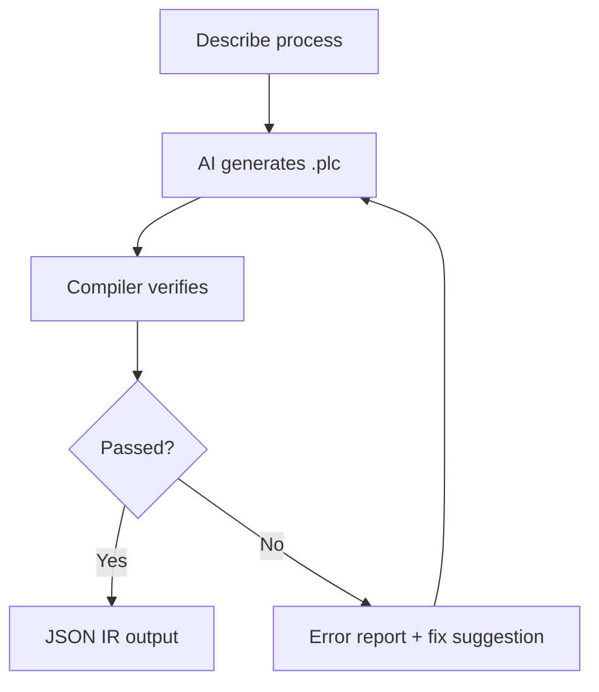

<p align="center">
  <h1 align="center">RustPLC</h1>
  <p align="center">
    <strong>Formally Verified Industrial Control Compiler</strong><br>
    Declare physical topology and safety constraints. Compiler proves correctness mathematically.
  </p>
  <p align="center">
    <strong>English</strong> | <a href="README.md">中文</a>
  </p>
</p>

---

## Understand RustPLC in 30 Seconds



**Traditional**: Engineer writes ladder logic → manual safety review → collisions/deadlocks/timeouts found during commissioning

**RustPLC**: Engineer describes process → AI generates declarative DSL → compiler mathematically proves safety → all issues caught at compile time

---

## Quick Start

```bash
git clone https://github.com/xxrust/RustPLC.git
cd RustPLC
cargo build --release
cargo run --release -- examples/two_cylinder.plc --no-print-ir
```

```
Verification passed:
  - Safety: Complete proof (depth 4) — conflicts_with satisfied
  - Liveness: Passed — no deadlock risk
  - Timing: Passed
  - Causality: Passed — all signal chains connected
```

---

## System Architecture

```
┌─────────────────────────────────────────────────────────────────────────────────────┐
│                                  📝 Input Layer                                      │
├─────────────────────────────────────────────────────────────────────────────────────┤
│  .plc DSL File                    Scenario YAML (scenario.yaml)                     │
│  - topology                       - digital_inputs / analog_inputs                   │
│  - constraints                    - tick_ms / duration_ticks                         │
│  - tasks (control logic)          - fault injection                                  │
└────────────────┬────────────────────────────────────────────────────────────────────┘
                 │
                 ▼
┌─────────────────────────────────────────────────────────────────────────────────────┐
│                              ⚙️ Compiler Core (src/)                                 │
├─────────────────────────────────────────────────────────────────────────────────────┤
│  Parser (pest PEG) ──▶ AST ──▶ Semantic Analysis + Preprocessing ──▶ IR            │
│                                (repeat/delay expansion)   (TopologyGraph + StateMachine)│
│                                                                                      │
│  Key Modules:                                                                        │
│  • parser/plc.pest    - PEG grammar definition                                      │
│  • ast/mod.rs         - AST types (PlcProgram, DeviceDeclaration, StepStatement)   │
│  • semantic/mod.rs    - Semantic analysis + IR lowering                             │
│  • ir/mod.rs          - IR types (petgraph DiGraph)                                 │
└────────────────┬────────────────────────────────────────────────────────────────────┘
                 │
                 ▼
┌─────────────────────────────────────────────────────────────────────────────────────┐
│                    🔬 Verification Engines (Parallel) (src/verification/)            │
├─────────────────────────────────────────────────────────────────────────────────────┤
│  ┌─────────────────┐  ┌─────────────────┐  ┌─────────────────┐  ┌─────────────────┐│
│  │  Safety Engine  │  │ Liveness Engine │  │  Timing Engine  │  │ Causality Engine││
│  │  BMC + k-induct │  │ SCC + Reachable │  │  Critical Path  │  │   Topology BFS  ││
│  │  conflicts_with │  │  Deadlock check │  │  response_time  │  │  connected_to   ││
│  │  requires       │  │  Livelock check │  │  budget bounds  │  │  detects chain  ││
│  └─────────────────┘  └─────────────────┘  └─────────────────┘  └─────────────────┘│
│                                      ▼                                               │
│                          verification_report.json                                    │
│                          (Structured verification report + warning levels)           │
└────────────────┬────────────────────────────────────────────────────────────────────┘
                 │
                 ▼
┌─────────────────────────────────────────────────────────────────────────────────────┐
│                          🏃 Runtime Layer (crates/)                                  │
├─────────────────────────────────────────────────────────────────────────────────────┤
│                        ┌─────────────────────────────┐                              │
│                        │   runtime-core (no_std)     │                              │
│                        │   Deterministic State Machine│                             │
│                        │   - Program / Task / Step   │                              │
│                        │   - Instr / Action          │                              │
│                        └──────────┬──────────────────┘                              │
│                                   │                                                  │
│              ┌────────────────────┼────────────────────┐                            │
│              ▼                    ▼                    ▼                            │
│  ┌──────────────────┐  ┌──────────────────┐  ┌──────────────────┐                 │
│  │   SimIO (sim)    │  │  Virtual Board   │  │  RP2040 HAL      │                 │
│  │   SIL Simulation │  │  Virtual Runner  │  │  Hardware Layer  │                 │
│  │   - Plant model  │  │  - tick_timing   │  │  - GPIO/ADC/PWM  │                 │
│  │   - Fault inject │  │  - Real board sim│  │  - PIO (motion)  │                 │
│  │   - Waveform     │  │  - Overrun mark  │  │  - RTT logging   │                 │
│  └──────────────────┘  └──────────────────┘  └──────────────────┘                 │
│          │                      │                      │                            │
│          ▼                      ▼                      ▼                            │
│   sil_trace.jsonl      board_trace.jsonl      RP2040 Firmware (UF2)                │
│   sim_report.json      tick_timing.jsonl      + board.log (RTT)                    │
└────────────────┬────────────────────────────────────────────────────────────────────┘
                 │
                 ▼
┌─────────────────────────────────────────────────────────────────────────────────────┐
│                          📊 Analysis & Gating (src/)                                 │
├─────────────────────────────────────────────────────────────────────────────────────┤
│  trace-diff              timing-report           no-board-gate                      │
│  SIL vs Board Compare    p50/p95/p99 Stats      Real-Time Threshold Gate           │
│  - Tick-by-tick diff     - exec_us / slack_us   - --max-p99-exec-us                │
│  - Context window        - overrun_count        - --max-overrun-count               │
│  - fail-on-mismatch      - timing_report.json   - Trace consistency + RT checks    │
│                                                                                      │
│  release-bundle                                                                      │
│  Auditable Delivery Package                                                          │
│  - manifest.json (SHA256 manifest)                                                  │
│  - build_meta.json (git commit / dirty / tool_version)                             │
│  - All verification reports + trace + timing evidence                               │
└────────────────┬────────────────────────────────────────────────────────────────────┘
                 │
                 ▼
┌─────────────────────────────────────────────────────────────────────────────────────┐
│                                📦 Output Layer                                       │
├─────────────────────────────────────────────────────────────────────────────────────┤
│  ✅ Compile-time: verification_report.json (four engine proof results)              │
│  🧪 Simulation:   trace.jsonl + wave.vcd + sim_report.json                         │
│  📦 Deployment:   firmware.uf2 + io_map.toml + analog_contract.toml                │
│  🚫 Gating:       diff_report.json + timing_report.json + gate_summary.json        │
│  📋 Delivery:     release-bundle/ (manifest + all artifacts + SHA manifest)        │
└─────────────────────────────────────────────────────────────────────────────────────┘
```

---

## Core Capabilities

| Capability | Description |
|------------|-------------|
| **📝 ST Code Generation** | `gen-st` compiles verified IR to IEC 61131-3 Structured Text; vendored `iec2c` validates syntax in CI |
| **🔬 Formal Verification** | Four engines (Safety / Liveness / Timing / Causality) with compile-time mathematical proofs |
| **🤖 AI-Assisted Generation** | Natural language → AI multi-turn dialogue → `.plc` generation → auto-verification |
| **🧪 SIL Simulation** | Scenario-driven deterministic simulation, fault injection, waveform export, batch regression |
| **📋 Scenario Engineering** | Scenario init, validation, expansion, batch generation, failure minimization |
| **🎛️ PID Control** | DSL-declared PID loops, deterministic runtime execution, KPI regression analysis |
| **🔄 Motion Control** | Stepper + AB encoder, PIO high-speed pulses, collision guard, virtual channels |
| **📦 RP2040 Deployment** | Cross-compile to Raspberry Pi Pico, I/O mapping, trace comparison gate |
| **⏱️ Real-Time Gating** | Tick timing sampling, p50/p95/p99 stats, real-time threshold gates |
| **🚫 No-Board Delivery** | Virtual board runner, SIL vs virtual-board comparison, release-bundle |
| **🛡️ Recovery Templates** | E-stop/power-loss/sensor-stuck recovery templates, critical wait recoverability lint |
| **🏷️ Tag-Driven Topology** | Multi-dimensional tags (functional/danger/location), batch refactor, rule engine, visual grouping |
| **🔀 Port-Level Wiring** | Explicit `driven_by`/`reports_to`/`detects` semantics, MIMO topology, port contract validation |
| **📊 Semantic Diff** | Topology change impact analysis, node/port/relation/tag-level diff, audit records |
| **⚡ Performance Gate** | 500-node/2000-edge baseline, compile/parse/render p95 threshold CI gate |

---

## Typical Workflow

### 1. Write / Generate .plc

**Option A: AI Dialogue Generation (Recommended)**

```
> Help me write a PLC program. I have two cylinders that can't extend simultaneously, extend A first then B...
```

AI will generate a complete `.plc` file through multi-turn dialogue and auto-verify it.

**Option B: Hand-write DSL**

```plc
[topology]
device plc_main: plc {
    purpose: "Controller body and process I/O port mapping",
    ports: [Y0:digital:producer, X0:digital:consumer]
}
device valve_A: solenoid_valve {
    purpose: "Drive the main pneumatic path for cylinder A",
    response_time: 20ms,
    ports: [coil:digital:consumer, out:pneumatic:producer]
}
device cyl_A: cylinder {
    purpose: "Cylinder actuator for station A motion",
    stroke_time: 300ms,
    ports: [cmd:pneumatic:consumer, extended:logical:producer]
}
device sensor_A_ext: sensor { purpose: "Sense cylinder A extended position" }

relation { from: plc_main.Y0, to: valve_A.coil, via: driven_by }
relation { from: valve_A.out, to: cyl_A.cmd, via: driven_by }
relation { from: cyl_A.extended, to: sensor_A_ext.sense, via: detects }
relation { from: sensor_A_ext.out, to: plc_main.X0, via: reports_to }

[constraints]
safety: cyl_A.extended requires sensor_A_ext.on

[tasks]
task cycle:
    step extend_A:
        action: extend cyl_A
        wait: sensor_A_ext == true
        timeout: 500ms -> goto fault_handler
```

> **Note**: Legacy device attributes `driven_by/reports_to/detects` are removed. Use `relation { from, to, via }` only. Use explicit `plc_main.<port>` endpoint references in new topology.
>
> **Recommended modeling (since February 23, 2026)**: Prefer `device plc_main: plc { ports: [...] }` for controller ports. The old `device X*/Y*/AI*/AO*` style remains in a compatibility window (**February 23, 2026 ~ June 30, 2026**) with WARN-level notices.
>
> **Mandatory review rule (effective February 24, 2026)**: every `device` must declare `purpose`; missing `purpose` fails semantic gate review.

### 2. Compile & Verify

```bash
cargo run --release -- your_file.plc --no-print-ir
```

### 3. Scenario Simulation

```bash
# Initialize scenario skeleton
cargo run --release -- scenario-init examples/assembly_station.plc \
  --out scenarios/normal.yaml --preset normal

# SIL simulation
cargo run --release -- sim-plc examples/assembly_station.plc \
  --scenario scenarios/normal.yaml --out trace.jsonl

# Batch regression
cargo run --release -- sim-regress --plc-dir examples --scenario-dir scenarios
```

### 4. No-Board Gate

```bash
# SIL vs virtual-board comparison + real-time threshold check
cargo run --release -- no-board-gate examples/assembly_station.plc \
  --scenario scenarios/normal.yaml \
  --out-dir out/gate \
  --max-p99-exec-us 500 \
  --max-overrun-count 0
```

### 5. RP2040 Deployment

```bash
# Generate firmware build inputs
cargo run --release -- build-rp2040 examples/assembly_station.plc --out out/rp2040

# Fill I/O mapping
cp out/rp2040/io_map.template.toml out/rp2040/io_map.toml
# Edit io_map.toml to fill GPIO pins

# One-step UF2 firmware build
cargo run --release -- build-rp2040 examples/assembly_station.plc \
  --out out/rp2040 \
  --io-map out/rp2040/io_map.toml \
  --emit-uf2 out/firmware.uf2

# Flash to Pico
cargo run --release -- flash-rp2040 --uf2 out/firmware.uf2 --mount /media/RPI-RP2
```

### 6. Release Delivery

```bash
# Package auditable release artifacts (with SHA manifest, git metadata, real-time evidence)
cargo run --release -- release-bundle examples/assembly_station.plc \
  --scenario scenarios/normal.yaml \
  --out-dir out/release \
  --max-p99-exec-us 500 \
  --max-overrun-count 0
```

---

## 📚 Documentation

Full documentation available on **[GitHub Wiki](https://github.com/xxrust/RustPLC/wiki)**:

| Page | Content |
|------|---------|
| [Quick Start](https://github.com/xxrust/RustPLC/wiki/Quick-Start) | 5-minute getting started guide |
| [DSL Language Reference](https://github.com/xxrust/RustPLC/wiki/DSL-Language-Reference) | Complete syntax reference |
| [Architecture](https://github.com/xxrust/RustPLC/wiki/Architecture) | Compilation pipeline & module structure |
| [Verification Engines](https://github.com/xxrust/RustPLC/wiki/Verification-Engines) | Four engine internals |
| [SIL Simulation](https://github.com/xxrust/RustPLC/wiki/SIL-Simulation) | Simulation loop |
| [Scenario System](https://github.com/xxrust/RustPLC/wiki/Scenario-System) | Scenario engineering |
| [PID Control](https://github.com/xxrust/RustPLC/wiki/PID-Control) | PID loops |
| [Motion Control](https://github.com/xxrust/RustPLC/wiki/Motion-Control) | Stepper + AB encoder |
| [No-Board Gate](https://github.com/xxrust/RustPLC/wiki/No-Board-Gate) | No-board delivery gate |
| [Recovery Templates](https://github.com/xxrust/RustPLC/wiki/Recovery-Templates) | Fault recovery templates |
| [RP2040 Deployment](https://github.com/xxrust/RustPLC/wiki/RP2040-Deployment) | Board-level deployment |
| [Examples Gallery](https://github.com/xxrust/RustPLC/wiki/Examples-Gallery) | Example walkthroughs |
| [AI Assisted Generation](https://github.com/xxrust/RustPLC/wiki/AI-Assisted-Generation) | AI generation workflow |
| [Contributing](https://github.com/xxrust/RustPLC/wiki/Contributing) | Development guide |

**Local Documentation (in repo):**
- Scenario system: [`docs/scenario_playbook.md`](docs/scenario_playbook.md), [`docs/scenario_minimization.md`](docs/scenario_minimization.md)
- No-board delivery: [`docs/no_board_playbook.md`](docs/no_board_playbook.md)
- Motion control: [`docs/stepper_ab_encoder.md`](docs/stepper_ab_encoder.md)
- Recovery templates: [`docs/recovery_templates_sequence_lint.md`](docs/recovery_templates_sequence_lint.md)
- Topology refactor: [`docs/topology_perf_baseline.md`](docs/topology_perf_baseline.md), [`docs/testing_inventory_matrix.md`](docs/testing_inventory_matrix.md)

---

## Roadmap

### Completed

**Core Compiler:**
- ✅ DSL design and parser
- ✅ Four formal verification engines (Safety / Liveness / Timing / Causality)
- ✅ Structured error reporting (line numbers + fix suggestions)
- ✅ DSL v2 (delay / repeat / wait AND|OR / if-else / goto task.step / custom states)
- ✅ AI-assisted generation (plc-gen skill)

**I/O & Control:**
- ✅ Analog I/O (analog_input / analog_output / set_analog / threshold comparison)
- ✅ PID minimal subset (DSL/IR/runtime integration + KPI regression)
- ✅ Motion control (stepper + AB encoder + PIO + collision guard + virtual channels)

**Simulation & Testing:**
- ✅ SIL simulation loop (SimIO / Plant / fault injection / waveform export)
- ✅ Scenario system (init / validate / expand / gen / batch regression / failure minimization)
- ✅ Simulation object model & KPI regression (overshoot / settling time / steady-state error)

**Deployment & Gating:**
- ✅ Code generation + RP2040 build/flash (build-rp2040 / flash-rp2040)
- ✅ Board-level observability & SIL comparison (board-parse / trace-diff)
- ✅ Virtual board runner + no-board comparison gate (no-board-gate)
- ✅ Release bundle & traceability (release-bundle + SHA manifest + git metadata)

**Quality & Real-Time:**
- ✅ Unified verification report contract (verification_report.json + warning levels)
- ✅ CLI gate (--deny-warnings)
- ✅ Runtime upper-bound analysis (tick transfer / action / parallel expansion budgets)
- ✅ Structural upper-bound to time budget mapping (budget_time_estimate)
- ✅ Tick timing observability contract (tick_timing.jsonl + per-tick exec/slack/overrun)
- ✅ Timing statistics report (timing-report: p50/p95/p99/max + overrun count)
- ✅ No-board gate real-time thresholds (--max-p99-exec-us / --max-overrun-count)
- ✅ Worst-case load scenario injection & reproducible replay
- ✅ Recovery templates & sequence lint (critical waits must be recoverable)

**Documentation & Engineering:**
- ✅ Analog safety coverage transparency (rule binding rate & abstraction granularity report)
- ✅ Threshold semantic hardening (type / range / unit consistency checks)
- ✅ No-RTOS Real-Time Playbook documentation

**ST Code Generation (this release):**
- ✅ `gen-st` command: compile verified IR → IEC 61131-3 Structured Text
- ✅ Vendored matiec (`vendor/matiec/`) — `iec2c` binary + standard library, no external install needed
- ✅ Full round-trip test: `.plc` → ST → `iec2c` compile → `POUS.c`/`POUS.h` artifacts verified
- ✅ Cross-platform test harness: Windows uses vendored `iec2c.exe`; Linux uses PATH fallback; graceful skip when unavailable
- ✅ `matiec_vendor_directory_is_complete` guard test catches broken vendor state early
- ✅ Unified topology direction: producer → consumer (`driven_by` / `reports_to` / `detects`)
- ✅ Removed `connected_to` ambiguity; batch migration tool + CI regression guard
- ✅ Ports as first-class citizens (`id/type/role`), MIMO topology support
- ✅ Multi-dimensional tag system (`functional_group` / `danger_level` / `location_group`)
- ✅ Tag-driven batch refactor (preview diff, rollback, export)
- ✅ Tag rule engine (danger-level dual-channel, within-group / cross-group connection constraints)
- ✅ Frontend tag visualization grouping & filtering, `location_group` one-click navigation
- ✅ parse-plc API returns relation & port metadata (`relation/from_port/to_port/signal`)
- ✅ Frontend port contract & wiring binding refactor (cylinder/sensor/switch/stepper/generic)
- ✅ Test inventory matrix & parameterization refactor, removed invalid tests
- ✅ Semantic diff & impact analysis (node/port/relation/tag changes + affected rules/tests/modules)
- ✅ Performance gate: 500-node/2000-edge baseline, p95 threshold CI alerts

### Planned

- ⏳ Hardware abstraction layer (EtherCAT / Modbus / more GPIO boards)
- ⏳ Multi-controller coordination
- ⏳ LSP editor integration (syntax highlighting, completion, go-to-definition)

---

## License

MIT

---

<p align="center">
  <sub>Written in Rust, so it won't panic. Well, at least not on the production line.</sub>
</p>
