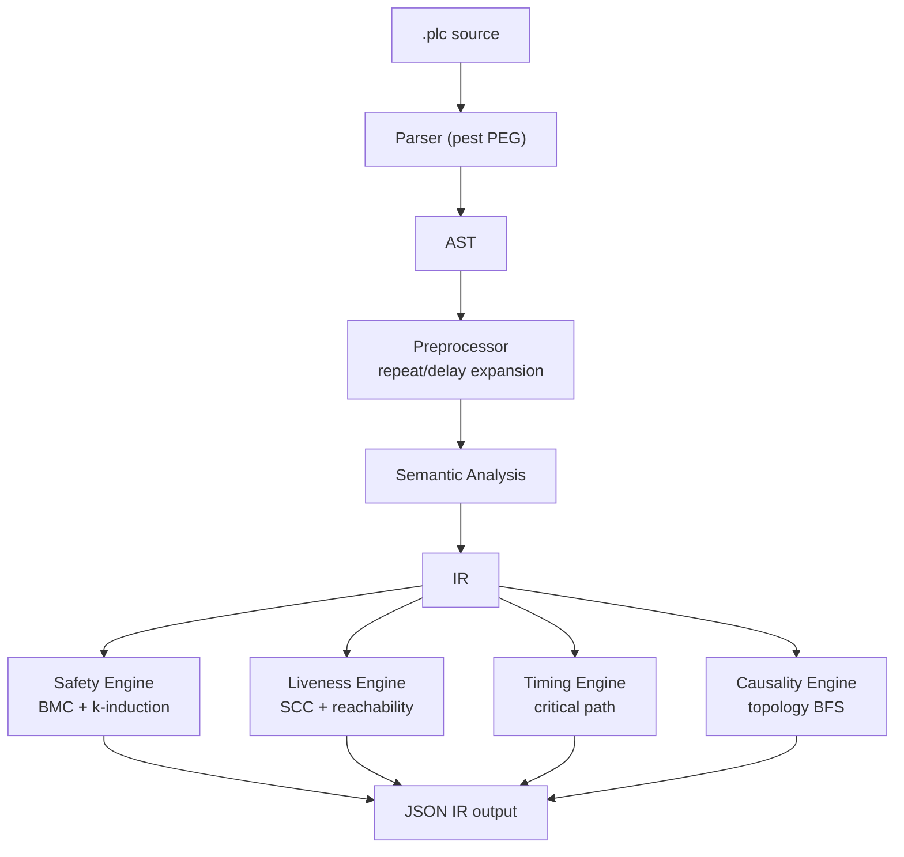

<p align="center">
  <h1 align="center">RustPLC</h1>
  <p align="center">
    <strong>Formally Verified Compiler for Industrial Control Systems</strong><br>
    Don't program devices — declare physical facts and intent, let the compiler prove it's safe.
  </p>
  <p align="center">
    <a href="README.md">中文</a> | <strong>English</strong>
  </p>
</p>

---

## What is RustPLC

RustPLC is a formally verified compiler for industrial control systems. Instead of writing ladder logic or structured text, you declare physical topology, safety constraints, and control logic in a `.plc` DSL file. The compiler mathematically proves safety, liveness, timing, and causality properties at compile time — before any code runs on real hardware.

## Quick Start

```bash
git clone https://github.com/xxrust/RustPLC.git
cd RustPLC
cargo build --release
```

### Option 1: AI-Assisted Generation (Recommended)

RustPLC ships with a built-in `plc-gen` skill for Claude Code / Codex. Describe your process in plain language, and the AI generates a verified `.plc` file through multi-turn dialogue.

Example conversation — an assembly station:

**You**:

> I have an assembly station: two conveyors (left and right) each deliver a workpiece. After both arrive, stop the conveyors. Then left and right push cylinders push the workpieces to the center. Once both are in position, a press cylinder presses down to assemble, then retracts. Both push cylinders retract, then an eject cylinder pushes the finished product out. The press must not act unless both push cylinders are extended. The eject must not act while the press is extended.

**AI (Phase 1 · Understand)**:

> Let me confirm the sequence:
> 1. Start both conveyors → wait for arrival sensors
> 2. Stop conveyors → extend left push → extend right push
> 3. Press down (requires both pushers extended) → press up
> 4. Retract both pushers → eject out (conflicts with press) → eject back
>
> Is this a button-triggered single cycle?

**You**: Yes, button start, single cycle, wait for restart after completion.

**AI (Phase 4 · Generate & Verify)**:

```bash
$ cargo run --release -- examples/assembly_station.plc
```

```
Verification passed:
  - Safety: Complete proof (depth 14) — requires/conflicts_with satisfied
  - Liveness: Passed — no deadlock risk
  - Timing: Passed
  - Causality: Passed — all signal chains connected
```

Generated core logic (excerpt):

```plc
[constraints]
safety: cyl_press.extended requires cyl_push_L.extended
    reason: "press requires left pusher extended"
safety: cyl_press.extended requires cyl_push_R.extended
    reason: "press requires right pusher extended"
safety: cyl_eject.extended conflicts_with cyl_press.extended
    reason: "eject conflicts with press"

[tasks]
task cycle:
    step push_left:
        action: extend cyl_push_L
        wait: sensor_push_L_ext == true
        timeout: 800ms -> goto fault_handler
    step push_right:
        action: extend cyl_push_R
        wait: sensor_push_R_ext == true
        timeout: 800ms -> goto fault_handler
    step press_down:
        action: extend cyl_press
        wait: sensor_press_ext == true
        timeout: 500ms -> goto fault_handler
    step press_up:
        action: retract cyl_press
        ...
    on_complete: goto ready

task fault_handler:
    step safe_retract:
        action: retract cyl_press
        action: retract cyl_push_L
        action: retract cyl_push_R
        action: retract cyl_eject
    step alarm:
        action: log "Assembly station fault: action timeout"
    on_complete: goto ready

task ready:
    step wait_start:
        wait: start_button == true
        allow_indefinite_wait: true
    on_complete: goto cycle
```

Full file: [`examples/assembly_station.plc`](examples/assembly_station.plc)

### Option 2: Write DSL Directly

```bash
cargo run --release -- your_file.plc
```

On success, the compiler outputs full IR (JSON to stdout) with topology graph, state machine, constraint set, timing model, and verification summary.

## Compilation Pipeline



## Four Verification Engines

| Engine | Checks | Method |
|--------|--------|--------|
| **Safety** | Mutual exclusion (`conflicts_with`), dependencies (`requires`) | Bounded model checking + k-induction |
| **Liveness** | Deadlock / livelock (wait without timeout, zero-outdegree states) | SCC analysis + reachability |
| **Timing** | Timing envelope (`must_complete_within` / `worst_case` / `must_start_after`) | Worst-case critical path |
| **Causality** | Signal chain integrity (output → actuator → sensor) | Topology BFS |

All four engines run in parallel. One compilation exposes all issues.

### Mathematical Foundations

RustPLC's verification is not testing — it is mathematical proof over finite state spaces, built on established formal methods.

**Safety — Bounded Model Checking (BMC) + k-induction**

Control logic is modeled as a finite state transition system `M = (S, S₀, T, L)`, where S is the state set (control location × device state vector) and T is the transition relation. For a safety property P (e.g., `¬(cyl_A.extended ∧ cyl_B.extended)`), BMC performs BFS from initial state S₀, exhaustively enumerating all reachable states up to depth k. The depth k is automatically determined by Kosaraju SCC analysis: `k = max(|SCC|) + 1`, ensuring every cycle in every strongly connected component is fully traversed. If all reachable states are exhausted within depth k with no counterexample, a complete proof is obtained (equivalent to the inductive step of k-induction holding).

**Liveness — Tarjan SCC + reachability analysis**

Deadlock detection is graph-theoretic: Tarjan's algorithm identifies all strongly connected components in the state machine transition graph. If every wait-edge within an SCC lacks a timeout and is not marked `allow_indefinite_wait`, that SCC constitutes a potential livelock. Zero-outdegree states (no successor transitions and no `on_complete`) constitute deadlocks. This is a conservative approximation of the CTL property `AG(EF done)`.

**Timing — worst-case critical path**

Each step's execution time is modeled as a weighted DAG, with weights derived from physical device parameters (`stroke_time + response_time`) and explicit `delay` values. The longest path algorithm computes worst-case execution time, compared against `must_complete_within` constraints. The `must_complete_within_worst_case` variant includes timeout upper bounds in path weights. Parallel branches take the maximum across branches.

**Causality — topology BFS reachability**

Device connections form a directed graph G = (V, E), where `connected_to` and `detects` define edges. For a declared causal chain `Y0 → valve → cyl → sensor`, the compiler performs BFS on G to verify reachability at each hop — ensuring physical signals can propagate from output ports to sensors along actual wiring.

## DSL Reference

A `.plc` file has three sections:

```plc
[topology]          # Physical devices and connections
[constraints]       # Safety, timing, causality constraints
[tasks]             # Control logic (state machine)
```

### Device Types

| Type | Purpose | Key Attributes | Default States |
|------|---------|----------------|----------------|
| `digital_output` | Output port Y0, Y1... | — | on / off |
| `digital_input` | Input port X0, X1... | `debounce` | on / off |
| `solenoid_valve` | Solenoid valve | `connected_to`, `response_time` | on / off |
| `cylinder` | Cylinder | `connected_to`, `stroke_time`, `retract_time` | extended / retracted |
| `motor` | Motor | `connected_to`, `rated_speed`, `ramp_time` | on / off |
| `sensor` | Sensor | `connected_to`, `detects` | on / off |

Any device supports custom states via `states: [...]` (e.g., 3-position valve: `states: [extend, neutral, retract]`).

### Device Connection Chain

In industrial control, signals flow from PLC output ports through solenoid valves to actuators (cylinders/motors), with sensors feeding back status. The DSL declares this physical chain via `connected_to` and `detects`. The compiler uses it to infer causal reachability and accumulate timing parameters:

```
digital_output (Y0)          ← PLC output port, sends electrical signal
    ↓ connected_to
solenoid_valve (valve_A)     ← Converts electrical signal to pneumatic (response_time: 20ms)
    ↓ connected_to
cylinder (cyl_A)             ← Converts pneumatic to mechanical motion (stroke_time: 300ms)
    ↓ detects
sensor (sensor_A_ext)        ← Detects cylinder position (detects: cyl_A.extended)
    ↓ connected_to
digital_input (X0)           ← PLC input port, reads sensor signal
```

Corresponding DSL declaration:

```plc
device Y0: digital_output
device valve_A: solenoid_valve { connected_to: Y0, response_time: 20ms }
device cyl_A: cylinder { connected_to: valve_A, stroke_time: 300ms, retract_time: 300ms }
device sensor_A_ext: sensor { connected_to: X0, detects: cyl_A.extended }
device X0: digital_input
```

This chain serves three purposes:

1. **Causality verification**: The compiler performs BFS along `connected_to` + `detects` edges, verifying that the signal from `action: extend cyl_A` can reach `wait: sensor_A_ext == true`. A broken chain (e.g., `cyl_A` missing `connected_to: valve_A`) triggers a causality error.
2. **Timing calculation**: The compiler accumulates `response_time` (20ms) + `stroke_time` (300ms) = 320ms as the minimum execution time for that action, used in `must_complete_within` verification.
3. **Safety checking**: States like `cyl_A.extended` referenced in `conflicts_with` / `requires` constraints derive their semantics from the device type in the chain.

Motor chains are similar, just with a different actuator:

```
digital_output (Y0) → motor (motor_conv) → sensor (sensor_pos)
                         ↑ ramp_time: 50ms     ↑ detects: motor_conv.position_A
```

### Control Flow Statements

| Statement | Purpose |
|-----------|---------|
| `action: extend / retract / set / log` | Drive actuators or log messages |
| `wait: ... == true` | Wait for condition (supports AND / OR, cannot mix) |
| `delay: Nms` | Fixed delay, included in timing verification |
| `timeout: Nms -> goto ...` | Timeout protection jump |
| `if: ... goto ... else: goto ...` | Conditional branch |
| `goto task` / `goto task.step` | Jump to specified task or step |
| `repeat N: ...` | Compile-time unroll into N sequential steps (2~100) |
| `parallel: branch_A: ... branch_B: ...` | Parallel branches, join after all complete |
| `race: branch_A: ... then: goto ...` | Race branches, first to finish decides jump |
| `allow_indefinite_wait: true` | Manual operation exemption (skip liveness check) |

Statement quick reference:

```plc
action: extend cyl_A                                    # Extend cylinder
action: retract cyl_A                                   # Retract cylinder
action: set motor on                                    # Start motor
action: log "message"                                   # Log message
delay: 2000ms                                           # Fixed delay
wait: sensor == true                                    # Single condition
wait: A == true AND B == true                           # AND (cannot mix with OR)
wait: A == true OR B == true                            # OR
timeout: 500ms -> goto fault_handler                    # Timeout protection
if: mode == true goto task_A else: goto task_B          # Conditional branch
goto task.step                                          # Jump to specific step
repeat N: ...                                           # Compile-time unroll (2~100)
parallel: branch_A: ... branch_B: ...                   # All branches, join after
race: branch_A: ... then: goto X  branch_B: ...        # First branch wins
allow_indefinite_wait: true                             # Manual operation exemption
```

## Examples

See the [`examples/`](examples/) directory for 15+ verified `.plc` files covering single cylinders, multi-station production lines, motor control, race detection, repeat cycles, and more.

## Tests

```bash
cargo test    # 120 tests (69 unit + 13 integration + 31 stress/coverage + 1 fixture + 6 e2e)
```

### Optional: Enable Z3 Solver

```bash
cargo build --release --features z3-solver
```

## Tech Stack

- **Rust 2024 Edition** — memory safety, zero-cost abstractions
- **pest** — PEG parser generator
- **petgraph** — graph data structures (topology + state machine)
- **Z3** (optional) — SMT solver for stronger safety proofs

## License

MIT

---

<p align="center">
  <sub>Written in Rust, so it won't panic. Well, at least not on the production line.</sub>
</p>
