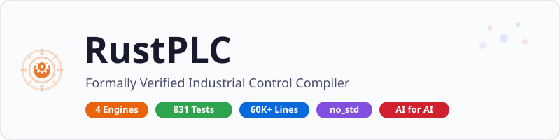
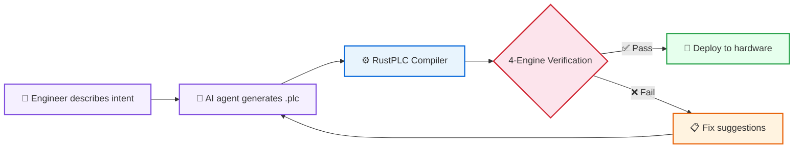
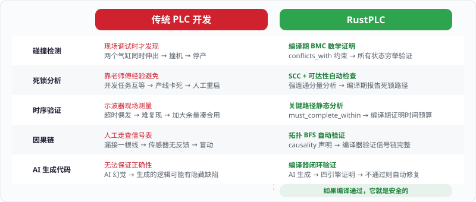
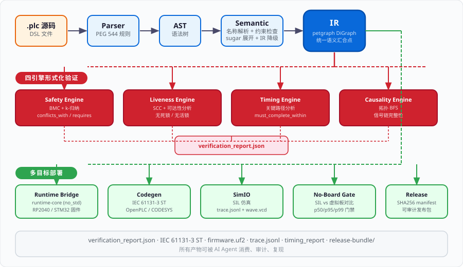
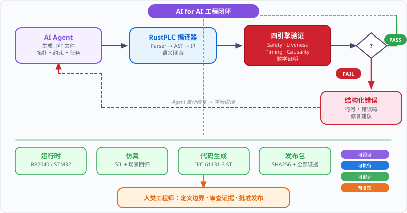
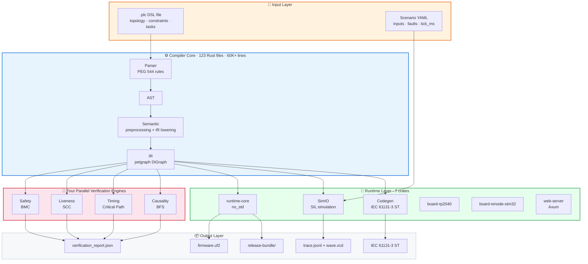

<p align="center">
  
</p>

<p align="center">
  <strong>AI agents design industrial control programs. The compiler proves them correct.</strong>
</p>

<p align="center">
  
  
  
  
  
</p>

<p align="center">
  <a href="README_EN.md"><strong>English</strong></a> | <a href="README.md">中文</a>
</p>

<p align="center">
  <a href="#understand-rustplc-in-30-seconds">30-Second Overview</a> •
  <a href="#why-rustplc">Why RustPLC</a> •
  <a href="#quick-start">Quick Start</a> •
  <a href="#core-capabilities">Capabilities</a> •
  <a href="#ai-for-ai">AI for AI</a> •
  <a href="#documentation">Docs</a>
</p>

---

## Understand RustPLC in 30 Seconds



**Traditional**: Engineer writes ladder logic → manual safety review → collisions/deadlocks/timeouts found during commissioning

**RustPLC**: Engineer describes process → AI generates declarative DSL → compiler mathematically proves safety → all issues caught at compile time

**In one sentence: RustPLC is the "Rust compiler" for industrial control — if it compiles, it's safe.**

---

## Why RustPLC

Industrial control software has a fundamental contradiction:

> The more complex the control logic, the less reliable human review becomes — yet complex systems demand the highest safety guarantees.

Existing toolchains (ladder logic, ST, FBD) are fundamentally **"write then check"** — implement first, find problems through manual review and on-site commissioning. This works for simple cases, but with concurrent control, multi-axis coordination, and safety interlocks, the state space explodes beyond what humans can reason about.

RustPLC's answer is **"prove as you write"**:

<p align="center">
  
</p>

The last row is the key: when AI agents can generate industrial control programs, **who guarantees the AI's code is safe?** RustPLC is that guarantee.

---

## Quick Start

```bash
git clone https://github.com/xxrust/RustPLC.git
cd RustPLC
cargo build --release
```

### Compile & Verify

```bash
cargo run --release -- examples/dual_axis_platform.plc --no-print-ir
```

```
Verification passed:
  - Safety: Complete proof (depth 4) — conflicts_with satisfied
  - Liveness: Passed — no deadlock risk
  - Timing: Passed — task.cycle within 8000ms budget
  - Causality: Passed — all signal chains connected
```

Four verification engines run in parallel, mathematically proving your program is free of collisions, deadlocks, timing violations, and broken signal chains.

### Generate IEC 61131-3 ST Code

```bash
cargo run --release -- gen-st examples/dual_axis_platform.plc --out out/dual_axis.st
```

Verified IR compiles directly to standard Structured Text, importable into OpenPLC / CODESYS.

### Scenario Simulation

```bash
# Generate scenario skeleton
cargo run --release -- scenario-init examples/assembly_station.plc \
  --out scenarios/normal.yaml --preset normal

# SIL simulation
cargo run --release -- sim-plc examples/assembly_station.plc \
  --scenario scenarios/normal.yaml --out trace.jsonl
```

### Deploy to RP2040

```bash
cargo run --release -- build-rp2040 examples/rp2040_motion_minimal.plc \
  --out out/rp2040 --io-map examples/rp2040_motion_minimal.io_map.toml --emit-uf2 out/firmware.uf2
```

### Create a New Project

```bash
cargo run --release -- new my_plc_project
```

```
my_plc_project/
├── rustplc.project.toml
├── plc/
│   ├── main.system.md      # Requirements doc (AI reads this to generate .plc)
│   └── main.plc
├── scenarios/
│   ├── nominal/
│   └── faults/
└── out/
```

---

## The DSL at a Glance

RustPLC's DSL is not another programming language — it's a declarative description of industrial control intent. Engineers (or AI agents) declare **"what devices exist, what constraints apply, what to do"**, and the compiler proves whether those declarations are consistent.

```plc
[topology]
device plc_main: plc {
    purpose: "Controller body",
    model_ref: openplc_softplc
}
device valve_A: solenoid_valve {
    purpose: "Solenoid valve driving cylinder A",
    response_time: 20ms
}
device cyl_A: cylinder {
    purpose: "Station A cylinder actuator",
    stroke_time: 300ms
}
device sensor_A_ext: sensor { purpose: "Cylinder A extended feedback" }
device sensor_A_ret: sensor { purpose: "Cylinder A retracted feedback" }

relation { from: plc_main.Y0, to: valve_A.coil, via: driven_by }
relation { from: valve_A.out, to: cyl_A.cmd, via: driven_by }
relation { from: cyl_A.extended, to: sensor_A_ext.sense, via: detects }
relation { from: sensor_A_ext.out, to: plc_main.X0, via: reports_to }
relation { from: cyl_A.retracted, to: sensor_A_ret.sense, via: detects }
relation { from: sensor_A_ret.out, to: plc_main.X1, via: reports_to }

[constraints]
timing: task.cycle must_complete_within 2000ms
causality: Y0 -> valve_A -> cyl_A -> sensor_A_ext
causality: Y0 -> valve_A -> cyl_A -> sensor_A_ret

[tasks]
task cycle:
    step extend:
        action: extend cyl_A
            timeout: 500ms -> goto fault.timeout
            on_motion_fault -> fault.motion_fault
            on_safety_fault -> fault.safety_fault
    on_complete: goto ready

task fault:
    step timeout:
        action: log "cylinder command timed out"
    step motion_fault:
        action: log "cylinder feedback did not match the requested motion"
    step safety_fault:
        action: log "cylinder feedback is contradictory"
```

Three sections, three concerns:

- **topology** — what devices exist, how they're wired
- **constraints** — what must never happen, what must always hold
- **tasks** — what to do, in what order

The compiler reads all three, builds a unified IR, then uses four engines to prove the constraints hold across every possible execution path.

---

## Core Capabilities

### Four-Engine Formal Verification

The compiler ships four parallel verification engines. These aren't tests — they're mathematical proofs:

| Engine | Method | What It Proves |
|--------|--------|----------------|
| Safety | BMC + k-induction | `conflicts_with` / `requires` hold in all reachable states |
| Liveness | SCC + reachability | No deadlocks, no livelocks, all paths terminate |
| Timing | Critical-path analysis | `must_complete_within` time budgets are satisfied |
| Causality | Topology BFS | Signal chains are complete, no broken links or orphaned devices |

### Compilation Pipeline

<p align="center">
  
</p>

### Multi-Target Deployment

| Target | Command | Output |
|--------|---------|--------|
| Formal verification | `compile` | verification_report.json |
| ST code generation | `gen-st` | IEC 61131-3 ST (OpenPLC/CODESYS) |
| RP2040 firmware | `build-rp2040` | UF2 firmware + io_map |
| STM32 emulation | `build-renode-stm32` | ELF + Renode trace |
| SIL simulation | `sim-plc` | trace.jsonl + sim_report |
| No-board delivery | `no-board-gate` | diff_report + timing_report |
| Release bundle | `release-bundle` | SHA256 manifest + all evidence |

### Scenario Engineering

```bash
scenario-init     # Generate scenario skeleton
scenario-validate # Validate scenario legality
scenario-expand   # Expand pulse/hold sugar
scenario-gen      # Batch-generate scenarios
sim-regress       # Batch regression simulation
```

Fault injection, waveform export, KPI regression (overshoot / steady-state error / settling time), failure minimization — a complete simulation engineering chain.

### Real-Time Gating

```bash
# SIL vs virtual-board comparison + real-time threshold check
cargo run --release -- no-board-gate examples/assembly_station.plc \
  --scenario scenarios/normal.yaml \
  --max-p99-exec-us 500 --max-overrun-count 0
```

Tick-level timing sampling, p50/p95/p99 statistics, automatic threshold enforcement. Release bundles include SHA256 manifests + git metadata for full auditability.

---

## AI for AI

RustPLC isn't just "AI helps humans write PLC programs." The stronger direction is becoming an **AI-for-AI engineering platform**:

<p align="center">
  
</p>

This direction holds if four contracts stay intact:

1. AI-generated artifacts must enter a unified semantic model, not stay as prompt text
2. Generated results must be constrained by verification, simulation, and traceability
3. Code generation must be explicit about preserved vs. erased semantics
4. Release bundles must be reproducible by another AI system or another engineer

The differentiator isn't "yet another generator." It's an engineering loop where AI output is **verifiable, executable, auditable, and repeatable**.

### MCP Integration

RustPLC ships an MCP server so AI agents can call the compiler directly:

```json
{
  "mcpServers": {
    "rustplc": {
      "command": "python",
      "args": ["-m", "server"],
      "cwd": "rustplc-mcp"
    }
  }
}
```

Available tools for agents:
- `validate_plc` — verify a .plc file
- `compile_plc` — compile and retrieve IR
- `get_rustplc_skill_guide` — get DSL authoring guide

---

## Examples Gallery

| Example | Features | Complexity |
|---------|----------|------------|
| `project_scaffold_demo/` | Minimal project structure, scaffolding | ★ |
| `rp2040_motion_minimal.plc` | Motion control, board I/O mapping | ★★ |
| `dual_axis_platform.plc` | Dual-axis coordination, parallel, race, conflicts_with | ★★★ |
| `assembly_station.plc` | Multi-device coordination, parallel, requires | ★★★ |
| `nuclear_coolant_isolation.plc` | SIL3 nuclear safety, redundant sensors, OR fault tolerance | ★★★★ |
| `three_station_assembly.plc` | Large-scale topology, assembly workflow | ★★★★ |
| `process_device_demo.plc` | Process-device semantic action, runtime handler boundary | ★★ |
| `recovery_templates/` | E-stop recovery, fault routing | ★★★ |
| `force_override_demo.plc` | Online forcing, debug semantics | ★★ |

---

## Architecture

> See the full pipeline diagram in the [Compilation Pipeline](#compilation-pipeline) section above. Below is a layered overview:



---

## Project Scale

| Metric | Value |
|--------|-------|
| Rust source files | 123 |
| Compiler code | 60,000+ lines |
| PEG grammar rules | 544 lines |
| Test cases | 868 |
| Example .plc files | 32 |
| Workspace crates | 7 |
| Verification engines | 4 |
| CLI subcommands | 20+ |
| Wiki pages | 18 |
| Architecture docs | 7 |

---

## Documentation

### In-Repo Docs

| Document | Content |
|----------|---------|
| [`AGENTS.md`](AGENTS.md) | Project charter, layering principles, code navigation |
| [`docs/architecture/signal-direction.md`](docs/architecture/signal-direction.md) | Concurrent task / blocking step semantics (frozen) |
| [`docs/architecture/device-semantics-library.md`](docs/architecture/device-semantics-library.md) | Device family semantic abstraction |
| [`docs/architecture/intent_alignment_verification.md`](docs/architecture/intent_alignment_verification.md) | Intent contract verification |

### Wiki

| Page | Content |
|------|---------|
| [AI-for-AI Platform Vision](docs/wiki/AI-for-AI-Platform-Vision.md) | AI agent engineering platform direction |
| [PLC Optimization Pipeline](docs/wiki/PLC-Optimization-Pipeline.md) | Optimization candidate generation & ranking |
| [Device Library](docs/wiki/Device-Library.md) | TOML device definitions & constraints |
| [Scenario Assetization](docs/wiki/Scenario-Assetization-Coverage-Feedback.md) | Scenario engineering & coverage feedback |
| [RP2040 Motion Control](docs/wiki/RP2040-Motion-Minimal-Example.md) | Embedded deployment example |
| [Topology Signal Direction](docs/wiki/Topology-Signal-Direction-Refactor.md) | Port-level topology semantics |
| [Stepper Safety Modeling](docs/wiki/Stepper-AB-Encoder-Safety-Modeling.md) | Motion control safety |
| [CI Runbook](docs/wiki/CI-Runbook.md) | CI/CD procedures |
| [Fail-Safe State](docs/wiki/Fail-Safe-Safe-State.md) | Safe state modeling |
| [Developer Bootstrap](docs/wiki/Developer-Bootstrap-Pack.md) | Getting started guide |

### CLI Help

```bash
cargo run --release -- --help              # Command index
cargo run --release -- help <command>      # Single command details
cargo run --release -- help compile        # Compile command help
cargo run --release -- help sim-plc        # Simulation command help
```

---

## Design Principles

- Semantics must precede implementation
- IR is the single semantic convergence point
- Verification is the main path, not a plugin
- Runtime and codegen only consume closed IR semantics
- Docs, examples, tests, and skills must stay in sync with compiler contracts

---

## Roadmap

### Completed

**Compiler Core** — DSL design, four-engine verification, structured error reporting, DSL v2 syntax extensions, optimization pipeline

**Device Semantics** — cylinder and axis action semantics, process-device actions, station protocol contracts

**Simulation & Testing** — SIL simulation, scenario engineering (init/validate/expand/gen/regress), KPI regression

**Deployment & Gating** — ST code generation, RP2040 firmware, Renode STM32 emulation, no-board delivery gate, release bundles

**Topology & Semantics** — Port-level topology, multi-dimensional tags, semantic diff, performance gate, intent contract verification

### In Progress

- Hardware abstraction layer (EtherCAT / Modbus / more GPIO boards)
- Multi-controller coordination
- LSP editor integration (syntax highlighting, completion, go-to-definition)
- Web IDE (online editing, verification, simulation)

---

## License

[MIT License](LICENSE)

---

<p align="center">
  <sub>Written in Rust, so it won't panic. Well, at least not on the production line.</sub>
</p>
