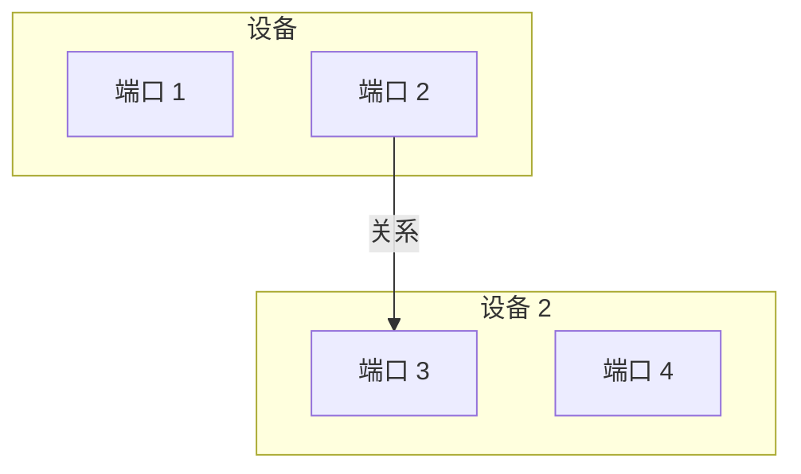

# RustPLC 拓扑语义与关系验证规范

| | |
| :--- | :--- |
| **版本** | 1.0 |
| **状态** | **定稿 (Final)** |
| **作者** | Manus AI (根据用户反馈修正) |
| **日期** | 2026-02-22 |

---

## 1. 背景与核心原则

### 1.1 问题背景

RustPLC 的核心优势在于其编译期的形式化验证能力。然而，如果输入到验证引擎的拓扑结构本身在语义上是错误的，那么即使形式化验证通过，其结果也毫无意义。

### 1.2 核心原则：语义先于验证

本规范确立一条不可动摇的核心原则：

> **拓扑语义正确性是形式化验证的绝对前提。**

所有 `.plc` 文件必须首先通过一个严格的“**拓扑语义门禁 (Topology Semantic Gate)**”。任何未通过此门禁的拓扑结构，都**绝不允许**进入后续的验证流程。

---

## 2. 核心概念：三层结构模型

为确保规范的严谨性，我们建立一个清晰的三层结构模型：



### 2.1 设备 (Device)

**设备**是拓扑结构中的**顶层容器**，代表一个物理或逻辑实体。例如：

-   `PLC`: 可编程逻辑控制器
-   `motor_A`: 一个电机
-   `valve_B`: 一个电磁阀

### 2.2 端口 (Port)

**端口**是**属于特定设备**的、具名的、有类型的、有方向的**逻辑接口**。它是建立关系的唯一锚点。

-   **命名**: `DeviceName.PortName` (例如 `PLC.Y0`, `motor_A.power_in`)
-   **方向 (Direction)**: `input` (消费者) 或 `output` (生产者)
-   **类型 (Type)**: `digital`, `analog`, `pneumatic` 等

### 2.3 关系 (Relation)

**关系**是连接**两个端口**的**有向链接**，描述了信号、能量或数据的流动路径。所有关系都必须遵循从 `output` 端口到 `input` 端口的方向。

---

## 3. DSL 语法设计

### 3.1 显式设备与端口声明

```toml
// 声明一个名为 PLC 的设备，并定义其端口
device PLC: plc_controller {
    ports {
        Y0: output(digital),
        Y1: output(digital),
        X0: input(digital),
        X1: input(digital)
    }
}

// 声明一个名为 valve_A 的设备
device valve_A: solenoid_valve {
    ports {
        power_in: input(digital),
        air_out: output(pneumatic)
    }
}

// 关系现在连接的是【端口】，而非【设备】
relation R1 {
    from: PLC.Y0,
    to: valve_A.power_in,
    via: driven_by
}
```

### 3.2 复合设备

```toml
composite_device electric_cylinder {
    // 外部接口现在就是一组端口
    interface {
        port cmd_extend: input(digital) { semantic_role: "actuator_cmd" },
        port pos_extended: output(digital) { semantic_role: "status_feedback" }
    },

    // 内部组件
    components {
        device motor: motor { ports { ... } },
        device sensor_ext: sensor { ports { ... } }
    },

    // 内部连接：将外部端口连接到内部组件的端口
    connections {
        self.cmd_extend -> motor.power_in,
        sensor_ext.signal_out -> self.pos_extended
    }
}
```

---

## 4. 验证规则

### 4.1 关系验证规则

| 关系 (`Relation`) | 起点端口属性 (Producer) | 终点端口属性 (Consumer) | 状态 |
| :--- | :--- | :--- | :--- |
| `driven_by` | `direction: output`, `type: digital` | `direction: input`, `type: digital` | ✅ **允许** |
| `driven_by` | `direction: output`, `type: analog` | `direction: input`, `type: analog` | ✅ **允许** |
| `driven_by` | `direction: output`, `type: pneumatic` | `direction: input`, `type: pneumatic` | ✅ **允许** |
| `reports_to` | `direction: output`, `type: digital` | `direction: input`, `type: digital` | ✅ **允许** |
| `reports_to` | `direction: output`, `type: analog` | `direction: input`, `type: analog` | ✅ **允许** |
| `detects` | `direction: output`, `semantic_role: state` | `direction: input`, `semantic_role: detector` | ✅ **允许** |
| *任何其他组合* | *任何属性* | *任何属性* | ❌ **禁止** |

### 4.2 端口语义角色 (Semantic Role)

为了实现更精细的验证，我们引入可选的 `semantic_role` 字段。

```toml
device motor_A: motor {
    ports {
        // 这个输入端口的语义角色是“执行器指令”
        power_in: input(digital) { semantic_role: "actuator_cmd" },
        // 这个输出端口的语义角色是“状态反馈”
        is_running: output(digital) { semantic_role: "status_feedback" }
    }
}
```

语义门禁可以利用这个信息来阻止不合理的连接，例如：`status_feedback` -> `actuator_cmd`。

---

## 5. 语义门禁 (Semantic Gate) 实现规范

| 步骤 | 校验项 | 伪代码/算法描述 | 失败错误码 |
| :--- | :--- | :--- | :--- |
| 1 | **端口存在性** | `For each relation, check that Device.Port exists for both from and to.` | `SEM-101` |
| 2 | **端口方向性** | `For each relation, check that from_port.direction is output and to_port.direction is input.` | `SEM-102` |
| 3 | **端口类型兼容性** | `For each relation, check that from_port.type is compatible with to_port.type.` | `SEM-103` |
| 4 | **端口语义角色兼容性** | `(Optional) For each relation, check semantic_role compatibility based on a predefined matrix.` | `SEM-104` |
| 5 | **悬空端口校验** | `For each declared port, check if it participates in at least one relation.` | `SEM-105` |

---


## 6. 回归测试与验收标准

### 6.1 正例 (必须通过)

```toml
device PLC: plc_controller { ports { Y0: output(digital), X0: input(digital) } }
device valve: solenoid_valve { ports { power_in: input(digital) } }

relation { from: PLC.Y0, to: valve.power_in, via: driven_by }
```

### 6.2 反例 (必须被拦截)

| 内容 | 预期结果 |
| :--- | :--- |
| `relation { from: PLC.X0, to: valve.power_in, ... }` | **失败** (SEM-102: 方向错误) |
| `relation { from: PLC.Y0, to: valve.non_existent_port, ... }` | **失败** (SEM-101: 端口不存在) |
